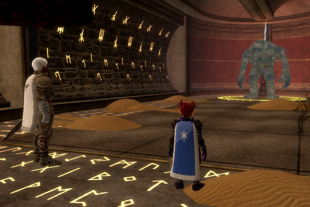
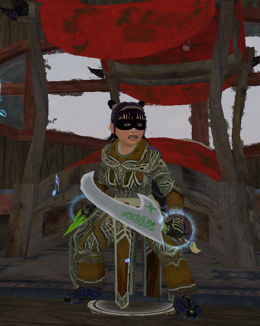

Back to: [West Karana](/posts/westkarana.md) > [2007](/posts/2007/westkarana.md) > [December](./westkarana.md)
# EQ2: Here's what a good day looks like.

*Posted by Tipa on 2007-12-30 13:30:01*

Saturday was an off-day for the guild, so I figured I'd get going with the whole crafting biz. I have to get Dorah, my jeweler, to 40,000 faction with her tradeskill society, *and* to level 80 jewelcraft so she can make Dina's spells. No problem, thinks I. I drag her to Gorowyn because there's no possible way I can find my way out of that confusing place (Mission: Find the mender in thirty minutes or left, starting... NOW!), grab some writs from Mister Hi I'm The Guy Who Stands Here Night And Day Just In Case You Came Buy, and set off, whistling merrily, Dina's mind wandering as she finds herself being Dorah's mana battery. Because, you know, bards = power song.

Thought nothing of it until Dorah noticed that her faction with the Coalition of Tradesfolk was mysteriously NOT RISING. Oh CRAP. When she moved to Neriak, her tradeskill society switched to Dark Bargainers.

She's going to have to move back to Freeport. Back to expensive housing Freeport. Because she needs that Coalition faction in order to make that AA-switching mirror. Sigh. She can have Dina's old place in West Freeport. West Freeport has EVERYTHING... bank, broker, crafting instance, city merchants... if you want to be in the most useful part of Freeport, and one room just isn't enough for all your STUFF, you can't beat West Freeport.

Anyway, I decided to take a break, and log Dera in to sell, repair, change outfits and stuff. I got sidetracked... I always get sidetracked... and found myself in Kunzar Jungle, questing and looking for an instance group (but not CoA, since I was locked out). After the fifth invite to a CoA group, finally someone was going to Maiden's. "A-ha!". I thought. "I can finish Anaphylaxis!".

That's the Jarsath Waste quest given by a little Fae outside the Vault of Eternal Sleep that results in a level 80 Legenday weapon, which is very nice for all classes (except Brawlers, apparently). You run through VoES, and then through Maiden's Chambers (the other Charasis instance, home of dirt, donuts and Drusella Sathir) (I was kidding about the donuts). The priest weapon is highly droolworthy. And the scout weapon looks like the old Rogue 1.5 epic from EQ1.

That's Sandstorm. He spits off tiny storms as you hurt him, but we had an enchanter and they couldn't do much but just stand around pining for the Sahara while we killed Mom. 

Oh yeah, Dera joined a guild around then. Someone sent me a tell asking me if I wanted to join an alt guild. I said, "Hey! I'm an alt!" and she said, "Great!" and then I was guilded. Go me! It's a wonderful day when even a 78 cleric can find a guild!

Don't do Maiden's without an enchanter. I mean, if you're in a group, and someone says, "Maidens?", and you look around and nobody has the kinda listless faroff dreamy enchanter look, just say no. I've been there twice without an enchanter and once with, and twice there was a lot of death and once we just stood around while stuff died. Enchanter GOOD.

Oh yeah, and take another look, and if there are no HALFLINGS in your group, well, you're just missing out. A lot of times in dungeons, you'll come across a pie-eating competition AND THEN WHAT? YOU'LL LOSE! Well anyway, it might happen.

We couldn't quite get the hang of killing Drusella.

The group wanted to go on to Chelsith, but guild wanted Dina for some instance fun and hey, count me in any time.

I'm not sure what instance it was. It I think it was Vault of Eternal Sleep, I know I was hoping we'd go there so I could get my green dagger. Kinda unusual my lower level alt would get her Anaphylaxis weapon before my main did. We may have done an instance before then but I know we did do VoES, totally smoothly. That place is so fun now. Got my updates, went to Maiden's without an enchanter (note to self: you are not an enchanter), managed to make our way to Drusella with some death but (significantly) hitting the Skorpikis guy up for his tail so Dina could get her dagger.

That's Dina with her knife and a new robe she got in Maiden's (she also has a new hat you can't see, the third piece of the legendary RoK Scout set, which gives her a nice double attack bonus for having three. She's standing in her bedroom in her Gorowyn suite. Ooooh, windows!).

I went off and repaired and was thinking about what it would take to get Dorah moved back when the guild needed a second healer for Chelsith, and was Dera perhaps available?

YOU BET!

Chelsith is a temple the Murlocs built to provide for the care and feeding of their giant, [multi-tentacled](http://en.wikipedia.org/wiki/Tentacle_sex) [hentai loving](http://en.wikipedia.org/wiki/Hentai) god, but for me, that place will always live in my memory as the home of the majestic Penisaurus, proudly displayed in the picture above. May it scar you as I was scarred. Brrr.

After a brief supper break, Evalin was on the prowl for a reflective shard with which to make a reflective AA-storing mirror, and I asked if I could bring Dera along for some xp and he said, sure, and the group picked up other lost strays until at the end of a few short hours, having found a shard, the group did what ALL RoK groups eventually do and went to the Crypt of Agony.

Every expansion has the one place you always go. DoF had Tables and the Hidden Cache. KoS had SoS and the Palace of the Awakened. EoF had Mistmoore Catacombs. And RoK has the Crypt of Agony. It's not "if" you go. It's "when". And "how often?". And "oh no, not again" :)

It's a fun, short crawl, lots of loot and the game's most annoying debuff, and hey, guess who dinged 79?

That's right, our (second) favorite halfing, Dera.

One short level to go and then I DON'T HAVE TO LEVEL ANY MORE!

This is my perfect MMO day. Solo questing or crafting until I get a group, and then, grouping and having a great time with friends new and old. It's what makes EverQuest, EverQuest.

Tonight's a raid night. So more on that later :)

And hey, if you've read this far, could you do me a favor? If it's before January 1, 2008, could you send my sister a [Happy Birthday](mailto:jennifernyc2003@hotmail.com)? Her birthday is New Year's Eve and nobody ever remembers :P

## Comments!

**[stargrace](http://mmoquests.com)** writes: Hey, have you been to the instance in Chardok yet? You need access to get in (drop from bridge keeper) and you need the sokokar post (to make things easy) But -- the best thing is it's VERY simple, and only on a 5 hour lock out timer. Those aa mirror shards also drop fairly frequently (2 legendary 1 master 1 mirror every run so far, not bad for a 5 hour lock out). Think it's called Korocust or something close to that (not sure if it was apart of EQ1 but I imagine so.. my memory isn't as great as yours!).

---

**[ongarr](http://spikedoucet@yahoo.com)** writes: are you going to make another character once all of your current ones hit 80?

---

**[Tipa](https://chasingdings.com)** writes: I have plenty of characters. My next lowest is my 66 necro/70 jeweler, Dorah. She's going to become an 80 jeweler and I may level her some. I still have a lot of gear to get for Dina and Dera so I expect plenty of instance runs in the future anyway.

---

**Faremorei** writes: Maidens can be a pain.

I've done with both with and without a mezzer. The last time we went it was with Nakko (Defiler) and I (Fury) on heals. We had a Brigand (MT), Assassin, Berserker(OT), and Conjuror. Since almost all encounters are single target mobs, Brigands act as amazing MTs in group setups since they have good single target taunts and good DPS which allow Assassins and other dps classes to max out on dps without worrying about pulling aggro away.

When you don't have a mezzer for sandstorm the major trick is to either stunlock him or have a scout or tank pull one add off the MT.

The sisters are simple if you can somehow preoccupy the brawler while you kill the other two.

Drusella is an easy last named. Though it can be up to a 10 minute fight depending on how it goes. You can't have any proc damage gear/buffs on and you cannot cast any dots. When the necro hands surround her any damage inflicted will heal her exponentially until she reaches 100 percent, this effect happens every 20 seconds or so but can be recognized by her casting animation. Ripostes also cannot happen during the fight since they inflict damage off of enemy attacks. Your MT essentially has to be walking face first into a wall while his back is exposed to Drusella with your dps jousting or holding dps while the effect is up.

You may already know this but in case you didn't, there you go!

I wish you all the best in Clan of Shadows!

Faremorei

---

**[Tipa](https://chasingdings.com)** writes: Fare! ***hug*** miss you, hope things are going well on Blackburrow. Zerith is back, he's still wearing the Revolution tag, too.

Yesterday was the world's worst ever Maiden's group. I brought Dera, my cleric... and the mezzer just couldn't keep anything dead, and our dps was for the crap. Usually when I go we just burn it and only get one set of adds, but that wasn't an option this time. I left when my armor was destroyed, had 5.4% debt, and I've been trying to get to 80 with her, too...

Never have managed to kill Drusella, which is sad because she holds both Dina and Dera's bps. We've known about not hitting her while she's got her shield up (matches her single target 1500 point lifetap she used to proc back in EQ1), but I didn't know about her riposte. I suspect the major problem is, the tank (and it's always been the same guy... note to self: don't group with him) is just not very good.

---

**Faremorei** writes: OMG Zerith is back?

Blackburrow is just starting to shape up. We almost have our 24 and have most of our key classes covered (Finally) but it took lots of convincing for Nakko to finally transfer. We are planning to raid teir 1 RoK very soon.

Blackburrow is much different than befallen. The raiding guilds here are extremely good and only have a limited number of players. Saints of Norrath is almost done Veeshan's Peak already. There are only 2-3 major raiding guilds on this server and we are hoping to make that 4 soon!

Anyway, instances like maidens makes this game that much more fun. More zones like Nizara and Unrest (but shorter, OMG) is what I like. ALSO, to rub it in, I got my set BP yesterday in maidens!!!!! 5 of out 7 done! 

BTW our guild is in the market for a troub.... /wink /wink

---

**[Tipa](https://chasingdings.com)** writes: Geez, Fare, you still want me even after you blasted me about falling asleep on raids :P I definitely couldn't do a PST guild at this point. Nearly killed me trying after I moved East. I've only done Nizara once, with Dera. It was a lot of fun. I wasn't up to that step in the quest so I need to do it again, and with Dina as well.

I can't wait until I set foot in VP. That was such a rush in EQ1, since back then, once you entered, you couldn't leave until you killed Phara'Dar (or left a corpse outside and got rezzed out, which is what everyone did). That first or second dragon in that knocked you back, dotted and snared you, then ran around killing people one at a time (until the dot took care of the remaining raid all at once), that was fun to figure out :) Later on when we could one-group VP, the magic was more or less gone.

---

**Faremorei** writes: I am also glad to see that I am not the only one who notices that Luclin is reforming.

How is healing with the Cleric? Daladir is mentioning that their heals seem to be a bit underpowered compared to other healer classes in RoK. I think it is mainly due to the lack of gear that drops for them or what you can get from the quest lines. I think hes actually considered wearing leather a couple times hehe.

I know your on EST time. Though, if you ever move back to PST give us a shout. We don't typically run raids for more than 3 hours like we did in Revolution. Your fabulous when your awake lol, those were rough times I think everyone was a little high strung when X and lick left. I would much rather be on EST time though and have the luxury of raiding from 9pm to Midnight, I usually find myself rather bored or disappointed we stopped raiding at 9pm PST heh.

---

**[Tipa](https://chasingdings.com)** writes: I can solo heal Karnor's with Dera, and I believe I could solo heal CoA and Chelsith, but have had two healers in those groups thus far. At least with Inquisitors, I find I have to melee -- Dera's stuns and interrupts (I returned to battle cleric spec) significantly weaken mobs attacks. One CoA run I did nearly nothing BUT attack, and mobs hardly had a chance to cast that group debuff. Those times when I have to focus on healing, dots and debuffs hit the group freely and I have to spend much more time curing.

In groups, I think clerics have to depend on their melee to help. Revenga was trying to teach me about this but I'm slow. Now I understand that melee for clerics isn't just for soloing -- especially since I proc power regen and group heals with my melee. I don't think Templars get the battle cleric line that turns all nukes and dots into combat arts? They probably get something similar.

Venril dropped some sweet cleric shoulders last night. Was a server disco... they are purple. I think there's good things waiting for raid clerics.

---

