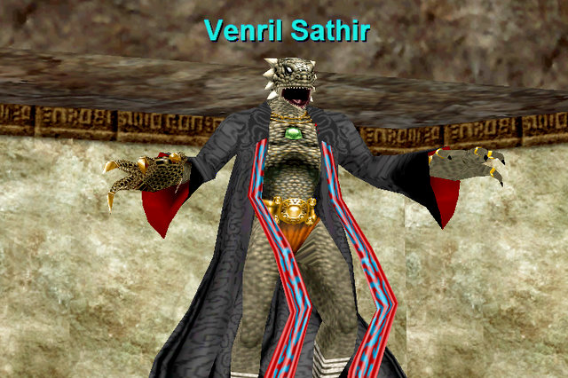

Back to: [West Karana](/posts/westkarana.md) > [2007](/posts/2007/westkarana.md) > [December](./westkarana.md)
# Santa Came Late!

*Posted by Tipa on 2007-12-31 19:21:33*

Our local CompUSA is closing (well, they all are... but so is our local one!), so I went down there to scavenge today. 

And, oh look what Santa had for me at discount prices. Dungeon Siege 2 with the expansions. That DS game where you draw your character and lots of other stuff in the game. Zelda and the Phantom Hourglass. Oh, and Vanguard, and EverQuest with all the latest expansions.

There's something about that game.

I'm SO OVER IT. I really am.

*C'mon... you can solo me...*

Anyway. I've been talking to some friends on EQ1, and I dunno... eventually I might go back in some capacity. I only have one account on Station Pass now, and my rogue, Tipa, only has gear up to Gates of Discord. Brita, my cleric, at least has gear up through the Depths of Darkhollow, has about 900 AAs vs 455 AAs, and is level 75 (and is flagged through DoDH), so I'd have to transfer her from my inactive account ($$$) then find some time to actually play ($$$) and also the inevitable EQ LFG4EVR syndrome... well, EQ2 is my home. But now I can go back and visit.

I downloaded the new Station Launcher and it downloaded all of EQ1 up through Serpent's Spine (the last expansion I bought), logged in in KC (last time I logged into EQ1, was taking pics in KC), and there were *people* there -- an xp group at the front, and a high level group coming down to take Venril Sathir on (I dashed in for the picture before they got there... rogues don't have to clear the way).

A couple of old CE friends (hi, Egat and Banayd!) we on.

What all started this was a comment yesterday that someone should put me in their pocket. And I remembered an old Barbarian Warrior, Hagath, used to talk about putting me into his backpack.

I wonder what became of him? I started hunting down old EQ1 friends by /tell EQ.Erollisi.YourNameHere... and found Banayd pretty quick. He was good friends with Haggy. And he told me what had become of him, though not how to get in touch with him.

Anyway. It's easy to leave a game but very hard to leave friends. For friends, I can make a place, probably a very small place, for EverQuest.

## Comments!

**Egat** writes: Best news ever!

---

**Zygwen** writes: I'm not sure which I liked better, DS or DS2. Sometimes though I still want to play D2.

---

**Paleodom** writes: I agree with the sentiment of leaving friends behind. I moved on to EQ2 also with my real life friends, but I miss the 3 people I started play EQ with. One helped me learn the game, the other was my brother in arms, and the other became my in game wife. I never see them on in the few times I have logged on, more than likely they play WOW, and I will never know what toons they play, but somewhere in the echoes of digital time we 4 are still banded together fighting the good fight.

---

**[Tipa](https://chasingdings.com)** writes: In our EQ1 guild. we've had (at least) three marriages, one death (rest in peace, Ginthalas), bunches of other relationships. Many have had kids. Lots of have gone to war and (thankfully) safely returned. These people are Crimson Eternity. EQ1s power was to make this sort of community. You don't leave this family just by playing another game. Given how we all came together, though, we still need a game to give us a common place to come together day after day.

SOE thought their game was about raiding, but it wasn't. It was about forging the bonds of a powerful community, with a game attached. I would count it a good and fun evening just sitting in Misty Thicket in the tunnel leading to Rivervale and just chatting with people. Total xp gained: 0. Total quests completed: 0. Fun had: lots. By making their games more 'gamey', now, a night just spent chatting or running events just seems wasted. We're all too efficient for community now.

The guild I am in, in EQ2, came from EQ1. They actually managed to shift their community to another game, and that must have taken a hell of a lot of work. My own guild eventually did the same when they went to WoW. I've seen no evidence so far that those two games can build communities that strong from scratch. And even then, I can't follow them to WoW because I don't like the game.

I'd be a lot happier if we could have these communities without having to depend so much on playing a specific game.

---

**Skeeterflea** writes: EQ1 forced us to make friends (and some enemy's) in Norrath in multiple ways. Such as Tipa said about sitting in Misty Thicket, I can recall many a night patiently waiting at the Oasis dock while observing lower seasoned players battle their hearts out against crocodiles. I could offer them my empowering spells to enhance their abilities and sometimes become a hero by saving them from the menacing Lockjaw, only to award one of the many spectators that would gather with the Lockjaw hide vest. I would turn and board my ship off to a land none of them had ever seen before, where I could make small talk or enjoy the ride in solice and watch the sunset. 

I left EQ not long after Planes of Power was released. Aside from some time playing America's Army I hadn't played any other MMO games (except for a small period where I visited RuneScape). I would often find myself surfing the internet for player names and guildmates that I had met along the way, especially for friends I made during my time on Vallon Zek (PvP). Then my wife decided she would suprise me for Christmas with Secrets of Faydwer. I found two of my old guildmates on Fennin Ro and am back traversing the lands once again. Except this time my wife was right beside me on a second account, and together (me as a Drakkin Bard and her a Drakkin ShadowKnight) we are laying waste to any thing that stands in our way. 

It's much different now though, Neriak along with MANY familiar zones are now empty (everyone remembers the East Commons). Most of the low level people you find with /who all X are not interested in grouping, many are twinks from all the high end players that now exist or know someone in RL that is powerleveling them exclusivley. I don't know if it is the same across all servers but this is what I have found so far. I'm hoping to get some old RL friends to join me and my wife, enough so that we can at least have a decent grouping experience. I know Fennin Ro recentley merged with another server, but this only affects the high end game where all of the players currently exist. I'm begining to wonder how I will ever be able to get flagged or gain entry into many high end zones. I'm not a fan of WoW's gameplay and really don't care to learn an entirely new game and it's content (there's plenty to learn in EQ1 still). 

 Oh well we shall see what the future holds, hopefully I can attain epic 1.0 at least...

---

**Skeeterflea** writes: Oh, btw we also picked up our Secrets of Faydwer from our local closing CompUSA! and I like your blog, just stumbled across it this moring.

---

**[Tipa](https://chasingdings.com)** writes: Welcome, Skeeter! I don't think I, personally, could start over in EQ1. So much of my good memories are tied up in the groups I had and the people I met along the way. I miss most of them terribly still. The game itself I eventually lost interest in.

We need, more than ever, a meeting-place, where we can bring our characters apart from any game, and meet, and chat, and build bonds and the community they bring -- and from there, having met, we choose a world and play there for awhile.

Community is too important to leave to the coming and going of any specific game.

---

**Skeeterflea** writes: I like your idea... but I'm still trying to figure out how to locate/contact old players.

I read in your post above about the "/tell EQ.Erollisi.YourNameHere" I am assuming this the old in game method to send a tell across servers... 

If I send an email or PM from the EQ.Station/players website to the email address's registered on their accounts, (much like a PM from any web forum) I would be happy. AND... I'm willing to bet I could get some of them to dust off their swords for (at least) a short trial run back at it again. Is this possible? And if not I wonder why SOE decided not to allow players to send messages to others accounts?

---

**Skeeterflea** writes: If I "could" send an email or PM...

Sorry about that.

---

**[Tipa](https://chasingdings.com)** writes: Go to any old EQ1 guild's website. The general areas are full with people trying to find old friends. This is a problem everyone has.

[Guild Cafe](http://www.guildcafe.com/) is trying to be that place where people can hook up outside of any specific game -- like Facebook for MMO gamers. I have found a couple of people through it, though not as many as I'd have liked. Best bet is to sign up and list absolutely every game and character you can remember and hope someone is looking for you :)

---

