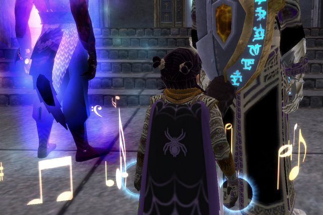

Back to: [West Karana](/posts/westkarana.md) > [2007](/posts/2007/westkarana.md) > [December](./westkarana.md)
# EQ2: Tier 1 RoK raids DONE!

*Posted by Tipa on 2007-12-31 22:43:28*

Talk about speedy backflagging -- two raid nights and all of Tier 1 done.

The raids in Rise of Kunark are based around an overplot; the Greenmist which once cleared Kunark of the Shissar and a second time killed the Rallosian attackers as they were about to overrun the human lands in the Age of Turmoil -- is about to be used again.

To find the Greenmist Oubliette will require keys worn as amulets by the Overking of the Di'Zok, and by Venril Sathir, leader of the Sathirian Iksar. To defeat THEM, requires special weapons held by three lesser creatures; Pawbuster in Karnor's Castle; a spider queen in her lair in the Fens; and from a Protector deep inside the city of Sebilis.

The other night I got the Wand of Interception from Pawbuster. The Wand allows the raid to incapacitate the Overking. Last night we started out deep inside Sebilis, going after the Protector, who carries the Mistmyrian Soul Cube, which can stun Venril Sathir himself.

It looks like we weren't the only ones going after the Cube. A higher level party, far more powerful than any of us, were racing us through the place. In the end, we had to take THEM down. Because this terrible weapon, the Greenmist Oubliette, must never be used.

The Protector was set to guard this Soul Cube. But to end the threat from the Greenmist Oubliette, we'd need it. And so he had to die.

2/3 of the way done!

We'd also need the Greenmist Orb... but we can't know why, not yet. The spider queen carries this, and so we entered her den to get it.

I don't have any really good pictures of this fight, so here's a picture of what I normally see in raids =- the butts of tall people. Welcome to my world.

Two nights, three raids, and I'm flagged through the Tier 1 raids! Thanks, Clan of Shadows!

Afterward, we went to Chelsith and did half the quest that results in a charm with water-breathing on it. That will be useful :) I don't even remember where I put my Fishbone Earring, but I miss it whenever I need to swim deep.

Chelsith is *such* a mysteriously creepy place. What the heck is that huge emerald crystal?

## Comments!

**[Mythokia](http://blog.thermonuclearexchange.com)** writes: I half expected to meet Jar Jar Binks in Chelsith.

---

**[Tipa](https://chasingdings.com)** writes: Ugh. I'd gone years -- YEARS -- without even thinking about Jar Jar.

Thanks.

---

**[stargrace](http://mmoquests.com)** writes: Grats! Sounds like fun

---

**[Ogrebears](http://www.ogrebear.com)** writes: I can't wait to start.. we tried are first rok raid not to long after Christmas didn't have enought on to kill the name, but we did better than we thought

---

