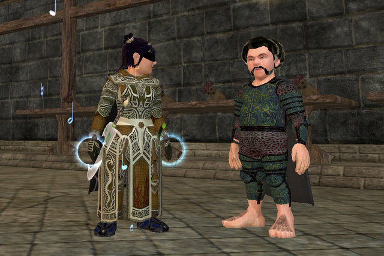

Back to: [West Karana](/posts/westkarana.md) > [2007](/posts/2007/westkarana.md) > [December](./westkarana.md)
# EQ2: The Fate of Norrath

*Posted by Tipa on 2007-12-31 22:58:38*

The Fate of Norrath is a level 80 quest that starts outside the City of Mist in the Kunzar Jungle. This little Halfling seems unusually preoccupied with the vast power of the Greenmist Oubliette and appears to have mysterious information and powers. Some even wonder if he is an avatar of Bristlebane, but could the God of Pranks really ever take on something as serious as this?

Regardless, he is the one that sets into motion this vast, secret army against the powers that reside in Kunark.

And here, for those interested in the lore, is the entire text of everything he says when you complete the Tier 1 raids. Laboriously retyped by me, SUBSTANTIAL typos fixed. Does nobody ever proofread these things?

Enjoy!

Long ago, in the Elder Age, the shissar ruled over the continent of Kunark. They enslaved all other races, including the iksar tribes. Their power seemed limitless. It seemed no force on Norrath could depose te sinister shissar kingdom. Then came the whispers of an approaching storm, a green maelstrom.

*What kind of storm do you speak of?*

The shissar seers dreamed of the approaching storm of green clouds that would eradicate their entire race. Their entire kingdom worked feverishly to devise a means of
salvation. The primary result would be a great machine that could consume the approaching storm. This great oubliette must be constructed for the shissar race to survive their doomsday.

*That is the Doomsday Device, the oubliette!*

The device has a proper name, it is called the Greenmist Oubliette, but to the empires that wish to use it as a final solution, it is the Doomsday Stone.

*What became of the Greenmist Oubliette and the shissar?*

The shissar race worked hard to complete the Greenmist Oubliette, but time was not on their side. Before they could complete the device in full, their doomsday approached. A
vast green mist storm descended on Kunark, slaying each and every shissar in a most grisly way.

*What was this green storm?*

Some say it was a message from the gods to those races that chose to oppose their powers. Some say it was the god of fear or plague having fun with mortals. All we can be sure is that the green mist storm is absolute death to entire kingdoms and possibly worlds. It has only been recorded twice.

*It was seen again?*

Yes! It was the same storm that descended upon the Rallosian Empire's second rise during the Age of Way. If not for that arcane maelstrom, the kingdoms of man would have fallen and many more.

*Then it can be used for good.*

Such astronomical power could only bring death to us all if any kingdom controlled it. It would corrupt even the most benevolent king.

*Why do we want the Greenmist Oubliette if the shissar never used it to stop the green mist storm?*

There are ancient iksar records passed down from the legendary Kotiz that suggest that the device was used. The shissar used the oubliette to capture a faint portion of 
the great green storm of death. It was not enough to swallow the entire storm, but even a sliver of such a power is enough to destroy empires and possibly the world.

*Then tell me how we can get the Greenmist Oubliette.*

The Doomsday Device, or rather, the Greenmist Oubliette, is said to rest in the heart of the ancient shissar capital called Chelsith. It is recorded that there is a Chamber of Destiny
that can only be opened by a special key. We must find that key.

*What is the key?*

I do not know. It was suggested in tales that pass by wind that the ancient Chieftain Thuuga held the key, for that is where he was once lost. This was the knowledge that the 
drachnid sought in the Tomb of Thuuga. Did you find a key in there?

*The spirit of Thuuga rose to speak of destiny. He said the Amulet of Drolakis would break the seal of destiny.*

The Amulet of Drolakis was once worn by the Iksar Chieftain and his mate of the ancient city of Drolakis, origin of the drolvarg. It has been passed down manu times as an
ornament of opulence fit for only the necks of royalty. The amulet must be a key to the resting place of the Greenmist Oubliette. We should need but one.

*Then that is good news! Where can I acquire one of these amulets?*

Unfortunately, to this day, they both embrace the necks of royalty. Emperor Venril Sathir wears one and the Overking of the Di'Zok wears the other. I was not expecting to come
in conflict with them so soon. However, I prepared you for either fight. The relics shall aid you.

*How am I prepared to face the Overking of Chardok or the Emperor of Sebilis?*

The three relics are important to your future and the conflicts to come that you and your secret army will be forced to endure. Do you wish to know more about any of the relics?

*What does the Mistmyrian Soul Cube do?*

The infamous ruler, Emperor Venril Sathir, has begun to drawn new power from a crystal that plummeted from the planes. This large Stone of Syllokk is infused with the souls of the newly departed. By trapping the spirits of dead followers of the false god, Syllokk, it emits an arcane energy that makes Emperor Venril Sathir nearly invincible. The Mistmyrion Soul Cube can combat that.

*How?*

The soul cube contains powerful spirits taken from the realm of hate. These spirits will leech off the spiritual powers of the Stone of Syllokk, thereby giving you valuable time to incapacitate the emperor of the Sathirian Empire and claim the Amulet of Drolakis.

*I shall pry it from the dead hands of Emperor Venril Sathir.*

I am afraid the Emperor is far beyond dying. We have been unable to locate his phylactery to destroy him. Thankfully. all you need to do is incapacitate him long enough to grab the Amulet of Drolakis.

*What does the Wand of Interception do?*

During the Age of Enlightenment, the leader of the drolvarg, Chieftain Thuuga, betrayed Venril Sathir by forming a secret alliance with the giants. Venril Sathir then ordered his vampire lord, Xalgoz, to eradicate the traitorous drolvarg leader. This would be no easy task. Through his Alliance of Stone, Thuuga had earned an extremely powerful sword. With it in his hand, the drolvarg chieftain was nearly unstoppable.

*Thuuga does not have the Amulet of Drolakis, does he?*

Xalgoz overcame the power of Thuuga's sword with an artifact called the Wand of Interception. With it, the drolvarg chieftain was destroyed. However, his sword
continued a long journey. It now rests in the sheath of Overking Selrach of the Di'Zok. Use the wand to combat the Overking and claim the Amulet of Drolakis.

*What does the Greenmist Orb do?*

As you may have guessed, the Greenmist Orb is associated with the Greenmist Oubliette. However, now is not the time to explain its role in your odyssey.

--

My wrists hurt.

## Comments!

**[The Shadow of Odyssey &#8211; Digging for The Truth! &laquo; kithicor.org](http://kithicor.org/2008/04/the-shadow-of-odyssey-digging-for-the-truth/)** writes: [...] can find this “Look to the stone of the Shissar.” Which made me look to a quest called ” The Fate of Norrath” which mention a Greenmist Oubliette which the Shissar [...]

---

