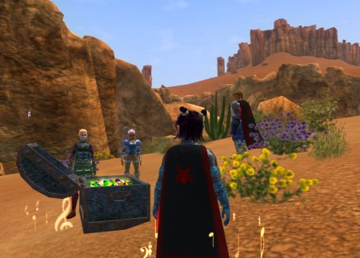

Back to: [West Karana](/posts/westkarana.md) > [2007](/posts/2007/westkarana.md) > [February](./westkarana.md)
# EQ2: Barakah

*Posted by Tipa on 2007-02-01 11:41:00*

More in my little series of the big baddies of EverQuest 2 -- Today, Barakah, the gold dragon who holds part of the mystic barrier guarding access to the Djinn Master's Prism, the Pedestal of Sky, and Poet's Palace: Return.

Barakah sometimes wanders Maj'Dul in his mortal form as a dark elf, and it was there we tricked him into assuming his dragon form and slaying him for his half of the mystic key. But though we defeated him there, he fled to the Pillars of Flame to nurse his wounds and his anger. And it was there we found him hiding last night.

We had to sneak up to him, on his island off the west coast of the Pillars. If anyone poked their head up, he'd blast it off. And what a blast -- AE fire attack, a frontal, long-term stun, AE knockback (so many people got flung from the island), and an annoying habit of forgetting all about the fighters in front of him to go after the wizards and warlocks behind him.

It was the kind of fight where every instinct screams "BURN! BURN!", but it's best to keep things slow. And his memwipe forces the raid to heal and fight through the mob (something which, by the way, would have helped so much in EQ1 with memwipe mobs like Vule) instead of through the Main Assist. Since Barakah is solo, a MA isn't as needed as in other raids.

We had two groups for this four group raid. It took two tries to set the strategy, and on the third time we downed him. We got some nice cloth shoulders, and a plate BP that turned out to be a server discovery!

We spent the rest of the night hitting random T5 raid targets for guild status. Slowly marching our way through guild level 53... All part of our new strat to make our raid nights successful. We aren't ready for T7 raids -- yet, though we have had some success with Labs nameds. We'll build our core and our skills on T6 raids, and be better prepared for the endgame mobs.
