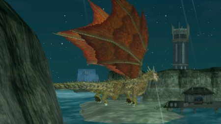
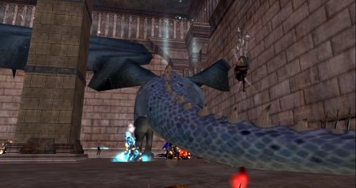

Back to: [West Karana](/posts/westkarana.md) > [2007](/posts/2007/westkarana.md) > [February](./westkarana.md)
# EQ2: There be DRAGONS! Let's kill them.

*Posted by Tipa on 2007-02-10 00:19:55*

There be further foul denizens cluttering the shores and deeps of Norrath, and it's my intention to carry on in the grand tradition of halflings everywhere and watch them die.

Except Tarinax, of course... he's *already* dead...

**Darathar**... tricky guy. Lures people into Maiden's Gulch to "save him" in his mortal guise as the Sage of Ages. But it's Nagafen who is the villain, and the Sage wonders if we could have some words with him -- of course, he'll teach us the dragon language so we can. Naggy won't tell us anything until we resurrect his ancient love, the gracious Lady Vox. And once we do, he tells us that Darathar has stolen the prismatic egg, his last remembrance of his fated, forbidden romance with a white dragon. If we avenge him and her memory by killing Darathar, he will reward us with weapons recovered from the tomb of the great Kerafrym.

And so we come to the Isle of Refuge. Darathar thought we would never find him there. He's taken it over, kicked all the newbies out, filled it with his drakotan legions and subjugated orcs.

We killed Darathar. Naggy thanked us for doing that. We couldn't save the egg, but that's okay, Naggy said he had bunches. Still gave Dera that nice glowy mace, though.

**Vyemm**... I'm in this picture. See if you can find me. Hint: I have a dagger that glows red. I was revived, though, so Vyemm didn't get the PKP (person kill points) for me. And anyway, we got him first!

He used to be this deadly guy in the North Temple of Veeshan; he flung people about his room, but I once wielded his fang when I was Tipa, halfling rogue, in EQ1. Five hundred years later, I'm hunting him down again, hoping to get another fang.
I don't know the lore about him. It's told a bit at a time as I work on Deathknell access, and I haven't reached that part of the story. But what do you really need to know beyond the fact that he is a dragon and he needs to die?

It took us six and a half hours to get deep enough into Deathknell to find its master, Tarinax. What's his story? Well, plenty of quests in the Feerrott tell of him. A bone dragon with a heart of fear.

I'm betting he was that bone dragon that used to prowl around the Plane of Fear back in EQ1. I guess I'll find out for sure once I finish that key.

If it IS him, death has been good to him. Master of a huge dungeon, an army at his command... much nicer than the almost incidental kill he was back in the old days.

It just doesn't feel like a raid unless there's a dragon at the end.
## Comments!

**[Stargrace](http://mmoquests.com)** writes: Just wanted to point out quickly that Deathknell = Deathtoll.

---

**[Tipa](https://chasingdings.com)** writes: Deathknell is in EQ1, Prophecy of Ro expansion. I get so mixed up so much of the time :/ Thanks for the correction :)

---

**[Stargrace](http://mmoquests.com)** writes: Np's I just thought I had missed some sort of expansion along the way *chuckles* Got excited for a second or two.. *really hopes unrest comes out soon...*

---

