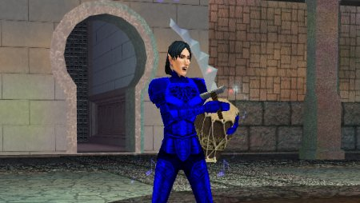

Back to: [West Karana](/posts/westkarana.md) > [2007](/posts/2007/westkarana.md) > [February](./westkarana.md)
# EQ2: The Fashionable Bard

*Posted by Tipa on 2007-02-12 03:03:39*

The Slavering Azid finally let go of his bard legs tonight. I *told* Taps, the other bard (a dirge, poor guy) on the raid, that when he went AFK to get his kid that bard gear would be sure to drop, and it did... but I doubt he was unhappy with the Nightchord wrists and boots he got.

Anyway, my combination of Vhalen's and Nightchord armor just happens to match, so now I look fine in bard blue. After the raid, a couple of us finished the Rain Caller heritage quest, so I got a shot of my new armor and new bow picking off some vampires that were trying to pick *us* off.

Blue's always been the color for bards... but EverQuest 1 bards had little use for subtlety... pastel turquoise? NAAAA... let's do a BLUE.
## Comments!

**[Adele](http://www.adelecaelia.blogspot.com)** writes: Blue is a color of Tranquility. Congrats on the armor!

---

**[Tipa](https://chasingdings.com)** writes: Thanks!!!

Now, if a couple of weapon upgrades would come my way :)

I STILL don't see how other troubs can get 800-1100 dps in a raid and still do what troubs do. I'll have to make a post someday on all the ways I tried to improve my dps on raids (and a lot of them worked). It involved a lot of time swapping out gear while parsing fights against gray heroic giants in Sol's Eye though...

---

**[wilhelm2451](http://tagn.wordpress.com/)** writes: That is a pretty stylish outfit. A great screen shot too of you loosing an arrow there.

---

**[Stargrace](http://mmoquests.com)** writes: I've seen (personally) a troub easily parsing 1,200 raid wide -- depending on the group make up. Add an illusionist, a wizard, and a troub, and that group will pretty much out parse the entire raid -- especially if that troub has lots of proc'ing gear. The stuff that goes off every time you cast a spell. Add a templar to the group who gives a bonus to proc'ing gear, and you're sailing. 

My illusionist was parsing 900-1,000 or so in treasured gear, with a few key pieces. The proc from grizfazzle's stick, the helm of flames from T6 courts raids, the fitzpizzle protector from the second last claymore quest, and the earring that has the fire proc (comes from a simple collection quest, and the scout version has a proc as well), all of these added together = proc heaven and combine it with troub's dmg spell that goes off every time you cast a spell + wizards spell that does the same thing = oh gawd dps city.

---

