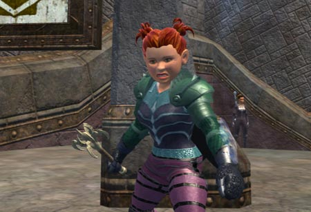
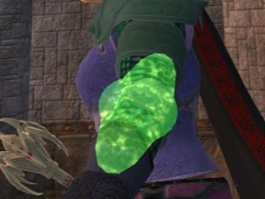

Back to: [West Karana](/posts/westkarana.md) > [2007](/posts/2007/westkarana.md) > [February](./westkarana.md)
# EQ2: Waiting for Kunark

*Posted by Tipa on 2007-02-23 14:55:04*

Rumors have the next EQ2 expansion as "The Rise of Kunark". That's a small surprise; I was expecting them to follow up "Echoes of Faydwer" with another adventure pack, not something as grand as a whole 'nother expansion, especially one that opens the lands that really launched the original EverQuest into MMO history.

The job SOE does here is so critical to EQ2's future... so many people from EQ1 and EQ2 are off trying Vanguard. Guilds all over EQ1 are imploding; I expect the same from EQ2 soon. Vanguard doesn't cost anything extra for people already on the Station Access plan, so it's never been easier to leave EQ.

SOE has to do something so mind-bogglingly original with Rise of Kunark that it defines the EQ2 experience the same was Ruins of Kunark did for EQ1. That was the expansion that made the game a raiding game, that set players apart, and gave real goals and enough of them to keep people always working. Epic weapon quests, a whole new race, dragons and enough lore to choke a historian, Trak and VS and KC and OS and HS and LoIO and Chardok...

*Does this boat dock at the outpost in Firiona Vie?
*
I don't talk like this normally but dammit, SOE has got balls to come out with Kunark so soon. I expected Odus this year and Kunark *next* year. These are big guns they're pulling out. They better be able to back them up with some serious firepower. The fallout if Kunark isn't amazing could kill EQ2. Kunark has to make EQ2 a whole new game.

I love the game as it is now. But that won't be enough. Kunark rewrote EQ1, and it made EQ1 great. Kunark has to do the same for EQ2. By bringing it out so early, SOE *must* believe they have something that will make EQ2 absolutely new.

*Help me with my epic, THEN I'll heal for your stupid raid!
*
But the EQ1 developers have been rewriting EQ1 each expansion and that hasn't been enough. EQ1 is a great game, but it makes no sense to have development split like that. I want those Buried Sea pirate battles in EQ2. I don't want to have to play multiple EQs to get the full EQ experience.

So, here is my idea of a transfiguration that will make people sit up and go OH MY GOD. You see where I'm going?

Merge EQ1 and EQ2. Bit by bit. First step is: if you have a character on EQ1, you have that character on EQ2. On new servers of course. You can't have the same gear of course, but for each piece of gear you could have on EQ1, you get comparable gear on EQ2. Yeah, given EQ1's advanced age, you'll find people logging in for the first time at max level and with raid gear. They'd also be given the opportunity to pick their variety of class (my cleric should be able to become an Inquisitor even though she's a halfling) and their race.
That's a HUGE task. But that's only where it starts.

Second thing SOE needs to do: Make Kunark zoneless.

All the continent, one zone. The dungeons and cities can be in their own zones but the wilderness.... I want to run from the Dreadlands to Frontier Mountains to the Lake of Ill Omen to Warslick's Woods without hitting a zone line.

Third thing SOE needs to do: Every dungeon in the original Kunark, is in the new Kunark. But bigger and better. And though we want to see how things have changed in 500 years, we want to keep what made EQ1 so great. Non-instanced dungeons planned in nice sections with good loot.

Yeah. That's a rewrite of the game. And a sort of character moving that has *never* been done at this scale. It's a huge investment.

But it's Kunark. It *deserves* it. And more than that, it's what SOE should have done in the first place -- rewritten EverQuest. They didn't, and now EQ1 is old and dying.

It's not enough to toss in another five or ten levels and a new race. Not now. Kunark needs to reinvent the game, and it needs to bring the two EverQuests together. All that innovation happening on EQ1 where nobody sees it? I want those people working on EQ2.
## Comments!

**[Kampfer](http://guildportal.com/Guild.aspx?GuildID=135821&#38;TabID=1155365)** writes: You just hit the nail on the head. The merging of eq1 and eq2 (separate servers of course) would allow high level people in eq1 to come over without totally throwing away years of work. The zone less rewrite of the game would be a big hit as well. Even if it wasn't completely zone less like vanguard but at least merge like antonica/thundering steppes, everfrost/permafrost sinking sands/pillars of flame and of course all of EoF would be cool zone less. Now they have made the zones bigger it seems like with each expansion but I think they can do more. A big one would be making Qeynos and Freeport zone less within the city walls or something.

---

**[Tipa](https://chasingdings.com)** writes: It would be great to have the older zones become seamless as well. I think that would be tough with older content. Kunark is new, though. Maybe they could just build it in from the start.

EQ2 was a sequel. With a separate, truly new game, you wouldn't expect to bring your character over. But a sequel? We should have been able to bring our EQ1 characters over from the start, as close to as they were on EQ1 as possible.

---

**Zyorel** writes: I hate to be cynical, but you all know its all about the money. I think the EQ2 developers knew a lot of people get bored when they reach level 70 with all the AA's possible. They wanted to increase the time people would be playing before this happened and players moved on to say WoW, Vanguard, or similar games. I think the only way this would happen would be by petition (not in-game, but say, start a website with people signing a petition), or by a huge number of players saying on EQ2 forums that they would leave if these changes didn't happen. 

I started playing EQ1 in 2000, and EQ2 in 2004, shortly after launch. I really wasn't very interested in EQ1 after I got into EQ2, mainly because it seemed to be slower, taking longer to finish a quest or whatever. In EQ2 I can log on for 1 hour or less and still accomplish something (especially with lower level chrs.). This seems to still be lacking in EQ2. Solo playability is lacking. I recall many nights of trying to get a suitable group together for a quest for 30 min. or more, then members getting frustrated and leaving or jumping to another group. I imagine this will only get worse with so many leaving EQ1 for Vanguard.

The zoneless thing has to be doable, maybe in bi-monthly updates or something. WoW started this way and still is zoneless (for the most part, according to my son). I could never really get into WoW myself, but it has some very strong points that SOE could learn from.

I myself would love to bring my high level EQ1 characters over to ANY EQ2 server, and would be happy with just basic gear, or even none, if need be. And I do agree this should have been an option (albeit with limitations) from the start.

---

