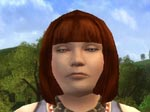
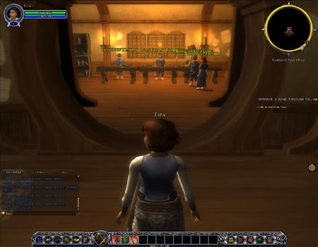

Back to: [West Karana](/posts/westkarana.md) > [2007](/posts/2007/westkarana.md) > [February](./westkarana.md)
# LotRO Stress Test Notes: Introduction

*Posted by Tipa on 2007-02-24 14:23:13*

I'm writing these notes as I am playing the game. They may be a little scattered :P

Character creation: No female dwarves? I suppose they could be male *or* female and you just don't know. Hobbits look decent. The Hobbit movie makes hobbits look too long in the torso and short in the leg, but the character models in the selection screen look good. All the races look good in character selection.

Hobbit class choices are Minstrel, Guardian, Hunter and Burglar. At this screen, I don't know any details about the classes. Those would probably have been described in the manual. Years of MMOs have taught me that I like support characters best, and since Dina on EQ2 is a hobbit bard, I'm going to make a hobbit minstrel here.

Next screen is class selection. Burglar - role: debuffer. In other games, the stealthy rogue class is used for positional high dps attacks. Interesting that the burglar shares with EQ2 scouts the ability to start good combo attacks. This feature is little used in current EQ2 as not having beneficial enough effects to bother with.

Guardian - tank. No surprises there. Hunter - role: Nuker. I'm not sure "nuker" means that much to a new MMO player. Think they should lose the slang here. Hunter would be the closest to the EQ2 scout archetype, or the EQ1 Ranger.

Minstrel - role: healer. Well, there ya go. I play healers all the time. So this is a good class for me. I'm able to zoom in and out of the paperdoll on the screen, but why? I don't see anything I can change about her appearance here. The "exit" button is grayed out for some reason.

Continuing zooms me in and lets me choose name and appearance. Looks roughly analagous to EQ2's character creation, way beyond EQ1 and WoW, fewer sliders than Vanguard. One of the sample hobbit girl names is Dora :) Choosing Tipa which, according to the guidelines, is a very valid hobbit name. It should be! I took it from one.

Eye color - most selections are way too bold a color and look unreal. The very left edge of the color chart has some paler shades. I choose pale blue like that woman from that 80s cop show with those disturbingly pale eyes. What was her name...

Hair styles - all suck. Apparently hobbit women have a thing for sideburns as it seems half the styles have them. I swear this Cleopatra bob has hair glued to her face.

Body type - slider goes from big butt, skinny shoulders to skinny butt, fat shoulders. Weird.

Origin - three selections, and each changes the default color selections for eyes, skin and hair. Nice! I do like that. Fallowhide was the default, so I am going to go with Harfoot and see if I stand out in the crowd. I can't get those pale eyes so I'll choose a nice mossy green that stand out well against the bronze skin and dark auburn hair. Very woodsy, earthy, not much like those aristocratish Fallowhide newcomers.

Entering Middle Earth. Transition screen with game hints like old EQ1. Oh good, screenshots now save to disk instead of having to tab out to Paint and paste them in.

UI: Hey, where have I seen this before? Oh yeah, WoW. I wonder if I need to be told that NPCs with no special role are TOWNSPERSONS. Shouting information at me that I don't need to know. Just like WoW and EQ2, I can tear off the tabs of the chat windows. Tab for IMs. Instant messaging? Another anachronistic term. That could be cool, though, if it allowed for talking with out-of-game IM clients.

Starting characteristics: Specialized Equipment, Daggers, One-Handed Swords, One-Handed Maces, One-Handed Clubs, Light Armour (note British spelling. Will they be consistent?), Lute Use, Small Size, Hobbit Toughness, Rapid Recovery, Hobbit Courage, Resist Corruption. Music here reminds me of FFXI Online music, that's a good thing.

Screen tells me I have a quest. Instance: A Road Through Th... What is an instance? Is this something MMO newbies should know? This is a programming term, every time I see it used in a game sense, I feel a little disconnected. Why can't they call it an Adventure? Adventure! A Road Through Th... okay clicking on that gives me the full title, A Road Through The Dark. It also reveals why I should talk to Postman Took.

Any WoW player will be instantly familiar with quest trackers and quests but again, I feel this is not so clear for someone new to the genre. Or is it safe to assume that all LotRO players will be familiar with WoW? It may be.

This would make a good expansion for WoW. I mean it. Why do expansions HAVE to continue the same world? D&D allowed for many different worlds. I'd like my troll priestess to find her way into Mordor some day, or for my little Hobbit minstrel find a hidden pathway to Ironforge.

Making expansions in different worlds or themes or genres but preserving the characters would let MMO makers do ANYTHING yet continue to keep their customers. One of the big problems with new games coming out is having to start from scratch every time. GURPS and Hero Games had ways to create characters that could be brought to other genres easily.

I have a new title: Tipa of the Harfoots. Not Harfeet? :)

Pop-up tooltips telling me good info. Interesting to note that the tooltip for how to move only came up after I had moved. Oh well.

Jumping and falling animation is nice. Alone of all the Hobbits, I wear shoes. I bet they talk about me behind my back. Tooltip reminds me that I need to right click on people to use them. Postman Took, I hope you feel used, now. Using Master Took gives a generic "Is there something I can do for you?" bit of speech, but does not speak his information. Sigh. I really love that about EQ2.

Using the generic Townspeople gives me little FFXI-like blurbs about how dangerous writing letters is these days. Tipa of the Harfoots is leaving the post office! Bam! Loading screen! A voiceover tells me that my road is "fraught with danger" in an upper class British accent.

First look at the outdoors. Very EQ2-ish. The stars Rigel, Betelgeuse and the other stars of the constellation Orion are bright in the sky, albeit the wrong color. Or maybe hobbits are somewhat colorblind. Ursa Major, Ursa Minor and there, the North Star. Nice touch. These are the skies of Earth.

Pressing some buttons. Here's the "Social" window. Three hobbits here in Green Hill Country and we're all level 1. Now five of us -- hunter, two minstrels, a guardian and a burglar. Sounds like a nice group! But we're all in our own instance. Raid window shows that yes, there are raids, and they can have four groups. Deed Log. Can I own property, I wonder? But it looks like a list of quests of some sort. Tabs for quest type and location. Why not just call them Quests? They sure haven't been shy about using other MMO slang. Inventory, skills, traits... now we know what all those characteristics we acquired do. Fellowship skills, I wonder, do you gain skills in acting as a group? I wonder if those are like formations.

Okay, off on our journey down the Stock Road. Checking my heading by the North Star and notice the night is getting a little foggy and there is a halo around the Moon. Nice! Very realistic.

Turning has some weird acceleration to it. I don't like that. Whoa! My screen just flashed! I'm stopped but nothing is happening. I wonder why it flashed? Continuing on... sometimes there is a jitter in the way Tipa runs and OMG A BLACK RIDER! Right there in the road in front of me! I stopped, he clearly doesn't see me. What do I do now? Clearly, running up to him would be a bad idea. Let's do the hobbit-ish thing and hide. If I were Elan, I'd start singing my "hiding from the scary monster" song about now. But there is no place to go. Surely, the game can't expect me to confront a Black Rider?

Oh well. Whistling a little cheery Hobbit tune, I skip merrily to my doom. Oh, he's looking for Baggins. He informs Bounder Boffin that Boffin is, in fact, a fool, and runs off. Let's go talk to Boffin. Tool tip informs me that this is Drama. Ooooh, draaaaamaaaa. He wants us to head to Old Odo's leaf farm just down the road to hide. Whoa. Odo? That sneaky shapeshifter, here? Okay, sure, we'll head down the road. There are only two ways to go on this road. Back the way I came, to safety, or along the way the Black Rider went, to the leaf farm. Sure, THAT sounds like a good idea.

Ugh, how do I equip this knife? It's in my bags but I don't know how to equip it. Now I am feeling stupid. Hmm. I can equip and unequip my mace, but not that knife. I can't do anything with it. Well, Boffin is obviously not going to be finding his way through that door unless I help him, so off to do that.

Aha! I had dragged the combat window over that bag window. Silly me.

Okay, kung-fu spider-killing action. Pretty standard. Spammed my two special attacks and did a heal for good measure. I didn't have to target myself for the heal, which is nice. Spiders are non-aggro, I wonder why we must kill them? Why not just run past them? Combat is just like WoW, cooldown timers and all. Oh look, a tiny spider carapace, I will treasure it forever. I can't remember if Bilbo looted spider parts while fighting them in Mirkwood, but maybe we can start a new tradition. I wonder if doors need huge labels above them telling us this is a door?

More kung-fu spider killing action, I now have enough spider parts to make my own spider. Oops, door locked. Hope Black Rider doesn't come for me. At least I know I run faster than Boffin. Bwahahahaa. I wonder if I can betray to Mordor.

Out through another door. OMG BLACK RIDER and two brigands! I told you we should have gone the other way!

Yay, elves to the rescue! Leet kung-fu pointy ear action! Ah, now my "friends" want to interrogate me. Who am I? What was I doing out here? What is this, do you suspect me of wanting to betray to Mordor? BWAHAHAHAHA You will never catch me, coppers!

Sigh. Busted. This ranger, Amdir, is going to "accompany" me to Archet. He spells connection, "connexion". Wikipedia says a Connexion is a "circuit of prayer groups". The quest log also misspells "traveling" as "travelling". Quest designers should have spelling checkers available to them. Turbine, look into this, please. Is Hobbit a proper or common noun?

The calm conversaxion I am having with Amdir belies the fact that OMG WE JUST WERE THREATENED BY A BLACK RIDER! Nobody seems that concerned any more. Two buttons on the quest window - Finish Now or Finish Later. I wonder what they do. Shouldn't they be "Follow Amdir to Archet" or "Look Around Some More"?

I choose to Finish Later, but can't get past the impassable rickety wooden gates barring my way. I can't jump off the small stone bridge, either. Oh well, I guess I'd better talk to Amdir and "Finish Now". I leave incriminating spider parts on the Brigand corpses.
Cut scene details Amdir's further adventures. He's searching for abducted hobbitses. I squirm away and run into the dirt and squalor of Archet.

In Archet, joining the town chat channels and now there are other people about. Another hobbit pops in behind me so I wave, dance, and bow to him. But he ran off! I wonder if it's because of the spider mandible I've been sucking on?

Kate Henseed seems unsure whether my friend, Celandine, is a boy or a girl. She refers to her as a "lass" AND a "fellow". Archet must be the Miami Beach of the whole Shire region. I will receive 40 copper for talking to him. And some gloves! I hate when people want to talk to me, and feel I should give them money and articles of clothing just because they said hello.

Ah, the quest was talking about Celandine and Amdir interchangeably in the same sentence. Weird. Explains the gender confusion, though.

Refugee! Chicken! Chicken! Refugee! Refugee! Snake!

Snake? But... that's a person. Oh wait, it's another player. So. Snake Pliskin. I thought you were dead. Mundo Sackville-Baggins haughtily informs me that the only person who wants to talk to me in this whole town, is Amdir. I feel so loved. Well, when I lead the dread legions of Mordor here, you just remember how friendly you were.

Hey Amdir. Why are you leaning pathetically against this tree? Ranger up! Whoa. He wants me to take his place in the defense of the town. I guess he *does* want me dead. Grrr. Just give me that 40 copper... and your gloves... thanks.

I have to talk to a Captain Brackenbrook, who doesn't trust Rangers, but will trust me, who was just seen talking to one. Okay. And I get 50 more bright shiny coppers just for saying hello! OKAY! Hmm my friend Celandine, whom I have come all this way to see, won't speak with me.

To be honest, at this point in the game, I just want to go out and kill stuff. The WoW and EQ2 newbie experiences include plenty of killing along with their plot elements.

Hmmm. I zoned as I entered the Inn. I totally didn't expect that.
