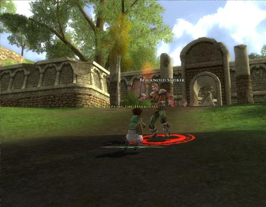
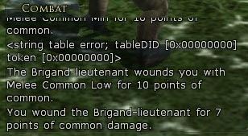
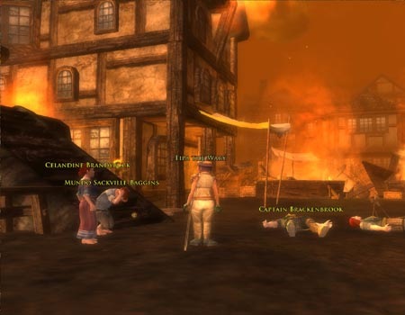

Back to: [West Karana](/posts/westkarana.md) > [2007](/posts/2007/westkarana.md) > [February](./westkarana.md)
# LotRO Stress Test Notes: Intro Part 2

*Posted by Tipa on 2007-02-24 14:36:06*

Ah, Captain Brackenbrook wants me to kill stuff. FINALLY.

Browsing through character window, come across a family tree. I wonder if this would let me form relationships among my characters? That would be cool. I can change my generation here but that doesn't seem to affect anything.

Loading window tells me that the first player or fellowship to hit a monster gets credit. Powerleveling technique?

Amdir directs me to my trainer and gives me more copper. What a guy. Maybe he could just give me all his copper now so I could stop bugging him.

Minstrel trainer says hello and lets me buy a new skill, which I then must drag to my hotbar. Yup, WoW. UI problem: The cost for my other skills is listed in silver and copper. The little icon for a copper piece is... silver. I check out the merchants in the vicinity but I can't afford anything they sell yet. I need to shake Amdir down for more money.

[I bank into my turns while running like an airplane](http://www.youtube.com/watch?v=RVUzQDZTois "Running in LotRO"). Wheeee Zooooom! Ah, now Celandine will talk to me! She wants me to gather kingsfoil with which to treat Amdir's wound. The finished potion will heal "morale". That's Amdir's problem? He just needs some cheering up? I have a song that adds 51 morale. Why can't I just sing him well?

Sigh. Didn't work. But it *should* have. Dangerous looking guy with a wicked pike needs ME to kill the wolves attacking his flock. Okay! Kung fu wolf killing action! Oops, sorry, I thought your sheep was a wolf in sheep's clothing! HAHAHAHA! Huh, no exp....

I kill the wolves, wander about and find a bandit hideout and kill them for armor, weapons and experience until I hit level 4. Very WoW-ish again. Using the special abilities as they cooldown is vital as autoattack doesn't do much. Being able to heal is a real advantage. I can take on a couple of villains at once. I still haven't found and kingsfoil. I keep looking for a small plant with a HUGE title of KINGSFOIL.

Oh, found it. It not only has a big label, it's glowing. Hard to believe everyone thought this was just a weed! It'd be cool if a lot of plants had a WEED label, and once you found a weed that was Kingsfoil, then you'd be able to find it easier after.

Wolves killed, kingsfoil gathered, heading back to get my rewards and also get my level 4 skills.

Ouch. These pants DO make me look fat. Plus I run really weird in them.

Got a title for reaching fifth level without dying. Good thing I made it out of the Blackwold hideout alive! After reaching town and selling, I have almost 22 silver. I buy Ballad of Steel and Ballad of Swiftness and still have 18.63 silver left. Time to go armor shopping!

Ballad of swiftness, a tier 2 ballad, requires a tier 1 ballad to be playing to activate. Interesting. Daggers increase crit chance and swords increase to-hit chance. Okay. All the hats look stupid. I just took a video of my char running, and in one of the funny hats.

Finally got quests to go kill those Blackwolds! Oh well, they die easy :)

Found some nice shoulders I can't use. Has been the only non-trash loot to drop for me! I also just got the final quest in the introduction, and the game warned me to finish all my newbie quests before I go. That was thoughtful.

While fighting the Blackwolds, sometimes the combat chat would fill with error messages. I think I got a picture of one.

A lot of the newbie quests give armor and weapon rewards so, like in most games of this type, you don't HAVE to buy newbie armor. However, I think the reason I could go back to Blackwolds Roost and kill six enemies at once was because I did buy it in advance.

Got a tier 3 ballad. I have to sing a tier 1 and a tier 2 ballad to play that one.

And that's it for the intro. Now to leave Archet behind!

Defending Archet from invaders. Archet should thank the spiders, they will kill the Blackwolds if I don't. I wonder what happens if I died? Oh, Archet is burning. I TOLD them to build homes in hills like hobbits ought, but nooooo and now look at them.

And here I am in Little Delving, intro done.

Gut reactions from the intro: Very WoW-ish. Quests were standard, loot was very typical. Character animations were severely off - running and walking look weird. Meeting a black rider right at the start seemed forced, especially since nothing in the rest of the intro made any reference to it -- the intro is about a bandit invasion that has nothing to do with black riders, though one of the bad guys at the end claims instructions from Angmar.

I kinda expected the name filter to stop hordes of Aragorns and Frodos from running around, but apparently not.

On the good side, aside from a couple of bugs, the game is very playable. The environments look awesome, and it ran very well on my computer, which is a couple years old. The character I chose, Minstrel, was very soloable, and people in game were raving about their Hunters and Captains.

Quest rewards were about as you would expect from an intro -- basic gear and weapons and enough coin to buy your skills.

I quickly forgot specifically what all my songs did. They usually damaged the enemy and buffed the group in some way. The combos had me watching the button bar during the fight to make sure I could hit the Tier 3 song at the right time.

I would have liked to have gotten a taste of a dungeon in the intro, but that probably won't be long coming.

Will I play when it goes live? It is too soon to tell. I don't see anything deal-breaking at this point. Like any MMO, my enjoyment will depend on the people I meet. Playing solo doesn't keep me interested.

Sorry for the incoherence of this post, I typed it up as I played through the intro :)
