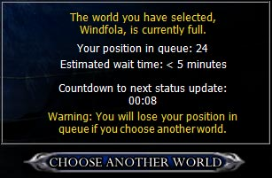
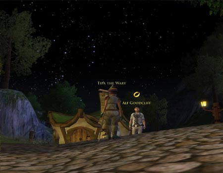
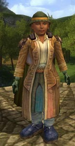
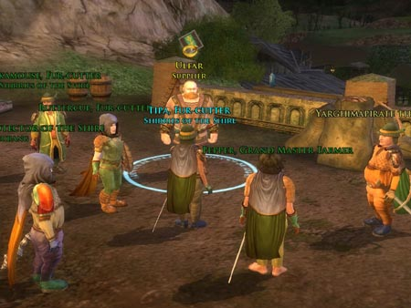
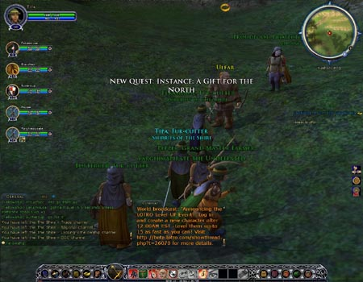

Back to: [West Karana](/posts/westkarana.md) > [2007](/posts/2007/westkarana.md) > [February](./westkarana.md)
# LotRO Stress Test: The Shire

*Posted by Tipa on 2007-02-25 12:02:57*

Returned to the game only to be put in a queue. The game initially said it would be fifteen minutes before I got in the game, but it was more like five. I hate queues. Not for the first time, I wonder what "Game Experience May Change During Online Play" really means.

Night in Little Delving and I can't help doing a little star watching before adventuring. Orion again, and Cassiopeia, the Seven Sisters and Taurus are all right in front of me. Strange what a little thing like putting a familiar sky in the game does for you.

First guy I see tells me about crafting. Crafting! I LOVE Crafting! So I'm off to the Craft-fair after getting a full slate of quests from Little Delving.

Michel Delving has all the town offices, Kinship charters, last name granters, all that kind of stuff. I grab a Hobbit Kinship charter in case I come across any like minded hobbits. I name my kinship "Shirrifs of the Shire".

Okay, out of the newbie area, I have to admit the quests, though simple, are pretty fun. Carrying mail but not letting nosey hobbits at it, or running around snatching chickens from the jaws of wolves...

You get a bonus skill for completing every quest in a region. The reward for completing all Bree-land quests is +1 Empathy. Also, you get titles for killing things -- the title for killing a certain number of wolves is Fur-catcher.

I knew carrying a hot pie to the Green Dragon Inn in Bywater would be a problem! Those hobbits can smell a pie from a league away.

You gain accomplishments for nearly everything you do. Using my main attack, Herald's Strike, 700 times gains me a 100% increase in its power. That's a nice thing. Using a skill SHOULD eventually make it stronger.

It looks like you can choose farming as a profession, and raise crops on the fields around the towns.

Story instances... using a reflecting pool allows you to join someone else who is doing a story instance you have done already.

Armor of each type comes in different styles with identical stats so you can build your own look. This is only true of bought and probably crafted items -- quest and dropped items look as they look.

--

That's the end of my notes from my first day of the stress test. I admit -- I got caught up in the game. Everything in the newbie introduction tells you that this is World of Warcraft: Lord of the Rings Edition. It's only when you get into the real game that you find out what sets it apart.

You get bonuses for everything you do. Killing monsters gives you a title (I've gotten Fur-cutter for killing wolves and Spider-sting for killing spiders. And I'm working on Slug-smasher.), and if you continue on, you get further benefits. You get upgrades for using every skill. Bonuses for completing all the quests in an area or completing certain fedex quests like delivering the mail or pies. You get bonuses for exploring... I even was surprised to start earning an achievement point for healing in the instance we did.

This game is the antidote to power leveling. You *can't* speed through the levels. Try it, and end up with a high level character who is significantly weaker than anyone else. Heals, for instance, that only heal half as much. Killing monsters doesn't give much experience -- at level 11, I need something like 10,000 xp to move to the next level. I won't level fast by killing monsters that give 10-20 xp.

Unlike WoW, or EQ1 or EQ2, this is a game for questers. The Shire, starting area for hobbits, has a *lot* of quests, and some are pretty fun while others are of the "kill six slugs" variety. That kill six slugs quest, by the way, was to make a potion that would dissolve the spider webs barring me from Lob's Grove. Once I'd done that, I found a walking tree that had been trapped by webs. I freed him from those and got another quest to escort him safely from Lob's Grove.

(I don't mean to say WoW and EQ2 don't have good quests, but in both games if your goal is to level quickly, your best plan is to find a good grind spot and go at it. That won't work in LotRO.)

I met up with another person in my Kinship (guild) and we formed a Fellowship (group) to take care of some quests in a marsh. This led to our first Fellowship quest -- to rid the hills of some dwarven brigands and the troll they were bringing to Angmar.

Ulfar warned us that the task ahead was a perilous one, and we should be prepared for a difficult fight, so we found more halflings to join us.

When we told him we were ready, he sent us to the instance. We'd been to this very area earlier, and it had been empty, but now it was filled with the dwarven band that was passing through that night.

We fought many dwarven guards until we reached the top of the pass and discovered the dwarven leader who had been doing various acts of mischief and mayhem in the area (stealing cows, souring milk and such), baiting a troll in a cage.

We defeated the dwarf bandit easily enough, but not before he had unbarred the cage and set the troll free.

He was no match for our Fellowship -- a Guardian, a Burglar, two Hunters and two Minstrels. We lotto'd the loot and returned to Ulfar who gave us further rewards -- I got a very nice longsword.

LotRO isn't vastly different from WoW or EQ2, and it is especially similar to WoW. The whole mechanism of crafting, mining, training skills, talent trees (called achievements here), and so on will be instantly familiar especially to those who play World of Warcraft. Perhaps with a greater emphasis on doing quests.
LotRO differs most from WoW in its PvP, or as they have it Monster vs Player, since you take on the role of a soldier in Angmar's legions. It is far more similar to DAoC's Frontier than the WoW battlegrounds. I'll go more into MvP in my next post.
