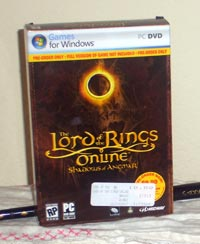

Back to: [West Karana](/posts/westkarana.md) > [2007](/posts/2007/westkarana.md) > [February](./westkarana.md)
# LotRO vs Vanguard

*Posted by Tipa on 2007-02-26 17:31:25*

After a weekend on LotRO, a game I wasn't all that excited about, I wanted to play more. After a weekend playing Vanguard, a game I was very much looking forward to, I never wanted to play again.

The difference? In Vanguard, I had an incredible sense that I had played this game before... many times... I found myself falling into the same patterns I had run in EQ, DAoC, WoW, FFXI and EQ2... kill stuff level kill stuff level kill stuff level.

I read all the blogs, and when I read about Diplomacy and how people are having fun with it, I can't help but shudder.... play the same card game against the same opponent for maybe a hundred times and hope to get a few points from it? So you can find a new NPC to play the card game with? How is this in any sense fun to someone WITHOUT a bad case of obsessive-compulsive disorder?

I tried LotRO this weekend expecting I would do my duty as a MMO player to at least look at games as they come out but not expecting more than another kill kill level kill kill level grind that I could safely skip.

Instead, I found a game where killing is de-emphasized, quests are plentiful, varied and creative, and the story is engrossing, if familiar. The classes are different. Combat is different. Group play is different enough that learning how to best work as a group will be a fun learning experience.

I did like one thing in Vanguard -- creating bard songs from fragments to make something unique. Think of what they could have had if they had given the ability to make your own spells and combat moves to every class.... now *that* would be something.

But I won't play even one more MMO where I have to grind. I have decided that I will only play games which are fun.
## Comments!

**[Tipa](https://chasingdings.com)** writes: When I went to Fry's to buy the LotRO preorder, there was this huge stack of PS3s.

No Wiis yet. They have no idea WHEN they'll get more.

Wish I could afford a PS3!

---

**Cameron Sorden** writes: "But I won’t play even one more MMO where I have to grind. I have decided that I will only play games which are fun."

I'm with you, but I'm also getting tired of NPCs that stand around giving me a reason to kill things, even an "interesting" reason. It's essentially grinding with a purpose.

I wonder if there's a market for jaded longtime MMO players that want a really complex and different system that's largely true-newbie unfriendly? You need newbies to survive as a game, but your newbies in this case would be players burned on WoW or other new-player friendly games that want a more complex offering.

Hmmm....

---

**[MrrX](http://mrrx.wordpress.com)** writes: Is that $19.99 ? I thought it was $9.99 ? I guess it doesn't matter too much, that's just trade-in when you buy the actual game isn't it ?

I'd encourage you to try diplomacy. I've tended to focus on the bits that are a bit hard to deal with, but try to always note that it's fun.

But you've got mob conning, the chance to take on something too hard or totally trivial, a turn-based mini game, and each turn you sweat a bit - is he out of cards ? Do I have enough Red to play my nuke card ? Can I squeak through with simple cards ? The tactics are fun, and the random element works very well from keeping things boring.

It'd also depend on how much you've played these Yu-Gi-Oh and MTG type card games; I never have, so I'm sure that's a plus.

Actually your post here is making me think I should do a play-by-play of a hard parley and see how it writes out.

---

**[Tipa](https://chasingdings.com)** writes: The box actually says $10.00; it's definitely weird not to see a price with a bunch of pointless '9's in it. Everyone I know would call $9.95, ten dollars...

And Vanguard is more or less free to me since I do have Station Access. I just don't have time to play the same game twice, and I already play EQ2.

Now, re: the grind. I am a crafter in EQ2, with a 70 jeweler and a bunch of lower level ones. I just spent half an hour grinding levels for a sage. Why is my grind any different from yours?

Largely because being a crafter gives me a real in-game advantage. I can craft spells and abilities and gear for my characters which, especially at the start of a new tier, gives them a huge leg up on those without a crafter at hand. Selling crafted items makes me about 70g-1 plat per day, and the guild comes to me for jewelry, tailoring and soon for armor and spells, which makes it easier for all of us in dungeons where high resists are needed, or adept 3 (or better) abilities are essential.

So I get real benefits from grinding crafting. And I don't even really grind crafting per se, I am grinding tradeskill writs, which confer benefits upon the guild as a whole and me in particular. It lets me easily afford a mansion to decorate :)

I just don't see Diplomacy having those same benefits yet. I have heard that eventually you'll be able to join a political party, which is... kinda cool, I guess. But does it really need to be done by grinding?

I believe grinding as a game mechanic should be done away with. LotRO has actually managed that, and EQ2 largely has (I never grind there. My characters level more slowly, perhaps, but at least I am always having fun!).

EQ1 is a shrine to the grind, and is a reason I hardly ever play now. The WoW grind was the reason I quit.

---

**Bhagpuss** writes: "But I won’t play even one more MMO where I have to grind. I have decided that I will only play games which are fun".

I see variations of this comment a lot nowadays, and I think it misses the point entirely. MMOs are a subgenre of a genre of a class of games (Games>Computer Games>CRPGs>MMOs). MMOs which emphasize the "grind" are a subgenre of the subgenre.

There's no reason for "grind" based MMOs to have to appeal to everyone, or even to the majority of players of the sub-genre, any more than all people interested in track and field sports have to run the marathon.

Personally, what you call "the grind" is what I call "amusing entertainment". I like the whole process of "kill stuff level kill stuff level kill stuff level". I find it interesting and involving. 

As it happens, Vanguard is chock-full of other things to do as well, many of which involve neither questing, crafting, killing or diplomacy. I have spent more time just riding around on my horse enjoying the scenery than pretty much anything else, and the game of spotting a distant landmark and working out how to get to it and take a close-up "photo" of it keeps me amused for hours. I already have more screenshots from Vanguard in a month than I had in EQ2 in 2 years.

I think the constant comparison of one game to another is purposeless. No MMO is intended to suit all tastes but there are enough for everyone with any interest in the sub-genre to find something they like, for a while, until the next one comes along. I'm more than happy with Vanguard for now, and probably for a year or two at least.

---

**[Tipa](https://chasingdings.com)** writes: I probably should have said, I will only play games I consider fun. I stayed with EQ1 long after it had ceased to be fun just for the people, because it was fun being with them even if the game wasn't giving me the things you'd expect from a game.

I do believe, though, that comparing games to one another is valid, because it answers the question, "which of these two games deserves my time?". The games themselves serve two very different types of MMO player; LotRO perhaps would best fit a casual gamer, and Vanguard would be better for the more hardcore fan.

Don't be surprised if sometime you see me compare Star Trek Online and SOE's spy game :)

---

**[DM Osbon](http://dmosbon.wordpress.com)** writes: LotR online is looking increasing a place where I'd like to spend my time & where WoW is becoming a less attractive proposition...

http://dmosbon.wordpress.com/2007/03/23/observations-experiments-11-lord-of-the-rings-online-special-in-the-spirit-of-adventure-discovery/

---

**Wes** writes: I don't care if this is a necro reply or not since it still applies. I read comments like the above and have to ask if any of the people tired of WoW clones and grinding have ever played Dungeons and Dragons Online. Other MMOs feel so... slow... in comparison. DDO is sort of like a third-person shooter in ways. Character building is the best in the business, and quests actually feel like quests, not "Go over there and kill 5 ants, then come back so I can send you back there to kill 5 slightly-bigger ants." And DDO is going free-to-play in August, so anyone reading this has nothing to lose.

---

