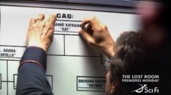

Back to: [West Karana](/posts/westkarana.md) > [2007](/posts/2007/westkarana.md) > [January](./westkarana.md)
# When We Return: Television's Finest (Part 1)

*Posted by Tipa on 2007-01-05 14:29:30*

It's a new year and time for all the shows that left us hanging last year to finally get around to rescuing us from that cliff. Read on for spoilers, rumors, speculation and rabid fangirl-ism for *Avatar: The Last Airbender*, *Battlestar Galactica*, and *Doctor Who*. Tomorrow I'll finish up with *Heroes*, *Lost*, *Robin Hood*, and *Studio 60 on the Sunset Strip*.

 I went without television for more than five years. There was nothing on worth paying the cable company to see. A couple of years back I started hearing about shows that sounded really intriguing -- I rescued an old 15" TV from my closet and watched a couple through layers of static. And yeah, they were good. They were incredible, actually. Last March I subscribed to cable and though I don't watch a lot of television, there are shows I never miss.

***Avatar: The Last Airbender*** isn't a nighttime drama. It's a cartoon on Nickelodeon, and you can see by the handy tag that this stuff is safe for anyone seven or older. Kids today are lucky. When *I* was seven, all we had was Scooby-Doo.

And though it looks like anime, and is meticulously researched with authentic Chinese fighting styles and settings, this is no product of Asia. It's a good old American cartoon, made in English for Americans. The basic plot: This is a world where people are divided into nations, each with their own magical fighting style: the Earth Nation, a complacent superpower who use their earth powers to block and deflect attackers; the antagonistic Fire Nation, whose fire-based powers compel them to attack and invade; the Water Nation, who live on the fringes of civilization and use their opponent's attacks against them; and the Air Nation, a race of peaceful monks with the air powers of evasion and escape who have been nearly entirely wiped out by the Fire Nation.

Keeping the four nations in peace is the job of the Avatar, a being who is reincarnated into a new body and new nation every time he dies. The old Avatar was of the Fire Nation, and disappeared a hundred years before the current story begins. The current Avatar is a twelve year old boy, and the last survivor of the Air Nation, Aang. He must master the powers of all four nations in order to bring peace to the world.

The story is a little hard to jump into, but they refer to past events often enough that it won't take more than a couple episodes to get your bearings.

When Season Two, Earth (Water was the first), ended, Ang and friends had finally rooted out the corrupt cult of Earthbenders at the heart of the Earth Nation. The exiled ex-general and his companion the crown prince of the Fire Nation found themselves living in the Earth Nation capital city just as the prince's sister, Azula, had taken control of the traitorous Dal-Ri Earthbender cult and set up a coup to dethrone the Earth king.

The exiled prince was showing all the signs of letting go of his hate and anger and joining Aang and his friends as another companion, but when his sister offered him an end to his exile and the love of his father back, he turned on the group to the distress of his uncle. His uncle will be the one, I have predicted for months when my son argued otherwise, to teach Aang his final power, Firebending.

Though since Aang recently learned to consciously enter the Avatar state where he has access to all the skills of all the previous Avatars, I wonder at the real need to learn the powers all over again, but there you go.

***Battlestar Galactica*** knows drama like no other show does. The story of ordinary people put under extraordinary stress and how they cope completely overwhelms the sci-fi setting. This show could be set in World War II, or present-day Iraq, or the Crusades for that matter, and I'd still watch. These are people for whom there is no light at the end of the tunnel, but that doesn't stop them from getting up each day and following it further. What else can they do?

Season 3 went on hiatus with the surviving humans and the Cylons at their heels discovering another clue to the fate of the mythical thirteenth tribe who set off long ago in search of Earth. The humans are looking for Earth because they need a goal, *any* goal, in order to continue on. The Cylons are looking for Earth because they believe the future of both the Cylon and human races is by interbreeding to form a new, hybrid race with the best qualities of both.

They don't particularly need the humans they're chasing. In fact they would much prefer to get to Earth without the human survivors sending any sort of warning.

I don't see how they'll ever find Earth. I do believe that in the remainder of the third season, we'll find the fate of the thirteenth tribe, and it will not be that they found and colonized Earth. They will have been destroyed or met some horrid fate, and both the Cylons and humans will have to learn to live lives without hope unless they learn to work together.

***Doctor Who*** ended its second series (and first with David Tennant as the Doctor) with his companion, Rose (Billie Piper), trapped in a parallel universe. Billie Piper has moved on to her old career of trying to be the British Brittany Spears, or perhaps acting, but in any event, she's gone now.

Last season saw the Doctor in a continual tussle with the secret British research organization, Torchwood (an anagram of Doctor Who). Torchwood was started by Queen Victoria with the primary purpose of seeing the Doctor not interfere with history, at least British history, any longer, and secondarily to find and exploit any bits of alien technology they could find.

Their experiments in using the energy that separates universes for power weakened the barriers enough so that both the Cybermen *and* the Daleks could push through, as well as the Doctor himself, by accident. The Doctor forced the Cybermen and the Daleks back through the gap into the void and sealed it behind them, but not before losing the love of his current incarnation, Rose.

It didn't take long for him to invite the very next floozy to stumble into his TARDIS to join him. What a guy. So broken up.

Scorecard at the end of Season 2: Doctor Who stuck in our universe. Parallel Doctor Who -- no clue, we never saw him. Rose Tyler in the parallel universe. Parallel Rose -- was never born, though her parents did have a dog named Rose. Rose's Mum -- in the parallel universe, shacking up with Parallel Dad. Parallel Mum -- turned into a Cyberman. Dad -- dead when Rose was just a baby, though in Series One, Rose did try to save him with disastrous results. Parallel Dad -- a rich tycoon. Ricky (Rose's boyfriend) -- in the parallel universe, taking care of his grandmum who is still alive in that universe. Micky (parallel Ricky) -- dead in the fight against the Cybermen.

Got all that?

When *Doctor Who* went on hiatus, *Torchwood* took its place. It's okay, nothing special and nothing I'd particularly recommend. After the *Doctor Who Christmas Special*, the adventures of Sarah Jane Smith and K-9, the companions of Tom Baker's Doctor, will (or is) airing.

Fans are deeply divided about the new *Doctor Who*, but apparently it is doing very well among non-fans and the Welsh, so there you go. Me? I don't miss an episode, but then I don't often go back and watch them, either. David Tennant is no Christopher Eggleston.

Tomorrow I'll finish up with *Heroes, Lost, Robin Hood* and *Studio 60 on the Sunset Strip*.
