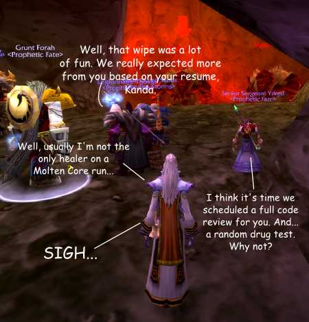

Back to: [West Karana](/posts/westkarana.md) > [2007](/posts/2007/westkarana.md) > [January](./westkarana.md)
# Corporate Warcraft

*Posted by Tipa on 2007-01-10 16:30:03*

In my job search, there is a question I dread hearing from an interviewer. And that would be, "Do you play World of Warcraft?"

It's great so many people play. When I lived in Escondido, this guy came over to borrow a Windows XP install disk (does this really happen? apparently...). He'd seen me carry computer gear into the apartment... a LOT of computer gear... and I guess he had a hunch I might be a person who might have one. Which I was.

Anyway, I happened to be playing WoW, and he looks at the screen and says, "Hey! I play WoW too!" Being a Marine, he naturally was on a PvP server. And from then on we'd trade hellos and WoW news when we'd see each other. WoW is so popular you can just run into people who play! It's great!

Around this time last year I started seeing stories like this one, "[Is World of Warcraft the New Golf?](http://www.1up.com/do/newsStory?cId=3147826)" People who work together, playing together. Or people holding meetings in game while doing an instance.

And I have to admit, this makes me a... little uneasy.

But it gets worse. Do you let your boss get all the purples? Pass on the Thorium nodes for brownie points? Change servers?

And you know what happens in the game won't stay in the game.

**Boss:** John, could I see you in my office?

**John:** Sure, be right there.

**Boss:** Or should I call you "Sluttella"...

**John:** I'll just be killing myself now, boss.

**Boss:** No, no. Just joking. But hey, can you dance like that in real life?

I better play it safe. Yeah. I better come up with a game *nobody* plays.

"Me? I play... um... Dark War of Asheron. Quest. Yup. Level 92. Uh huh. What's this 'Warcraft' thing?"
## Comments!

**[Adele Caelia](http://www.adelecaelia.blogspot.com)** writes: LOL... that gave me a good chuckle:)

---

**[Lishian](http://lishian.wordpress.com)** writes: I wouldn't play with coworkers or a boss unless it gave me some type of real world political clout.

just kidding...

---

**[tide](http://tidehorizon.blogspot.com)** writes: Last week I had a plumber come over to drain my heating system. He saw a WoW box around and excitedly began to interrogate me. Luckily for me I played the right side, and class. I don't know what he'd have done if I said, "Horde 4 LIFE!" or whatever. He kept going about the best ways to make money, lecturing me on new WSG tactics, how it's sucks to have to raid -4hrs on a PST server (being in AST). Was weird. And I am sure added to my service bill. True annoying story.

---

**krask** writes: OMG you could have had Grum in the picture instead of that other tauren :(

Hugs 
Krask

---

**[Tipa](https://chasingdings.com)** writes: I'm sorry :( Was just the first picture I came to that wasn't a crowd scene.

How's Iraq? Hoping you come home safely.

---

