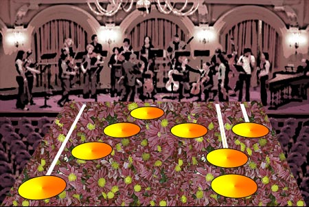

Back to: [West Karana](/posts/westkarana.md) > [2007](/posts/2007/westkarana.md) > [January](./westkarana.md)
# Kiss Your Air Cello Goodbye!

*Posted by Tipa on 2007-01-10 01:15:19*

Yoyo Ma? YO MAMA!

Yeah you, the guy who loses it to largo. Schizo for scherzo. Tantrums for tarantellas. Sawing away at the air cello through the entire winter concert season.

Take the symphony home with you!

Cello Hero brings the symphony to your living room!

Greatest hits from four centuries of cello's finest! Bach! Bann! Bantock! Bax!

Solo play or gather a dozen friends for multiplayer ensemble action! Or tab a friend for cello duels a la Dutilleux!

John Cage - One^8

George Crumb - Cello Sonata

Jonathan Harvey - Curve with Plateaux

Mauricio Kagel - Unguis incarnatus est

Alvin Lucier - Indian Summer

Giacinto Scelsi - Voyages

Dozens more! Rock out to avant garde classics like Wuorinen's "Cello Variations", or Iannis Xenakis' "Nomos alpha".

Live the dream! Dream the life!

CELLO HERO!
## Comments!

**[Tipa](https://chasingdings.com)** writes: Before anyone mentions it, I know cellos don't play chords. My idea was to have a scrolling F Clef staff coming down at you, which was actually the whole idea for the whole thing, but it looked kinda yucky. I dunno.

---

**[Lishian](http://lishian.wordpress.com)** writes: Couldn't a celloist play a two note chord (i think they are called diads or diatonic - its been awhile)? I could play a two not chord on my violin, when I was young, and I think the fretboard is basically the same shape.

Where's lishian.wordpress.com? ;)

---

**[Tipa](https://chasingdings.com)** writes: I'll add it :) I need to add a couple more I read all the time but don't have on my blogroll.

Playing notes on two strings is far more common on fiddle music than any cello piece of which I'm aware. While researching this (yes, sadly, I did research cello music (and this is all I came up with. Sad, huh?)), none of the scores did that, but what do I know, I play woodwinds :P I guess 'Flute Hero' can add Ian Anderson-ish harmonics and overblowing.

Which reminds me of when I was preparing Ian Anderson's "Bouree" for a flute recital I did years ago. Now they provided a pianist, so I had to condense all the other parts into a single piano part (thanks, Noteworthy Composer). I had a partner who I'd written an accompanying second flute part for, but she chickened out.

Anyway. I handed the piano part to the pianist and she begins to play through it... then she turns to me and says, "What's the deal with this bass solo? I'm not playing that!"

So I had to take it out.

True story.

---

**[Amber](http://ambernight.org)** writes: Oh dang, you had me going there for a minute! Ha!

Call me when they release didgeridoo hero...

---

**[Lishian](http://lishian.wordpress.com)** writes: Classical music, the piano and the violin were pushed on me at a very early age... 5 or 6 to be approximate. When I turned 9, I left it behind in frustration. My teacher, who was also my mother's teacher, was extremely hardcore. The guy had me crying while trying to play that fiddle and his wicked witch wife was teaching me piano. I later discovered heavy metal, punk and eventually Goth with which I played my guitar and sang. Unfortunately, I don't do much of the latter anymore. I sing in my car and in the shower though. hehe!

The chord thing was just a semi-educated guess and I know bass guitarists play chords sometimes. Technically, you could play a chord on the cello even if its not the standard to do so.

I wouldn't say you're wrong about the cello chord thing.

---

**[Tipa](https://chasingdings.com)** writes: I know it's technically possibly... well if anyone did it, I bet ELO did. Durn it, should add an ELO song to the song list just for fun. Did you see that Doctor Who episode about these random guys who got together to talk about Doctor Who (who in their world is, of course, a real person), and ended up forming an ELO cover band?

I wonder what other bands would be good for "Cello Hero". Penguin Cafe Orchestra, obviously. Kronos. Barber's Adagio for Strings. Though I find that one dull. Whatever song Susan Sarandon played for Jack Nicholson in Witches of Eastwick...

---

**[Lishian](http://lishian.wordpress.com)** writes: Last time I watched Docter Who was in the 70s. May have seen it, but I certainly don't remember.

I'm not sure how guitar or cello hero works... Are you able to use your own music with the game?

---

**[Tipa](https://chasingdings.com)** writes: No, you play along with pre-recorded and your performance itself is pre-recorded, you just press the buttons in the correct order and time to continue the performance.

As you increase the difficulty, the buttons you press (on the guitar-shaped controller) correspond more closely to the actual notes played on the song.

I play GH on hard. You play nearly every note, but most chords are simplified. And of course you only have five buttons on the controller vs six (or more) on a real guitar. That said, there are people out there who are both turning the guitar controller into a real musical instrument, and are figuring out ways of playing your own music on something like the game.

Though before it got to that, I'd rather just play it on a real instrument and have pre-recorded accompaniment, like in the "Music Minus One" series, or semi-random accompaniment like "Band in a Box". If you can really play the instrument, there's not much reason to play Guitar Hero, but it's really fun if you're just pretending :)

---

