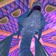
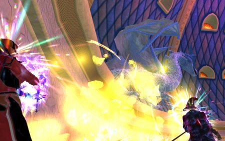

Back to: [West Karana](/posts/westkarana.md) > [2007](/posts/2007/westkarana.md) > [January](./westkarana.md)
# EQ2: Gorenaire

*Posted by Tipa on 2007-01-25 12:12:30*

Lauren over at [Mystic Worlds](http://notadiary.typepad.com/mysticworlds/) was bemoaning the fact a month or so ago that she [hadn't seen any pictures of EQ2 boss mobs!](http://notadiary.typepad.com/mysticworlds/2006/12/missing_the_god.html) She wanted to feel the danger and majesty of those fell creatures whom raids must take down.

She has a point. You can see every boss in WoW plastered over the Internet in a thousand places. EQ1 as well, if you go looking. Maybe it's good that information on EQ2 is so scarce that each zone is new and the bosses, surprises. But here's a glimpse at the ice queen of the Ascent of the Awakened, Gorenaire.

Gorenaire is said to be a short raid, thirty minutes, no more. And it probably is for raiding guilds. We have to open up the raid to the general populace of Befallen to fill ours, and you just never know who or what you're going to get.

One thing is for sure. The people who are any good at raiding probably are doing it already with their own guilds. For casual raiders, instructions like "keep the monsters with the group-wiping breath attacks pointed AWAY from the raid, and do your best not to get aggro that would turn the mob toward you" fight a losing battle with "no matter what happens, I need to be at the top of the damage list".

Gorenaire used to roam around the Dreadlands scaring experience groups and occasionally chasing a unhappy lizard to Karnor's Castle. She'd just go bonkers with her ice breath, then, suddenly realizing there were other people nearby, go on a rampage killing everyone near her. You'd end up with forty people just inside KC waiting for the bad dragon to go away, and laughing at the people zoning a train from deeper in who were about to become dragon kibble once they got outside.

Players grew in power over the years and fearsome Gorenaire became bard plaything Gorenaire. In the Age of Turmoil, she left the mortal realms and flew to her palace within the Ascent of the Awakened, there to await Kerafrym's return away from the swords and spells of the short-lived softskins.

Well, sorry, old girl. Guess who's at the door.

She's picked up a few tricks. Guardians of extreme power with their own deadly attacks. She'll take the tank and toss them to the other side of her lair. Knock back anyone else she sees. And sear you with her icy breath.

And everytime someone dies... or someone's pet dies... four icy blizzards spawn and attack the raid.

There'll be a white dragon-hide rug on the floor of the guild hall soon, but you have have to feel sorry for the grand lady. She only wants to be left alone. Well, her own fault volunteering to help guard Deathtoll from our greedy hands.
## Comments!

**Breen** writes: I love this article, as a new EQ2 player can you show me other ones you've done like this?

Comparing the good old EQ1 mobs to EQ2?

Great article.

---

**[Tipa](https://chasingdings.com)** writes: I have an article about more dragons, including Lord Vyemm (the toss 'em mob of old North Temple of Veeshan) and Tarinax (who, I maintain, is the old Plane of Fear's Dracoliche based on quests in the new Feerott) above this one.

Harla Dar (from Western Wastes), Aaryonar (first dragon of NToV), and Talendor (from Skyfire) are encountered through the Deathtoll access or Qeynos Claymore quests, but I haven't seen them yet.

Wuoshi (from Wakening Land) is encountered during the Tunare deity quest in a non-aggro form. He is also the boss of Emerald Halls and quite likely the target of the Void incursion into the Lesser Faydark. I haven't seen him yet either.

I suspect Severilous (from Emerald Jungle) may be in game because I have seen a Dragon Hero Bracer linked, which was his common drop. I also would love to know the fate of Sontalak, Trakanon and Yelinak. I think we'll find out about old Trak when Kunark opens on EQ2.

I've seen a few of the non-dragon nameds from EQ1 pop up -- Efreeti Lord Djarn is in Solusek's Eye now in an instanced sub-zone. Noble Dojorn was moved from Plane of Sky to an instance in Temple of Solusek Ro. Fright moved from Plane of Fear to an instance in the Temple of Cazic-Thule... if I have a chance, I'll stop by and say hi to them :)

---

