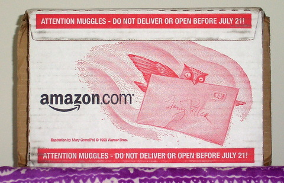
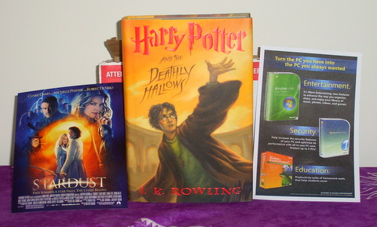
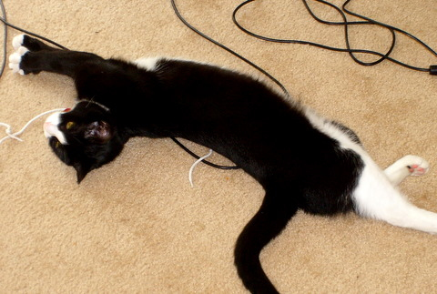

Back to: [West Karana](/posts/westkarana.md) > [2007](/posts/2007/westkarana.md) > [July](./westkarana.md)
# Expelliarmus!

*Posted by Tipa on 2007-07-22 11:22:39*

'Twas near the eleventh hour of yesterday before the Owl dropped a package at my door. "I hope you have your reading glasses!", quoth she, unusually talkative (for an Owl).

I tapped it twice with my wand. "*Capsa Adaperio!*" The box flew open

Inside was the tome for which I had waited so long, as well as an advertisement for a Muggle cinema and a flyer for Microsoft Vista, undoubtedly placed there by a Death-Eater in the employ of Owl Mail.

I started to read. The sun faltered and weakened as the dark tale unfolded. At last, I could bear it no longer. I paced the room, my heart distraught. If only I had Dumbledore's wisdom with me now! For a moment, I thought I caught a glimpse of his bright, clear, blue eyes, and a word came to me -- "Scones!"

Scones? Wasn't that the name of Ron's rat? No, that was Scuppers. Who was the evil Pettigrew in disguise! No, Dumbledore would never mention that name to me. Maybe I should make some...?

So I made some scones. They were just the sort of thing needed for the long night ahead.

Mmmm.... scones, Diet Coke, and a good book. Heaven!

I didn't have the strength to finish it all in one sitting, and reluctantly, went to bed.

I spent the morning lost once more in the book. The search, the surprises, the betrayals and the heroism... It didn't end as I expected; in fact, I think maybe it was entirely different than I thought. But I won't say another word, except to have pity on my poor cat...

The final battle (well, of course there is one!) was so beyond imagination that a *Immobilus* curse sprang from the pages of the book and good Isis was right in the way.

She's better now.
## Comments!

**[DM Osbon](http://sweetflag.wordpress.com)** writes: Ah you gotta a nice cat there...

---

**[JoBildo](http://bildos.blogspot.com)** writes: I finished it last night as well, Tipa. I am completely and utterly spent. But it was worth it. I wrote my quick thoughts on it at my place.

---

**[Cassaendra](http://cassaendra.blogspot.com)** writes: Hi Tipa, 

Wow, you finished that book already?! Amazing! Sorry about your Vista woes. :(

I need to show you a pic of Hoppkins cat. Our cats will be like the 3 Muskateers! :P 

Miao! 

- Cassaendra

---

**[Mythokia](http://blog.thermonuclearexchange.com/)** writes: I bought it on the launch but realised I had forgotten the details in book 6, so I had to read 'The Half-Blood Prince' again before proceeding on.

---

