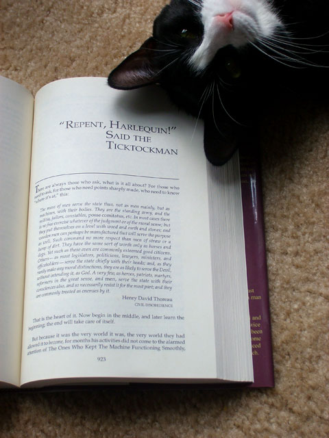

Back to: [West Karana](/posts/westkarana.md) > [2007](/posts/2007/westkarana.md) > [July](./westkarana.md)
# Repent, Harlequin! This ain't Harry Potter...

*Posted by Tipa on 2007-07-28 11:34:55*

> There are always those who ask, what is it all about? For those who need to ask, and for those who need points sharply made, who need to know "where it's at," this: - *from "Repent, Harlequin!" Said the Ticktockman, Harlan Ellison*

Ellison leads into an excerpt from Thoreau's *Civil Disobedience*, which ends:

> A very few, as heroes, patriots, martyrs, reformers in the great sense, and *men*, serve the state with their consciences also, and so necessarily resist it for the most part; and that are commonly treated as enemies by it.

The ruthlessly efficient world of 1965, with the dads all trooping off to work and the moms all doing the laundry and making meals and the kids all putting on their nice pants and shirts and dresses to go to school and changing to play clothes when they got home -- that was the 60s to me. The music on the radio was Beach Boys and Beatles and Bobby Vinton and the Supremes. Radio, school, television, books, all made precisely to convince the masses that everything was fine & super cool & the best it's ever been and we should be happy.

In Ellison's story, time is the most precious thing. Being on time is the bestest virtue. A toothless cog in the industrial machine? That's high praise, and its all presided over by the Master Timekeeper, who keeps everything running, precise, to the second... because if *you're* late, then you just made *her* late, because she was depending on you. And now *he's* late and this whole *company* is late and society is grinding its gears, the perfect order ruined, because you didn't wake up in time to catch the train to work.

The Timekeeper, the Ticktockman, takes these seconds, minutes, hours lost, from your life. It's an important government post. And everything runs smoothly... until some madly dressed maniac dumps a crate of jellybeans onto the moving sidewalk and now everyone is late.

It's only been forty-two years, so I won't spoil the ending. Just a hint, though: someone is late.

I read Ellison and others from huge books in the back shelves of the "adult" floor of the Uxbridge Public Library, a cool, castle-like building with a tower, right across from the town square. It's still there, having traveled from the sixties to the 2000s in better shape than me.

The places I read about in those books weren't the kinds of places I had ever lived, or heard about. Not just because they were set in the future, or on other worlds... but because they were about people who more than anything saw what they had been given, and like Oliver Twist, wanted *more*. More diversity, more life, more surprises. Ellison's story, which won the 1965 Hugo award, told me -- *look, kid. There is more. Lots more. Don't settle for what they let you have.* And he pointed toward Thoreau and Orwell and said, *It's not just me telling you this.*

Big lessons when you're eight.

*Repent, Harlequin!* and approximately ten thousand of his other stories are gathered together in a huge book called *The Essential Ellison*. I've had it for half a dozen years. When I need a jolt, I reread *I Have No Mouth and I Must Scream*, or *Adrift off the Isles of Langerhans*, or *Lonelyache*... He doesn't care if anyone likes him personally, he just wants you to wake up.
## Comments!

**[yunk](http://www.plutospage.com/wow/)** writes: Starting this weekend on ABC is a 4 part series Masters of Science Fiction featuring stories by Harlan Ellison and Robert Heinlein among others, and some actual decent actors. Looks like it will actually be good.

http://abc.go.com/specials/mastersofscifi.html

---

**[Tipa](https://chasingdings.com)** writes: Really? Dang! Thanks!

Ellison did the old Outer Limits story, Demon with the Glass Hand; and the old Trek episode, City on the Edge of Forever... the one where McCoy ODs and jumps back to WWII.

---

**[Shreya](http://)** writes: hi i enjoyed the read

---

