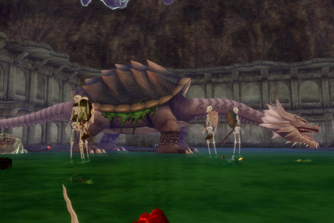

Back to: [West Karana](/posts/westkarana.md) > [2007](/posts/2007/westkarana.md) > [June](./westkarana.md)
# EQ2: Turtle Soup

*Posted by Tipa on 2007-06-07 07:08:42*

Who will pull first -- us or them?

We were gathering to kill Cheldrak, when someone noticed that the Direvine Matron, one of the hottest contested bosses in the game, was up, in the same zone we were in, and there was nobody there!

Well, except maybe one or two people from Fallen... so, it was a race.

Nothing brings back EQ1's glory days more than racing for raid mobs. Nagafen for cleric epics; Trakanon, Venril Sathir, Yelinak, Tormax, Statue, Dain, Aaryonar, Vyemm, Tunare, Cazic, Inny, RZtW... the best times were always finding a boss, gathering, and taking it down before another guild could get to it. EQ1 died for me when all the bosses went instanced. Sure, guilds wouldn't have to compete any longer, but the competition is what made it fun to begin with.

Fallen pulled first. Our raid leaders kept pulling us back because it was *laggy*. Not only were we and Fallen there, but Reborn was in the zone as well, doing Cheldrak. The server started smoking a little. Fallen nearly killed Matron, but lost it at the end... they blamed it on lag, specifically, *us* making lag for them. We formed up and pulled. Fallen kindly stood right in the middle of the raid, chain summoning pets and doing all they could to lag us out. Well, we eventually lose it, though I'm not certain it was lag (didn't help, though). Fallen pulled again, and by this time another guild, Clan of Shadows, arrived. Fallen loses, Cos pulls it and wins. We all smile, wave, grats, and head to Cheldrak.

Soon to be a dead turtle...
Cheldrak is this turtle thing in the Isle of Mara. It's instanced, so no racing to this particular guy. His trick is tossing out a skeleton now and again that can only be killed by a certain archetype -- so my job was to keep troub buffs and debuffs up, dodge AEs, dps as much as I could, and occasionally drop everything to help kill a mob only scouts could touch.

Soon Cheldrak was dead, and I looted a bracer from his steaming corpse. Ninja bard :P

We finished the night in a quick Lyceum run. I've done the whole thing before with Revolution, so no new AAs, but I did complete the Amygdalen Invasion quest which runs through it which pushed that green bar up some.

Aside from the targets, the raiding wasn't any different than it would have been with Revolution. Lyceum was the same with EC as with Revo, no better or worse; but Revo would have stopped with one raid. Last night we were going to finish off the KoS raids by doing Deathtoll, Halls of Seeing and Labs, but DT took too long (though finally got my AA for killing the snake in the water, the only mob in DT I had not killed), so after HoS we broke.

Hoping they'll do some of the DT key dragons...

Was it worth leaving Revolution to raid more? Revolution has canceled raiding for now, but they are organizing pickup raids so I'd be raiding pretty much the same zones were I still with them. Raiding 5+ hours a night, though, uses up all my free time. I'm not even sure we get days off. I only need to keep a 60% raid average but more is certainly expected. Real life takes precedence, and nearly every weekend has family stuff to do, and now that I am a 'raider' once more, balancing game and RL gets tricky. Raiding every night, game *becomes* real life.
