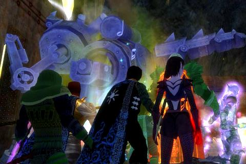
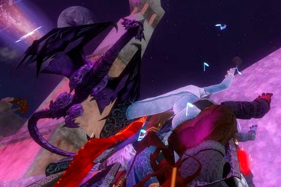

Back to: [West Karana](/posts/westkarana.md) > [2007](/posts/2007/westkarana.md) > [June](./westkarana.md)
# Freethinkers, Clockwork Menace, Labs of Lord Vyemm

*Posted by Tipa on 2007-06-08 01:14:16*

*Nice place for a pumpkin...*

I joined Eternal Chaos wanting to raid, and raid we do. Tonight we started off with Freethinker's Hideout. This is a fairly short instance in the Loping Plains with just four bosses. I don't have any decent pictures of the fights themselves, as 20 people gathered around one poor, frightened vampire... well, what's there to see? We're so MEAN to them. I swear. Vampires need love, too!

*Eternal Chaos outside Freethinkers*

I'd never killed the last two nameds in Freethinkers, so I got AA for that, bringing me to 86. I've had to respec. Having so many points in my INT line was amusing to them. They needed me to be strong. To be a... BLADE DANCER.

> *"Anata wa 'Blade Dancer' date to iimashita.* *He say you Blade Dancer. He say you under arrest, Mrs Tanglewood."*

*He spoke cityspeak, a mishmash of German, Japanese, Spanish, what have you. I knew the lingo. Every good bard did. But I wasn't going to make it easy for him.*

*I was quick when I came in here, Bryant. I'm twice as quick now. Yay, Selo's.*

Blade Dance makes my group immune from AEs, as long as they don't take any damage, the monster only AEs once every ten minutes, and all fights last ten seconds or less. *I* don't consider it *that*valuable, but they do and so, for them, I did it. I'm also fiddling with the Troubador AA tree to make Precision of the Maestro last a little longer. They got those AA for me, after all. My AAs currently are toward maximizing my buffs and my mez. They hardly ever (read: never) ask me to help with the mezzing on raids, even on those mobs I can charm... AH WELL...

I rescued a nice ring from being transmuted. That's two pieces of gear in three days; not too shabby!

After the last Freethinker bit the dust, we headed to the Clockwork Menace Factory for eight minutes of doom. From first mob pull to last boss kill, eight minutes is all you have. We tried this in Revolution but just weren't fast enough. Tonight, EC was, but we were on the last minute. (I'm the vampire in the picture above. Showing solidarity with my bfs and gfs back in FTH, doncha know. Somborn REPRESENT!)

We closed the night raiding the Laboratory of Lord Vyemm. Neither my shoulders nor boots dropped tonight (again...) but Labs is always a fun run. The picture above is of the Young Dragon strafing us as we cower on the wall above the Halls of Fate. A human named Bard brought down the dragon Smaug with one black arrow, but I'd be darned if I was going to let go of the wall to try and shoot a purple dragon before the droags snarling below got me.

Camped out now in Loping Plains, in case the Pumpkinheaded Horseman might pop.

I really hope he does. I'm so close to AA 87...
## Comments!

**[ogrebears](http://ogrebear.blogspot.com)** writes: damn a lot of raiding for one night. My guild had freethinkers down a month or 2 ago, but we had a lot of DPS leave so where struggling with it again. 

The other 2 we still have down

---

