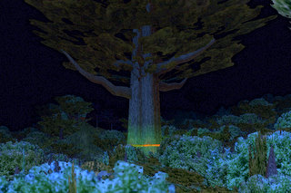
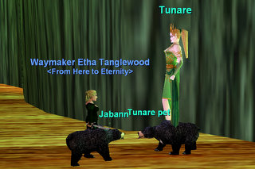
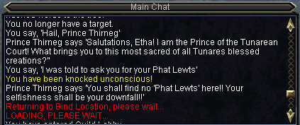
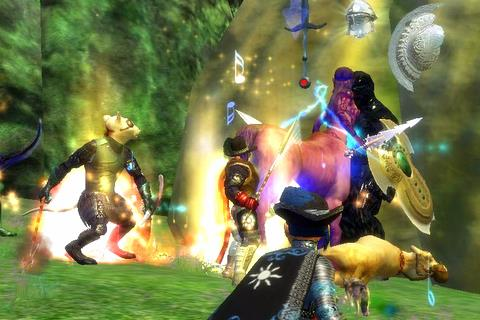

Back to: [West Karana](/posts/westkarana.md) > [2007](/posts/2007/westkarana.md) > [June](./westkarana.md)
# Emerald Halls and the Plane of Growth

*Posted by Tipa on 2007-06-09 09:35:49*

We raided Emerald Halls last night, and the whole thing reminded me so much of old Everquest's Plane of Growth... so before getting into our Emerald Halls raid, a little nostalgia to another zone that, years ago, was *also* filled with loads and loads of trash, mobs with a zillion hit points, and more growing things than you could pile on your lawn and burn in a lifetime.

*Tunare's tree rises above the forested canopy of the Plane of Growth*

If you were a good person and never once killed anything sacred to the goddess Tunare, she would let you wander about the Plane of Growth, though you could expect to be stalked by wolves, bears and panthers all making sure you weren't with those *other* guys who were rounding up her creatures and AEing them to fiery death. *Those* guys, well, they had a world of hurt coming to them, someday. But *you*, you're fine. Go about your business!

It just didn't make *any sense at all* that the druid pet spell dropped off mobs druids weren't supposed to kill.

*Tunare: So, Etha... where'd you get that pet spell?
Etha: You aren't the god of me!*

Tunare's tree used to be the favorite place for goodie good elves to quit Everquest. They would come here to her tree, kneel before her, take lots of screenshots, then post long, angst-ridden, emo posts about how they were regretfully moving on with their lives "... and I cried as I camped out one last time at the feet of my goddess, Tunare."

Me? Heck, I just want the Phat Lewts!

*Oops!*

Last night we gathered before the door to the Emerald Halls. An officer, Madcap, had brought an alt in already to see if the instance we'd gotten had the Rumbler up or not. I'd fought him in the EoF Beta; he's a snake that divides every time you kill him. VERY annoying. He wasn't up this time, though, and there was much rejoicing as I cheerfully led the raid into the Emerald Halls.

Did I say oops? I didn't know then that I'd done that. I was only positioning for a screenshot and then, there we were, inside. No harm was done but I was more than a little embarassed, since I had just said over Vent that it WASN'T me, thinking some other hapless noob had accidentally clicked the door. Turns out that hapless noob, was me.

Each of these screenshots was separated from the others by about an hour and a half of tedious trash clearing. At least the tedious trash clearing in the Plane of Growth drops class armor, spells and rare gems. Here, it's just put in to make clearing EH take an entire day.

*Mistress of the Veil*

The Mistress of the Veil threw a small party for us. The tea was wonderful! She had so many things to tell us. She showed us how to make tree roots grow into marvelous living bridges that would not harm the land or the forest! And in turn, we showed her how to make dryads burn.

Bwahaha. MwuhahahahahaHAHAHAHAAH take that, Miss Wood.

*Well you see, you need to create a mulched patch around the OW! the um, the seedling that is half again larger th -- OW! BLESS IT! -- than the spread of the branches and about -- OW! BY TUNARE'S GRACE, WOULD YOU WATCH WHERE YOU SWING THAT?* 

Next up was the Tender of the Seedlings. Very gracious fellow. Went on and on and on (and on) about his job planting saplings throughout the Halls. Had to hit him on the head a *lot* to make him shut up. Then after awhile he got tired and took a nap.

The last named of the night (but not the end of the night, we did some more clearing after, *just for fun!*) was a sprightly old centaur named Sariah the Bloom Seeker.

He must have thought we'd come for a picnic, because he was *cake*.

Things are a little fuzzy after this. There were brownies and bees. And a field of poppies! And I was so tired... eventually I dozed off. The raid continues today but as with most weekends, it seems, I'm traveling (today to visit my dad), so I camped out in the Emerald Halls in a place brownies once frolicked before, you know, we slaughtered them, and Sunday, I can rejoin the raid wherever they've gotten. Maybe, finally, a chance to set eyes on my nemesis from years back, the dragon Wuoshi.

## Comments!

**[Lishian](http://lishian.wordpress.com)** writes: You always have the coolest screenshots!

---

**[Tipa](https://chasingdings.com)** writes: Heh :) Thanks. I take dozens to come up with a few decent ones. I have like thirty of Wuoshi to go through for my next post. I get my new laptop today, so I'll finally be able to try a few new things with screenshots; since my main computer died, all I've had is Picasa -- which is decent free software, but can't let you layer or composite.

---

**[stargrace](http://mmoquests.com)** writes: Again I agree with Lishian on this one, the screen shots are amazing, it's nice to see you're back to posting again as well ;)

---

