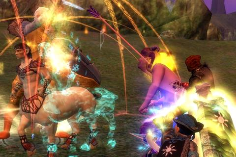
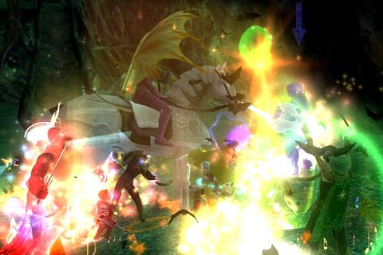
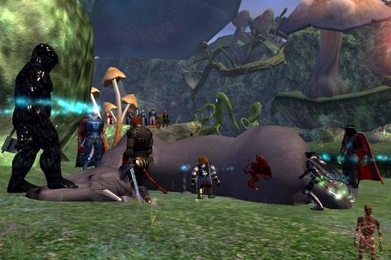
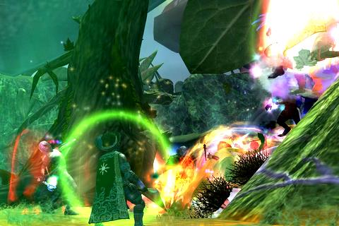

Back to: [West Karana](/posts/westkarana.md) > [2007](/posts/2007/westkarana.md) > [June](./westkarana.md)
# Wuoshi and the Emerald Halls

*Posted by Tipa on 2007-06-12 07:10:10*

*Hi! Look at me! I'm a big scawy dwagon! So ha ha ha!*

When Tunare left Wuoshi in charge of the Plane of Growth, could she ever have predicted that he'd turn into a tin-pot dictator, strutting around in a circle, terrorizing innocent people who just wanted to skip and frolic in the home of all growth?

*Gardener Thirgen*

This poor faun was sobbing and crying. *Someone* had destroyed *years* of work on his most special garden, the one celebrating Tunare's return. Could we help discover who could have done this awful, terrible thing, and have them, perhaps, help repair the damage?

When someone is in this much pain, a part of me dies inside. I'm sure it's the same for you. Humiliation, too much to bear. We did what we had to do, what Thirgen *begged* us to do, and killed him.

We're here for *you*, bud. We don't do this for ourselves. We do this for you. Us? We'd rather be donating food to orphans, but we're here. For you.

*Herald of Wuoshi*

The Herald here wouldn't give us a group rate to see the Great Wuoshi. Instead, he insisted on ten plat from each of us. I was going to pay, but for some reason, I only had *nine plat* on me. I couldn't go! Thankfully, the guild rallied behind me and the others who were 'between paychecks' and negotiated a group rate after all. Slightly blood-stained tickets in hand, we ran, with awe and purpose, into Wuoshi's Abode.

*Galiel Spirithoof*

Oooh! Ponies!

This one got awful tired from playing with us. Mother says we mustn't play with our toys so hard, but they are so squeezie and pokey and slashey and bitey that we forget, sometimes. Some of the guys corpse-humped the horsie after, but you could tell their hearts weren't in it.

*Treah Greenroot*

Well, all that excitement had tuckered us out. If we were to be ready for our Big Date with the Big Green Guy, we needed to make camp for awhile and get all ready and cleaned up. Problem, though -- we hadn't any firewood! Of course we looked for some dryads, but they'd fled the area for some reason. Luckily, we came across a friendly treant.

That worked *fine*.

Wuoshi still had some tricks up his scaly sleeve. Next time :)
