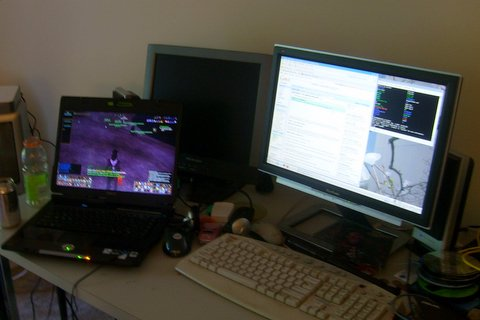

Back to: [West Karana](/posts/westkarana.md) > [2007](/posts/2007/westkarana.md) > [June](./westkarana.md)
# My Space

*Posted by Tipa on 2007-06-12 19:21:11*

Cuppy of Cuppycake.org asked bloggers to [post pictures of their gaming setups](http://www.cuppycake.org/?p=110). Mine's in a bit of a flux; my main gaming computer just died, and I have a laptop replacement.

Here's mine. The left rear screen is for Supernova, my recently deceased computer. In front of it is Darkstar, its replacement (after a star goes supernova, it becomes a dark star... Hey, my LAN is called GALAXY, I have to keep with the theme). The widescreen and keyboard to the right are Baphomet, my Linux computer and the one I use to watch movies and program. Waaaay to the left you can see a bit of my 15" TV, and on top of that is Spock's Brain, the external USB drive enclosure that has Nova's main drive in it. You knoew you're a geek when you just happen to have a USB drive enclosure lying around.

Anyway, Cuppy's upped the ante with her workplace, but mine is boring. A laptop connected to a docking station, I haven't brought anything of my own there yet.

Now, for consoles, our trusty Wii and Playstation 2. We have a Nintendo 64, SNES, Dreamcast, Sega Saturn, a Colecovision and an Atari 2600 packed away. My son, who plays Readysetboom! on Nagafen, is holding down the couch...

Dunno why people are so concerned with people's bookcases; here's a couple of mine. The rest are in my bedroom, which is messy...
## Comments!

**[Stingite](http://minstrelmagnet.blogspot.com/)** writes: heh . . . the only computer I ever named was my Commodore 64, which I named "soothsayer."

10 print I rock!
20 goto 10

---

**[Tipa](https://chasingdings.com)** writes: These days we use LOL CODE!!1!

```
HAI
CAN HAS STDIO?
I HAS A DT
DT IZ 0.1!!
I HAS A COUNTR
IM IN YR BLOG
    UP COUNTR!!1
    IZ COUNTR BIGGER THAN 100? KTHXBYE
    VISIBLE TAB(36+SIN(COUNTR*DT)) "UR AWSUM!!!1!!!"
IM OUTTA YR BLOG
KTHXBYE
```

Hmmm.... in old DEC BASIC, it'd be something like below... but I haven't used DEC BASIC since high school... but it's the kind of thing I'd write all the time when learning to program.

```
10 LET DT = 0.1
20 FOR I = 0 TO 100
30 PRINT TAB(36+35*SIN(I*DT));"YOU ROCK!"
40 NEXT I
50 END
```


---

**[Lishian](http://lishian.wordpress.com)** writes: Haha! Lol code!
Here's a few of mine:

VOL = vomit online.
FOL = fart outloud

---

**[Lishian](http://lishian.wordpress.com)** writes: ComputerNerd nerd = new ComputerNerd();

while (nerd.hasStuffTosay()) {
 nerd.shout("You rock!");
}

---

**[JoBildo](http://bildos.blogspot.com)** writes: I never named one of mine... but now I'm thinking I have to. It just never occurred to me.

And is that Fresh Prince on the TV? :P

---

**[Tipa](https://chasingdings.com)** writes: Well, they need names to be found on the LAN... and http://baphomet/ is easier to remember than http://192.168.0.11/. My son's laptop, btw, is named Lochinvar after a much-loved family cat. And I should also point out that LOL CODE!! is a (regrettably, maybe) a real programming language. I started writing a Python->LOL CODE translator but came to my senses. I don't have a clue what Drew is watching; I just walked in the room, snapped a couple of pictures, and walked back, while he went "Huh? What?" Last night I took Darkstar out to the living room and made Drew watch "So You Think You Can Dance?" with me while we both played EQ2. That was fun :) That's why I wanted a laptop to replace Nova!

 

---

**[JoBildo](http://bildos.blogspot.com)** writes: You should see the set-up at my in-laws. Regrettably, I got them all into WoW over 2 years ago and they're still playing it casually. So much so, that my mom and pop in law got her brother and their nephew into the game as well. 

Now, every evening, they sit chilling in front of Dave's (pop in law) 56 HDTV, either playing laptop WoW, or occassionally 56 inch WoW.

---

