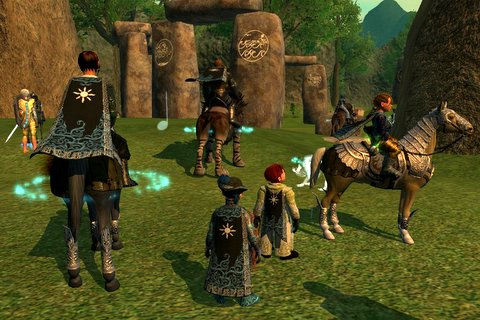
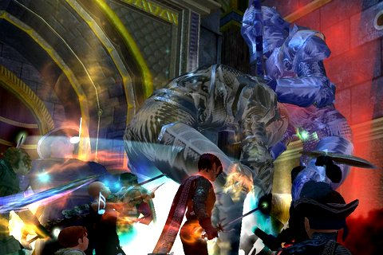

Back to: [West Karana](/posts/westkarana.md) > [2007](/posts/2007/westkarana.md) > [June](./westkarana.md)
# EQ2: Mutagenic Outcast, Direvine Matron, Inner Sanctum

*Posted by Tipa on 2007-06-15 06:51:53*

The Mutagenic Outcast is a little critter who stands about, minding his own business really, on the Isle of Ravasects in the Bonemire. I don't know why he was outcast. If you roll a ball to him, he'll knock it back, but he won't talk. Lost in thought, he is. Did he commit a crime? Did the other ravasects not want to play with him because he was mutagenic?

It was good that we found him! Unfortunately for the poor Outcast, though, many of us had *just* come down with a bad case of vampirism. Normally, we would have worked something out, tried to see if he could play near the other bugs some days, but... ya know, vampires, we gotta kill. So we did.

Can't remember what he dropped, but I'm so far in the hole re: DKP from the two items I got last week, I can't even consider bidding on anything for another month.

MO was a race we won. When Direvine Matron popped again, we were there, but it's summer and it took too long to build a raid to kill her, so Fallen got her this time.

Normally I don't screenie about mobs I've already blogged, but... look at that picture. *That's* the kind of graphics I raid with with my new computer, Darkstar. Shadows, great colors, very sharp... if these kinds of computers (and this is a *laptop*) had existed when EQ2 first came out, well, more people would have given the game a chance.

We finally delved into Mistmoore Castle's Inner Sanctum. I dunno what these guys are doing to each other, but we had to kill them for it, so it must have been bad. MMIS is a good place to be a bard. There's this punishing AE that some of the vampires do around 10% of life. With a bard in the group, *it doesn't hit*.

Didn't see Mayong. Apparently, you need some Wolfsbane to kill him, and we did have a couple of pieces, but the raid leaders didn't think we had the people to win, and didn't want to waste the Wolfsbane, so we left for the night.

What with discovery and named killing, I managed to get to 90 AAs, finally far enough in the Troub tree to increase the duration of my Precision of the Maestro. I'd been focusing on increasing the power of my buffs and resistances while in Revolution, but I use PotM *so much* in raids with Eternal Chaos that I changed direction and now it's paying off.

We all get nerfed to some extent in the Live Update after the next one, though. Lots of people are terribly upset by the changes. Everyone gets hit, except bards, perhaps because devs are still shy about the beating they gave us when they nerfed our charm and mez.

Yeah, troubs hated being able to solo well. Thanks, we needed that.

The LU needs a post of its own, so I'll end this one for now.
## Comments!

**[Stingite](http://minstrelmagnet.blogspot.com/)** writes: "Normally, we would have worked something out, tried to see if he could play near the other bugs some days, but… ya know, vampires, we gotta kill. So we did."

HAHA! Nice! Beautiful screenshots there too, T.

What kind of a DKP system are you using anyway?

---

