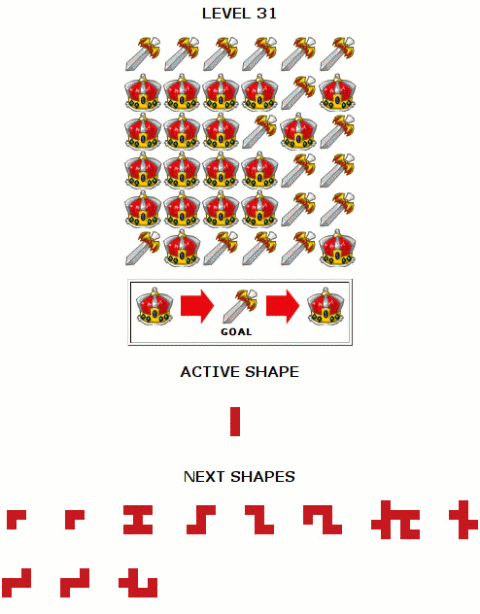

Back to: [West Karana](/posts/westkarana.md) > [2007](/posts/2007/westkarana.md) > [June](./westkarana.md)
# Neopets, Lambda Calculus and Decision Tree Pruning

*Posted by Tipa on 2007-06-23 01:44:47*

"What has she been working on?" you might well ask. "All this raiding, all these long long long comments on everyone else's blogs but precious little here?"

Well. Aside from raiding with Eternal Chaos and occasionally visiting Nagafen, I have been trying to solve a puzzle on the children's MMO/Community Site, Neopets.

This place... is deceptive. There's stuff there for adults. In fact, I sometimes think there's two tiers to the game; the lower tier, where children socialize, play games, earn Neopoints and play with their Neopets; and then there's the upper tier, where adults think of innovative ways to fleece the children of their money and items through legitimate methods, such as the thriving commodities market in the game.

I'll be working on that later. The ticket to entry to the adult tier is software. Stuff in the adult tier is too complicated and fast paced to be done by any human, and so people write programs to do program-based commodities trading, play their stock market, and solve some of their games.

One game in particular is nearly impossible to do without a computer, and that's the one that's been taking my time. This is a "game" which gets exponentially harder (literally) each level.

It's very simple. You have a grid containing from two to three (so far) kinds of shapes, and up to twenty or so variously shaped pieces. Placing a piece on the board changes all the squares under it to the next shape up. You must use all the shapes, you must place them in order, and in the end, every square must show the "goal" piece.

Brute force worked up until about level 21, when they introduced a larger board. I rewrote my program to use bitfields instead of relatively slow arrays, and then at 25, they moved to three value squares instead of the old two value ones. So bits wouldn't work. I then generalized my program to dynamically create a function to kick a square to its next state based on the number of states... and here it is. This function generator was itself partially written by another program using a very simple genetic algorithm, just as an exercise to see what kind of function a computer would write (the weird formulas for case 2 through 4 are the result. No human wrote those!). I had actually written a general solution for any value, but kept the computer's because they looked quirky. All code is written in Python, which handles lambda functions very well -- it's one of the few languages which supports lambda calculus, which is (very basically) the mathematics of functions.

This new code worked wonderfully, until level 31, when they returned to two value squares, but greatly extended the size of the board. This placed the solution space well out beyond any reasonable time to solve -- I modified the program to run in parallel and ran it on my Linux computer and one on each of the two cores of my laptop, went to bed, when I got up in the morning it had barely made any progress.

This wasn't going to get me to level 100. I can't imagine how difficult the problems get, but there are two people there already and several more are closing in on it, so I know it is possible, and that they must have some seriously good algorithms (or some time on a supercomputer) (well, if they can get supercomputer time, they probably are smart enough to come up with the good algorithms, too).

To make it anywhere, I was going to have to abandon the brute force approach and be a little smarter. While driving to work today, I came up with the framework for a pruning algorithm, which I fleshed out at lunch.

I figured I could save a lot of time if I could detect early when a move would produce an unsolvable board. Let's consider a simple case.

Counting only the number of squares a piece covers, we can add the number of squares in all the pieces to come up with a total number of squares that will also be changed on the board. We can look at the board and see what the minimum number of changes we would need to make in order to finish the board (some pieces can be flipped many times in order to come back around to the final piece more than once). So if we need more changes than the changes in the pieces we have, we can't solve the board. Alternately, if we have plenty of changes left over, we better be able to flip some pieces entirely around, or the puzzle is not solvable. Lastly, if we have exactly enough pieces to change all the pieces exactly enough, then we're probably pretty close to an answer.

My final algorithm boils down to four rules:

P = piece to consider
A = total area of remaining pieces (not including P)
O = potential piece position
B = the board

For each O in B:
* place P at O
* calculate D by subtracting the board value from the goal value
* calculate N by subtracting D from A

 * If N = 0, O is valid and the remaining positions are flat-tiled

 * If N < 0, there are not enough pieces left to solve the puzzle - prune

 * If N is not a multiple of the board depth, then the remaining pieces cannot possibly solve the board - prune

 * Otherwise, a solution with this move is a possibility.

I wrote up a inefficient test implementation just to see if it worked. It did work on some easy test cases, and I'll be doing some testing and optimization this weekend, but for now, I'm just letting it run for a few hours. It's already two magnitudes faster than my previous algorithm, but will it be fast enough?

After the dot.com bust, I was certain I'd never program again. Lost myself in games and.. well, I just lost myself. I got stupid. I couldn't even understand my old code. When the programming spark returned while I was AWAY from MMOs and working at Surya, I treasured it like a sputtering ember in a rainstorm.

Playing MMOs made me stupid. Not the MMO's fault. It was my fault for letting them have so much of my life. Now I can program again, I can do math again, I have a great job which constantly challenges me, and MMOs are no longer the number one thing in my life. (But I still play them!)

(Though the new algorithm is much faster than the old one, it still needs to be about three magnitudes faster. Stay tuned for my exciting thrilling adventure in rewriting the program in C. That should be good for one or two magnitudes right there.)
## Comments!

**[Tipa](https://chasingdings.com)** writes: I've been browsing other people's solutions. Some are really nice, but none that I've found seem significantly faster than mine yet. But I haven't found any yet that do what mine can do and grab the board and pieces directly from the web page. Thanks, Python's HTML parser!

---

**[ogrebears](http://ogrebear.com)** writes: It been almost a year since i've used a Decision Tree... Maybe i should start writing program for the games i play.. it would make things a little easier.

---

**[Tipa](https://chasingdings.com)** writes: My first optimization -- randomizing the order of moves down to the sixth level -- gained me three orders of magnitude. I don't trust that, though. Depending on the roll of the dice to give a favorable result... I expected some speedups, but not that much. I started over to give the pruner a real shakeout, and it's been doing great. I added a timer to it and now know that it started off more than half a magnitude better right from the start (it seems to eliminate 75% of unproductive nodes). Adding the randomizer brought it from 100.45s to 0.04s on the test puzzle. Next is to try it on a level 31 puzzle...

Level 31 puzzle has been going for a couple hours now. I removed status code in it to bump up the speed, so I don't know how far it's gotten. Doesn't matter; I'm going to stop it now because I have thought of a new optimization, based on the fact (easily demonstrated) that a given puzzle has multiple solutions. We don't have to find the specific one -- we can't even know what that was, anyway. It's my feeling that the best solution to this puzzle will be found with better algorithms, and that in the end, the fact that it is written in an interpreted language (Python) instead of a compiled one (C) will not give me the four or five magnitude savings I am looking for. I'd expect just one. That's significant, but I already saw how one algorithmic change gave me almost five magnitudes. If I can get the Python implementation to ten minutes, then I know I can get it to one with translation. But getting it to ten is the trick.

Anyway, my new idea is to eliminate much of the exponentially long tail of the puzzle solver. Instead, I plan to split the puzzle in half; work forwards with one half, backwards with the other, and hope they have a place to meet in the middle. Be right back with those results.

The run ended, by the way, with the prune-6 algorithm, at 11835 seconds. This is the first level 31 grid the program has ever solved. Without the random prune algorithm, this same run could have taken 30 million seconds. Anyway that's the new baseline for the halfway algorithm to beat.

When I get to level 100, I am getting in touch with the other people. I wanna exchange code :)

--

Outline for the new algorithm:

Let A = initial board, B = goal board, and F a function that transforms A to B.

Let us choose a board C that forms an intermediate state between A and B.

F(A,B) = F(A,C) + F(C,B)

We can construct arbitrary boards C by working randomly backward from the goal board B. The problem is now just determining whether or not F(A,C) exists, which can be done fairly quickly for small C-A with the current prune-6 algorithm. The success of this solution depends entirely on how many valid Cs there are. There are very few Cs close to A or B; therefore the algorithm generates Cs for the widest point of the search, at the middle.

This algorithm needn't go searching the largely unproductive decision trees past C (even though these are well-pruned by prune-6, billions remain). If C is unique or nearly so, then this algorithm will take far longer to find it than a brute force solution. In fact, it may never find a solution, even if it exists. However, in this case, a brute-force approach, while always eventually successful, could take longer than anyone would ever wait. Analysis of previous solutions strongly suggests that C is fairly common (many pre-level 31 brute force solutions happily had the first ten or eleven pieces placed at (0,0) -- the very first place chosen.)

--

Just thought of another algorithm -- since the order the pieces are applied doesn't affect the solution, if the pieces were ordered from smallest to largest, the potential Cs returned would have a far higher chance of being valid solutions to C where F(A,C)+F(C,B) exists. This, by the way, contradicts the advice of the Neopet who made the puzzle, who advises placing the larger pieces first.

---

**[Tipa](https://chasingdings.com)** writes: One possible answer to the puzzle above, by the way, is (0, 2), (3, 1), (4, 1), (2, 3), (0, 1), (0, 1), (2, 2), (0, 1), (1, 2), (1, 2), (1, 3), (2, 3). Thanks, prune-6 :)

---

**[Tipa](https://chasingdings.com)** writes: Latest algorithm (well, more of a heuristic), was a miserable failure. My assumptions were clearly very wrong. I made a clean-up pass through the code, packed the fun bits into a thread, and have started four parallel threads with half hour restart timers in the theory that if throwing the dice once is good, throwing it four times is better.

Brute force, even with pruning, is a dead end. I know that now. If I get it fast enough for puzzle X, then puzzle X+1 will do something that makes it take even longer. I am sure puzzle 100 will be truly sick and twisted.

My new plan is just to throw every piece on the board, then (since I have threads on the mind) just have them each adjust themselves to good places.

I don't know if it would work or not, but it would be fun as hell to watch them swimming about, trying to find a home.

Most of the time, with brute force, you are not dealing with possible solutions. You're fiddling with piece 1 while piece 11 is sitting in the tray. Throwing them all on the board means every potential dealing only with the leaves of the tree and ignoring the nodes. After all, it is against the rules to end the puzzle without using all the pieces, and we aren't moving against an opponent, so alpha-beta pruning isn't an option. We might as well flatten the tree. At least every single test will be a test against a potential solution. My God. Why didn't I think of this sooner? Anyway, a typical high level board could have 10^15 possible solutions (or more), so this by itself is not a solution (also, pruning is impossible if you're only playing with the leaves, but pruning wasn't that effective, not even making things one magnitude faster).

My concern is that the pieces will find local minimums -- a (wrong) solution where any move by an individual piece will bring it even further (according to the game logic) from a valid solution. I can just restart or merely rearrange a few pieces on it, I guess. Steady states are also an issue -- where a board settles into two or more states. I guess I need to give the board a good shake every now and then. Still, this is another heuristic and there is no guarantee that this will lead to a solution, ever.

Proving I should long before this have turned to Wikipedia, my pruning algorithm is an instance of [Backtracking](http://en.wikipedia.org/wiki/Backtracking), and this new one I'll be implementing is an instance of [Min Conflicts](http://en.wikipedia.org/wiki/Min_conflicts_algorithm)... There's another algorithm, [AC-3](http://en.wikipedia.org/wiki/AC-3_algorithm), but I think I have too many variables for that, and also, there are very few restraints on the positions.

All the good algorithms use weighting, but our pieces are weightless...

There were some hints to improving the efficiency of my current algorithm in the Backtracking article.

---

**Hillary** writes: wow -- didn't read this all closely, but it looks like fun and would count as a really good master's project at a grad. school. This blog may end up being the basis for a really quickly written thesis one day!

for help with local optima, have you played around with using a tabu list/ tabu search? this is equivalent to the "shake" you mention.

---

**[Tipa](https://chasingdings.com)** writes: When I got home last night, one of my computers was still on, and had finished puzzle 31 with the threaded prune-6 algorithm. My son had turned off (!) my other computer, but when I turned it back on, it popped up another solution to 31 in a few minutes. That wasn't bad!

I re-implemented my old bit fields code to eliminate copying and move generation (I pregenerate every possible move for every piece in advance, once) and added the Min-Conflicts algorithm to it, and it could solve puzzle 32 in about ten minutes. It couldn't seem to crack puzzle 33.

I removed the min-conflicts code and added pruning back in (they are incompatible) and let it run last night with a fifteen minute timeout. This morning it was still running. I tightened the code some and set it loose with a half hour timeout.

I'm getting close to just re-implementing the whole thing in 'C'. But first I am going to have the min-conflicts and the prune algorithm work in parallel threads, just to cover all my bets.

I don't know why min-conflicts worked on 32 but not 33. It was just the addition of a piece or two. That should have only been a small, linear increase in time. Of course, min-conflicts is not guaranteed to ever find a solution, that's its disadvantage. Maybe I can integrate the pruning algorithm in such a way as to do better than just randomly picking a piece to move.

---

**[Tipa](https://chasingdings.com)** writes: Thanks, Hillary -- I hadn't heard of Tabu search before. Luckily, Wikipedia was there to tell me that Tabu searching is a way of moving from a solution to a more optimal solution.

This particular problem is a NP-Hard problem (thanks Wikipedia again for teaching me about orders of complexity) in that there's no 'near' solution or interim solutions; you can't know if you have a correct solution without placing all the pieces and checking. This is why min-conflicts didn't work for me -- the graph isn't one of gentle hills and ridges, it is sharp jaggy peaks, so the probability of landing on the side of a peak is the same order as rolling twenty dice, having nineteen of them come up six, and then rotating the last one until it reached six. Computers are really good at rolling dice, but these dice aren't six-sided (I lied), they are twenty to thirty sided, and I won't tell you what side you wanted to have up -- all I'll go is yes, that's it, or no, that isn't.

The challenge for this puzzle is two-fold. If I can formulate it so it is not an NP-Hard problem (in particular, if I can reformulate it as a Boolean satisfiability problem), I can use some better techniques that can solve it in less than k^n time.

Or I can just accept this problem is NP-hard and optimize the heck out of it. There's a Backjump technique I'd like to work in to help further prune the tree.

The last ditch solution would be to write an application which lets me play the game offline and just find a solution manually. I guess I'll have to wait until level 36 and see what the next wall is to see if they're going to add yet another order of complexity to the problem.

I shared the bronze award and the title of Grandmaster, by the way, for getting to 31. Silver is quite far still...

---

**[Tipa](https://chasingdings.com)** writes: I didn't get much time to work on Shapeshifter last night; I was instead working on EQ2's Swords of Destiny quest. I'll write that up as soon as I finish the first quest series.

I did add some analysis into the program, and found that 90% of the pruning was done at the second to the last piece. While this is definitely good news, I'd like to be able to eliminate 90% of EVERY piece's moves... ALL the pruning is done in the last few (six or so) moves. 

I'm going to step back and add some heuristics to try and prune at a higher level. First, is to sort the pieces from fewest to most possible positions. Second is to sort the possible moves per piece in such a way that the moves that bring the board closest to a solution are done first.

An early version of the program tried to find a solution in as few moves as possible. This is before I knew you had to use all the pieces. But. Once you have solved the board with n/m pieces, then all you have to do is solve a smaller problem -- can you place (m-n) pieces such that they overlap each other? This can be split into two problems -- given a set of pieces P, can you divide them into "n" sets (where "n" is the depth of the board) such that subsets P1..n all contain the same number of squares? If that is false, everything past this is a dead end.

So, that's the next step. Snip snip snip, prune that tree.

---

