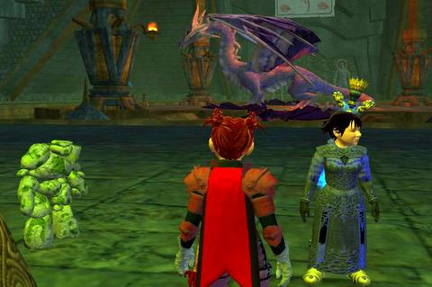
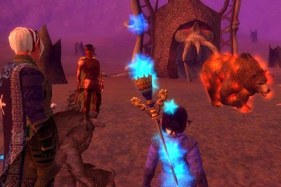
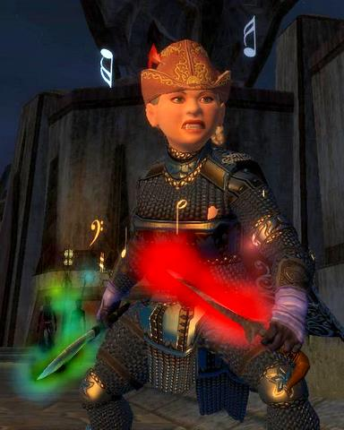

Back to: [West Karana](/posts/westkarana.md) > [2007](/posts/2007/westkarana.md) > [June](./westkarana.md)
# EQ2: Darklight Woods, Cyenadros, EOF Armor, EQ2Flames

*Posted by Tipa on 2007-06-27 07:36:22*

That Shapeshifter game doesn't take up all my time. It just seems like it does. Another game that doesn't take all my time: Overlord. I downloaded it based on the giddy reviews from Cuppy and Brent, but it seemed boring to me. MMOs have raised my expectations of games beyond what single player games can satisfy. Games without other people playing seem lifeless and barren, now.

Does anyone actually care about my progress in Shapeshifter? Maybe I'll just note progress now and then in Asides.

On to EQ2! Dina has had some exciting upgrades.... I'm really excited about -- well, I'll get to that in a second.

Cyenadros, Lord of the Sanctum, an Epicx2 is up in the Sanctum of the Scaleborn, you say? And you have two spots free? And you need a healer and some DPS? OMW!

I haven't played my alts much since I joined Eternal Chaos. I am the only troubadour in the guild, so that's the character I play in raids. Sometimes, though, the opportunity arises... and so Dera and Dorah find themselves at the very bottom of SoS, facing a purple dragon, a dragon moreover that once killed Dina. This time the story ended better, and everyone got a nice chunk of AA experience. Still, I need to go back there with Dina. This is the same spot she needs to complete Riddle of the Vault and finally get out of SoS forever!

Dorah has been keeping busy with alt raids; here's a shot from the Epic x4 in Zharvonn's Tower. For the life of me, I can't remember the name of the mob we killed, but like Cyenadros, the uber bosses of yesteryear can't defeat even the underpowered twink raid forces of today. This will only get worse when Kunark comes out and everyone is level 80.

Back in Nagafen, my fury Tipara finally finished all the Darklight Woods quests at level 21 and about thirteen AAs. These quests got a little easier when she outleveled most of the roving bands of Qeynosians.

The quest above is the end of a line dealing with fire worshipers who have set up shop in an old crater. They worship this fire elemental. All that chanting and moaning and whatnot really annoys a lot of the people in the all-too-close Wanderlust Fair, and so Tipara was tasked with killing some of them, killing some more of them, and still more, until finally, they gave her a way of waking the fire elemental and having it just go around and kill all of them at once. The cultists died, running around like singing candles, praising their maddened deity as it fulfilled their dreams by incinerating them with inexhaustible fire.
It's so good, to be evil!

The little mushroom guys to the south of the Woods are spreading. Not by themselves, oh no. Because stupid ADVENTURERS like YOU tramp in there, get their spores ALL over themselves, then stagger all around shaking them off and causing an INFESTATION! Picture above shows some of the dozens little shroomlings I accidentally shook loose at the Fair.

Oops. Nothing to do but kill them. Kill them all.

It's amazing how many evil quests end with those words!

Finally, back to Dina :) I've been looking through some of the posts about Troubadours on EQ2 Flames, and realize now that my armor is all wrong.

Well. I don't care. At least I look great! Nearly finished with my Nightchord (KoS Fabled) armor set since I got the shoulders at our last Labs run. Now I only need the boots. But look at that sharp little chapeau on Dina's head. That dropped at the end of our last Mistmoore Inner Sanctum run... I was so tired, it took a couple of seconds before I realized that -- FINALLY -- a troubadour item had dropped!

Why, yes, I DO want it, thanks!

Ogrebear has pictures of the entire set. I would look great in it. Hat's a good start, though.

I hadn't gone to [EQ2Flames](http://eq2flames.com) before. A site about flaming folks in EQ2? Lishian was talking about it yesterday, so I gave it a shot. Ah... *here's* the EQ2 community site, free from SOE's influence... yes, there were flames, but it was also chock-full of good class information -- and the server sections are far livelier than those on SOE's official boards.

Well worth checking out.
## Comments!

**[Lishian](http://lishian.wordpress.com)** writes: I love your posts! Please, never stop writing about EQ2. Yours is one of the best out there! Oh, I recognize that spider cloak! :)

---

**[Kanthalos](http://mmoreinsight.blogspot.com)** writes: I'll tell you what, if I could get EQ2 to look like that on my comp there would be little doubt that I'd be playing, but my graphics card (which is pretty decent) has troubles for some reason so I have to set it pretty low and everything looks like crap, therefore I am MMO'less right now and likely will be for quite a while... :(

---

**[ogrebears](http://www.ogrebear.com)** writes: For some reason i don't use eq2flames as much as i should.

---

**[Stingite](http://minstrelmagnet.blogspot.com/)** writes: I love that picture of Dina crouching down a bit right there. Looks really quality and just awesome. Thanks!

---

**[Adele](http://www.adelecaelia.blogspot.com)** writes: Nice Screens!

---

