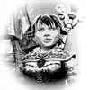
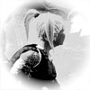

Back to: [West Karana](/posts/westkarana.md) > [2007](/posts/2007/westkarana.md) > [March](./westkarana.md)
# EQ2: Elimination Round

*Posted by Tipa on 2007-03-05 11:37:58*

It's no easy thing saying goodbye to beloved characters. Losing Station Pass means that some characters have got to go. In this post, the characters that are staying, and where they are in the world.

 Minstrel Dina Tanglewood, Hunter of Vampires. With Dorah, she just completed the Bloodline Chronicles, and now knows Thexian (will finally find out what the Count in the Crypt of Valdoon is going on about) and can shape shift into Vampire form, which she wore throughout last night's Deathtoll raid. It was our first Tarinax kill, and she got the scout gloves from him. Next up is completing the Desert of Flames epic quest up until, at least, the point where you can get the quest to learn Koada'dal, the language of the high elves. This is required to start the Echoes of Faydwer epic quest (for Soulfire), and is the only way for evil characters to learn that language. Luckily, Dina is already partway through that quest. Dina's transmuting is around 110. I hate transmuting, but someone needs to do it. Leveling transmuting to keep ahead of Donna's needs. Also finally making progress on her own Claymore quest, which has suddenly become important as the guild beings the long farming of the entirety of Deathtoll.

 Dera Tanglewood the Devoted. She has no title because, as a battle cleric, it is better to get to the melee boosts in a number of lines instead of reaching the end of any one line. Level 67 got her the right to earn and wear her "pope hat". One thing I *really like* about EQ2 is that it *lets* you be a battle cleric. Every nuke she has is now a melee attack; she crits 100% on melee attacks; hitting things procs Bolt of Power frequently... level 70 battle clerics with good weapons and even more AA can hit for 700-1K each swing. And this comes at no cost to the ability to heal; she solo heals many T7 instance groups now (Unrest, though, is a little beyond her at the moment). I've no particular goals for her; I've done the cleric thing in EQ1 already. But, she has started Claymore :P And she is finally about to embark upon Tier 4 Armorcrafting to keep Donna's gear up to date.

 Interagent Dorah Tanglewood, Vindicator of the Coin. Groups have been a little scarce, but her Jeweler skills are still very much in demand. She and Dina are my usual two box, and together are working through various quest lines. She can heal just enough to keep Dina alive, and does most of the dps as well. In the many, many trips into the crypts for the Bloodline Chronicles, Dina would stand in the middle of many groups, aggro them with the bow, Dorah would send in her AE-ing ooze pet and aggro them all, and Dina would assist the ooze pet to kill them off. Very fast and efficient, given that Dina has no out-of-encounter AEs with which to help... Her tinkering is now at around 15. I hate tinkering. Her *forestry* is about 190 -- just a hundred more skillups before she can finish Rain Caller and werewolves stop attacking her everywhere she goes.

 Champion Nashuya N'Hamsha. My lone non-halfling nearly didn't make the cut. With Dera's respec as battle cleric, Dera is the better tank and I usually do use her to tank when doing things that need a healer so the other spot can be for dps -- ie, Dorah. She chose the Stamina line for her respec, and has started on the Strength line, but perhaps should have gone with Intelligence for spell damage. She is currently only being played when there is a low 50s alt group going. She may come out to play more when Dina's transmuting gets to those levels.

 Etha Tanglewood, Hunter of Undead. She's been awake and active these days as a mentor and healer for Donna, though she gets some time to herself when the guild is doing a high 30s group. At 38, Etha, a defiler, is easily the most powerful healer at that level than any of the others I have played. Wards are just EXACTLY the sort of thing you want in a group -- anyone can tank! Etha's Alchemy is stalled at level 40 as she waits for the harvesting frenzy to reach T5 (Donna, the harvester, is just starting T4 harvesting as she herself moves to that tier).

 Donna Tanglewood, 28 brigand. Donna was my "Island" character, just someone to harvest on the Isle of Refuge and send that stuff off to my crafters. I needed a sage, though, and someone to feed Dina with transmutable items and Dorah with loams, so I took her off the island, tried to make a go of it but soon betrayed her to Freeport as I've done with all my other characters. Her damage is outstanding; she has lines of tank abilities and rogue abilities and can switch between them easily -- starting out fights from the back, hitting them from the front a few times, then stunning them and moving behind them for more punishing positional attacks. It's pretty fun. She is a 30 sage and all her harvesting skills are maxed. She has found so much Steel and Palladium while harvesting that she has become quite wealthy selling them on the broker. The rare loams she sends to Dorah to be made into Adept IIIs. It's nice having a dps scout. I love Dina, my troubador, but being at the top of the parse is its own reward.

I've already deleted a few low level characters, but some beloved ones are still waiting for me to clear out their banks and inventories ahead of cancelling my Station Passes. I might post about some of their (short) stories before they get consigned to Bitblivion.
## Comments!

**Noffin** writes: Did you delete me???

---

**[Tipa](https://chasingdings.com)** writes: Yes :(

---

**quimbius** writes: no you can't delete a stormfyre!!!!!

---

**[Tipa](https://chasingdings.com)** writes: Hi Quimb!

I only made Noff Jr. to make a sig :P

---

