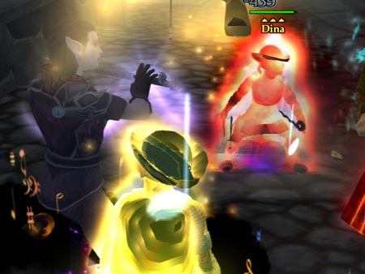
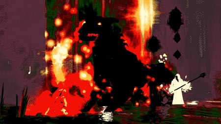

Back to: [West Karana](/posts/westkarana.md) > [2007](/posts/2007/westkarana.md) > [March](./westkarana.md)
# EQ2: Tarinax, Bloodlines and More Unrest

*Posted by Tipa on 2007-03-05 15:03:05*

Last weekend was the last weekend I'll be able to play EQ, as I am moving cross-country and it could be a few weeks for everything to arrive, Internet get hooked up, life to settle back to normal, fingers get unfrozen enough to type.
But, it was a good weekend.

*
We have seized control of your computer... and your MIND.*

**The Estate of Unrest**

I returned to Unrest a couple of times this weekend, seeing more of it with every trip. Trip? This place IS trippy. Unrest will do *anything* to mess with you. From fogging up your screen, to giving you double vision, to suddenly make things go hazy and throwing *cackling skulls* at you... this is less an adventure zone than a trip through madness. What with devious puzzles (collect pages of music, try to play them, and infuriate the guiding spirit by your lack of ability -- or try to prepare a meal for people long dead), playing with nostalgia and a wicked sense of humor.

*
OMG HAFFER KILL!*

Sometimes we'd hear someone in the party mutter something aloud... I heard myself demanding to know why everyone had left me behind... but I was with the group and so who could THAT Dina be? And she'd laugh and start attacking us. The fight against the Festering Hag teleports people randomly into cells. I saw a party member get ported to one, so I ran to open it and OH NO.... ANOTHER ONE!

*
If you played EQ1, you think you know what to do here.*

The group I was in, about half had played EQ1. Coincidentally, half the group wanted to run right through this pit of boiling blood, and half wanted to sensibly go around it.

Both were wrong. Crossing this pit spawns the blood goblin, Hemogoblin (/groan). He spits out adds every few seconds, so all you can really do is kill him as fast as possible and then deal with the adds. Afterward you can prance merrily through the blood pool and avoid the hidden spike pits on either side.

**The Bloodline Chronicles**

 I didn't care much for the Bloodlines Chronicles when it was first released. I did do a couple of the quests, but as is often the case in long quest chains, the groups I joined were always further along in their quests than I was in mine, so I never really progressed that much.

I logged on my prize duo of Dina and Dorah yesterday really intending to work on the Peacock Club quest series, but instead, ended up delving into the tombs and crypts of the Bloodline Chronicles. The eventual rewards of learning the Thexian language (used all over EoF but hardly anyone knows what the NPCs are saying) and getting the Vampire illusion for completing a level 30-40 quest series seemed like just the thing to do before our Sunday raid.

The quest series tells the tale of a coup in the Vampire hierarchy. A new gun in town has killed the old Master and taken over, and hopes to use various artifacts in order to control the power of vampires even more ancient. Freeport wasn't alarmed by some old world Thexians living their lives in peace, feeding on their captive goblins and leaving the surface world alone, more or less. But this new vampire has other plans and so, must be dealt with. And of course, as they're deciding this, who should stumble up but Yours Truly.

*
Bloodmaw? Helltooth? Marmaduke? Whatever, he's a Big Dog.*

Far from being the dull grind I thought it would be from what I had seen before, it was an exciting, involved quest with many, many nameds which were all, unfortunately, gray to us. Working through the quests opens up new solo and single group dungeons; the final quest opens a raid dungeon.

The art isn't as good as SOE would produce; this was the adventure pack Gabe of Penny Arcade pointed to to illustrate SOE's lack of design skills. And I agree. The expansion could be a lot more atmospheric with some bolder colors (why are the EQ2 artists afraid of color?) and more creative textures. However, it's still a lot of fun. The Crypt of Thaez is a dungeon in three dimensions and even with a good map, it is still far too easy to get lost.

*
Dead, and loving it.*

**Deathtoll**

I was feverishly working to finish the quests up while the guild was forming for the Deathtoll raid. I wanted to show up in full Vampire mode (and did!).

Deathtoll is a punishing raid. Up to a certain point it is easy, and then, somewhere around the Mucous Dragon that breaks up into globs of snot at times only to squish itself together to dragon form again, dying happens and people get discouraged and start making excuses to go.

This is especially true with Tarinax, who is NOT THAT HARD but really requires people to pay attention, keep between his feet, and get the debuff cured before Tarinax follows it up with a killing blast. Oh, and keep the adds that spawn whenever anyone or their pet dies mezzed (hey, I remember Vishimitar, too!). I was the only mezzer for our first try, but I can only keep two things mezzed since troubadors were nerfed several LUs ago. Still, I thought I did as well as could be expected, but eventually the unmezzed adds were too many to bear.

People stuck with it this time, though, and at about our fifth try, with all our armor to the point of breaking, we all clicked as a team and Tarinax and his buddies went down, and the guild suddenly had its first half dozen rewards from the Qeynos Claymore quests. I won some nice gloves (which, inevitably, didn't match the rest of my outfit), and now am working about as hard as I can on finishing up the Claymore quests so I can get my glowy knife from it.

Busy weekend of adventuring, questing and raiding and probably my last for awhile. And I do apologize for my experiments with Photoshop. I'm trying different things to make screenshots work better as illustrations.

