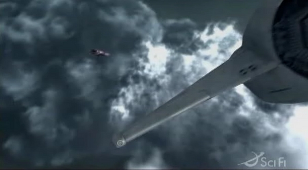
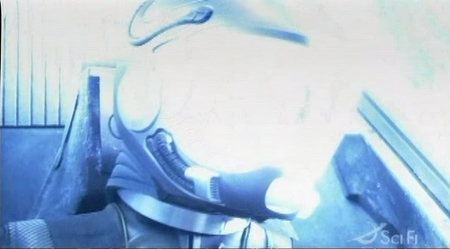
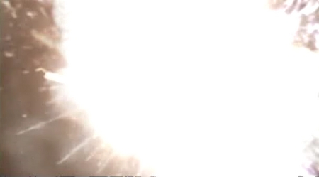

Back to: [West Karana](/posts/westkarana.md) > [2007](/posts/2007/westkarana.md) > [March](./westkarana.md)
# Battlestar Galactica, frame by frame

*Posted by Tipa on 2007-03-07 07:55:38*

What *really* happened at the end of Battlestar Galactica? Here's a frame-by-frame examination of the last few seconds. It's full of spoilers, so DO NOT read further unless you have seen the episode, "Maelstrom".

In this episode, Kara "Starbuck" Thrace is haunted by visions that she is on the verge of a greater destiny. She comes to terms with the memories of her abusive mother and then deliberately dives into the eye of a storm on a gas giant that looks (to her) like the mandala she has been seeing since she was a child. Her ship explodes -- but was she in it?

I don't think she died. I think something *else* happened to her. Here's frames from the last few seconds.

This is a view from Apollo's ship. See the Cylon heavy raider at the upper left, that he does not appear to notice. This is the first time we see the raider from anyone else's perspective than Starbuck's, and is the first time we know she isn't dreaming it. Moments later he noses down and Starbuck's viper comes into view.

Kara tells Lee to let her go as light fills the cabin.

She closes her eyes and sees herself as a child, at peace. Cylons, by the way, don't have childhoods. Kara is not a Cylon.

Kara disappears in a sudden flash of light.

Kara's Viper (notice that the cockpit is empty; Viper pilots wear lit helmets easily seen from outside) begins to burn up and soon explodes.

Simplest explanation is that Starbuck transcends her human/mortal existence somehow. The Five have been shown as beings of light, and the original Starbuck himself had a similar transformation into a [being of Light](http://en.wikipedia.org/wiki/Ship_of_Lights). The current producers of Battlestar Galactica have time and again brought back plot elements from the original show in unexpected ways.

It's *my* wild speculation that Kara will continue through the eye of the storm and come to Earth transfigured, similar to Dave Bowman's transfiguration into the Star Child in "2001: A Space Odyssey".

I guess we'll see at the season finale...
## Comments!

**[Amber](http://ambernight.org)** writes: I'm pretty sure Lee noticed the Cylon ship. I could be wrong, but I remember a surprised look on his face right after the ship zoomed past Kara's viper. He might have even said something, but I just don't remember. I'll have to record one of the inevitable re-runs and watch that scene again.

At the point I figured out they were going to kill her off (right about the time Lee sat down beside her and they had the "we're right back where we started" discussion--a beautiful reference to the circular nature of the mandala) I remember hoping that at least someone else would see the Cylon so she wouldn't go out looking crazy. I really think Lee noticed it.

With regards to the is she/isn't she question, an argument could be made that Kara is experiencing a manufactured childhood, and so the Cylon theory still holds some water. Like you though, I don't believe it. First, it's way too easy and convenient, very unlike RDM. Also, she had her ass handed to her during most of the fight with Six when obtaining the Arrow of Athena. Six toyed with her, and could have killed her at any time. Unless we're to believe that Kara's a weak Cylon (which would be a horrible cheat to the audience) we have to conclude that she's human. A hybrid at the very least, and I'm not ready to accept that either.

I'm not convinced by the empty cockpit evidence, but it is intriguing. If Kara's transformation is spiritual in nature, it really isn't necessary that she physically survive the explosion anyway. Fire has always been a symbol of cleansing and purity, and there are many fiery characteristics of the mandala. A physical death by fire would make a lot of sense.

---

**[Tipa](https://chasingdings.com)** writes: Remember the Aurora statuette the oracle gave Kara. Aurora was the Goddess of Dawn and symbolizes rebirth. When Kara asked what she should do with this, the oracle said she would know.

She gave it to Admiral Adama who used it as the figurehead for his model sailing ship. Symbolically, that could be seen as the goddess of light guiding the ship and thence Kara as a being of Light guiding the Galactica to Earth.

Kara's foretold destiny could hardly have been to die as pretty fireworks over an anonymous gas giant in some forgotten star system.

---

**[Tipa](https://chasingdings.com)** writes: I'm wrong about that Viper being empty. I went back and stepped through that scene again and it's clear in other shots that there is someone with a lit helmet in that Viper.

HOWEVER. In other shots, Starbuck's helmet is NOT lit. Also, it looks like Lee first sees the heavy raider, then it goes into some clouds and comes out as Kara's Viper.

Anyway, unless all the visions she is having are total bunk, she is now in some realm between life and death.

---

**[Amber](http://ambernight.org)** writes: 
> Anyway, unless all the visions she is having are total bunk, she is now in some realm between life and death.

I can't say I'm super thrilled about the heavy use of mysticism that Moore has been using lately. I think the more grounded storylines have served up much more compelling drama, and is in fact the secret to BSG's success.

I'm content to go along for the ride for now and see how it all pans out, but I'm starting to worry that the end result is going to be some *deus ex machina* crap whereby humanity is saved by whatever the re-imagined equivelant of the beings of light turn out to be. That would be a mistake.

---

**[Andrew](http://www.kantor.com)** writes: One thing to keep in mind, when considering the whole "beings of light" thing, is that in this series the gods are considered real -- that is, the history of humanity includes its history with the gods. (The Battlestar Wiki has more and more detail.)

So while bringing in the beings of light might seem to be *deus ex machina*, remember that in this machina there are dei. :)

---

**[Tipa](https://chasingdings.com)** writes: Star Trek: Deep Space Nine had real deities as well -- the divine Prophets and evil Na Wraiths were actually real creatures who lived in the wormhole near Bajor and did guide and inspire the Bajorans throughout their history.

It's probably the only time I have seen, before BSG, religious life and scientific life coexisting without friction or irony.

Any true god could hardly fear humanity's search for truth and knowledge.

---

