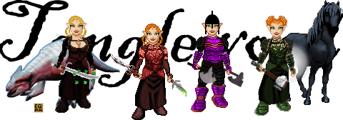

Back to: [West Karana](/posts/westkarana.md) > [2007](/posts/2007/westkarana.md) > [May](./westkarana.md)
# Letter to Pavel

*Posted by Tipa on 2007-05-09 19:34:25*

Pavel of PCZone left a comment asking some questions about my MMO history. Usually, such surveys carry the subtext that the recipient is a pathetic loser who nonetheless is part of a particularly disturbing part of nerd-dom that would be just the thing to chuckle over in some anonymous undergrad sociology class. And they should, when filling out the survey, include any really juicy bits. Answers that are also cries for help are the funniest!

This is probably one of those. But what the heck. Part of the reason I write this blog is to show how MMOs can be fun and even healthy...!

*1. Out of all the MMORPG’s you have played, which one has particularly captured your imagination and why?*

Well, that can only be the original EverQuest. I was happy playing online games with [cheesy sprite graphics](http://www.nexustk.com/index.html)... and then I saw the movies for the upcoming EverQuest. This was the game I had been wanting to play. It was beautiful and new. This was before games were published with every secret already shared on spoiler sites. I made an Erudite wizard, stumbled through Toxxulia Forest in the dark (and it was DARK) with only an unreliable compass and the glimmers of campfires through the trees to guide me. I didn't even know what my spells did, or why I would use one nuke over another. It was amazing.

*2. How long have you played MMORPG’s, and how often do you tend to play each week?*

Back at the University of New Hampshire, those of us who loved gaming and also could program the university PDP-10 mainframe collaborated on a number of multiplayer games. I wrote a couple of games in the vein of Dungeon (AKA Zork) and Advent (AKA Collosal Cave Adventure) that had some multiuser bits (my version of Dungeon, House, let you leave messages for other players). But a gifted programmer named (iirc) Chris Caldwell was the brightest star of the McConnell computer cluster; he wrote an ASCII-graphic multiplayer game called "Cave" that was a major hit on campus; everyone played. That was my first MMO, though I guess it wasn't really 'M'.

My first real MMO was an old CompuServe game called [Island of Kesmai](http://en.wikipedia.org/wiki/Islands_of_Kesmai). It was so slow and clunky and expensive (CI$ being a pay-by-the-minute place) that I never really got more than a little ways in. While high level people waltzed past. It was my first exposure to both MMOs and being humiliated by my crappy gear.

There were no graphics; it was all ASCII characters moving around (slowly); so the devs could be as imaginative as they like. Contrast with games these days, which are graphically phenomenal, but the gameplay must suffer and the mobs all begin to look alike.

I moved from there to Quest on the DELPHI Information Service, a CI$ competitor. They charged by the month -- MUCH cheaper. I loved that game, but eventually I would travel too far and run into the Fenris Wolf. And that would be that.

So... I've been playing MMOs since the early 80s. Those early efforts led sideways to play-by-email role playing games, to collaborative game development via Usenet... and eventually to today's games.

How long do I play each week? Less than I used to. But I would guess twenty hours wouldn't be far off.

My first raid - Lady Vox in Permafrost

It didn't go so well.
*3. Can you tell me about some of the characters you have chosen in virtual worlds?*

I *could* tell you about *all* of them.

But instead I'll talk about the Tanglewoods.

In EverQuest, you could choose a last name at level 20. My first "real" character, a halfling druid I'd named after a woman I admired from church, Etha (Gray, but I wouldn't take her last name), was nearing 20 and I didn't have a decent last name picked out. It took a lot of thought! I didn't want something out of Tolkein, but I wanted something that sounded like it *might* have. The name Tanglewood, the name of a summer music festival in Massachusetts I remembered from my childhood, came to me one day. Given a druid's "tangle" spells, the woodsy feel of the name, associations with the Shire's Old Forest and a hundred other reasons, this was the perfect name.

Scattered, ditsy, friendly but a little unreliable and prone to falling asleep, Etha Tanglewood.

She had a sister, a warrior, named Nina. Nina Tanglewood was everything Etha was not; serious, determined, rough-skinned and not one to suffer an idiot. She was madly in love, though, with Deputy Budo, a halfling Sheriff in the Misty Thicket. It might have been the hat, it might have been the mask, it might have been the tireless efficiency with which he went after the goblins and bixies that strayed too near the Wall, or the times he would nip into one of the guard towers for a little ale and a wee bit of shut-eye. Whatever the reason, they eventually produced a child, Tipa.

That's where "I" come in :) Raised by my Aunt Etha to be a good hobbit, and hardly ever seeing my warrior mother, I nonetheless struck out on my own at a very early age. Sneaking around Runnyeye or Befallen, only happy when I was somewhere I wasn't supposed to be.

The Plane of Hate

*4. What are some of the most memorable incidents that you have experienced in online worlds?*

Well, there's one, and again I return to the original EverQuest for it. Rogues had two tricks, neither one that powerful, but together along with a generous helping of skill and sheer nerve, they could do what no other class could manage: Walk into a room of monsters without fear. The skills were Hide, which made you invisible to some monsters; and Sneak, which made you undetectable by any monster as long as they couldn't see you. The Rogue epic quest required you to sneak into the Plane of Hate and grab a book from a monster's nightstand.

Now, this came in easy, medium and hard modes. The easy one was, wait for a raid to clear the Plane, then go there and get the book. But raids were rare and the book could only be grabbed once a day and usually, another rogue would grab it (or someone else would take it for a rogue alt) so that was unlikely. The second was to bank all your gear and find a wizard crazy enough to bring you, then sneak, naked, through the Plane, grab the book and use your port item (there were a number of different ones available) to gate out. It was dangerous, but if you failed, you wouldn't lose all your gear.

The HARD way was to just port up there with ALL your gear, and sneak through and grab it. There was a real chance I could have lost everything.

The monsters of the Plane of Hate... well, most of them see through Hide, but some don't. None of them see through Sneak, but often it's impossible to stay behind them (often times you might come across two mobs facing each other... no way past them). And there were the rat traps; trip one of those and you were toast, no matter how sneaky you thought you were. Patrols of mixed see-hide and no-see-hide monsters would roam around. Sneaking successfully through the zone at full spawn meant you had to be at your best; know where all the patrols were, and which were safe and which unsafe; know where all the traps were, and either disarm them (hoping not to fail) or avoid them, and sometimes, wait patiently in a deadly spot for a certain ghoul or spectre to turn around or move to another part of the room.

Grabbing the book and clicking the gate to west commonlands spell my hat carried was the high point. I'd passed through the rogue Rite of Passage and risked it all on a test of skill.

Etha, Tipa, Nina and Dera Tanglewood
*5. If you had to pick a favourite location in an MMORPG where would it be and why?*

The tunnel in East Commonlands (EQ1, still!) that connected that zone to North Ro. With no help or prompting from the game developers, players on nearly all servers turned that tunnel into a real marketplace. You could find anything, sell your treasures or find others; and it became a meeting place, a social area, a place to chat and buy and sell that emerged all by itself. SOE made their own version, The Bazaar, killing EC and also killing an important and valuable player-created bit of the game. "Game experience may change with online play" - that's the banner the games rating board puts on games that may contain user-generated content. I see that as a hope for a game that can grow beyond what its developers wanted or could foresee, but I think devs see that as something to be stamped out or controlled.

*6. How, if at all, does your time spend in MMORPG worlds affect your real life?*

I don't spend as much of my free time reading books, playing the console games or watching television... otherwise it's about the same.

Hope these answers helped prove your point, or at least didn't shift it too much.

## Comments!

**Noffin** writes: What do I get if I can name your first character??? 
.
.
.
.
.
.
.
.
.
.
.
.
.
.
.
.
..
.
.
Mehve

/hug Etha/Nina/Tipa/Brita

---

**[Tipa](https://chasingdings.com)** writes: Yup, it was Mehve, after Nausicaa's flying wing in "Nausicaa of the Valley of Wind". I've never re-used that name. She and I didn't really get along, had that whole novice wizard vibe going.

Always great to hear from ya, Noff. Hugs heading your way any time you need them :)

Here's one: ******HUG******!!!!!

But you know what I want? A song! Your happy hobbit songs always made me smile.

---

**[mbp](http://mindbendingpuzzles.blogspot.com/)** writes: Don't worry Tipa Pavel is legit and PCZONE is a good magazine. I have a subscription. It is a magazine written by adults for adults and while they poke fun at MMORPGers once in a while they are all committed PC gamers and they are not afraid to laugh at themselves. I will look out for some reference to your comments in the next issue.

On the subject of names Mehve sounds llike a derivative of Maeve (pronounced mave) an ancient Irish Queen with a pretty interesting history: http://en.wikipedia.org/wiki/Medb

---

