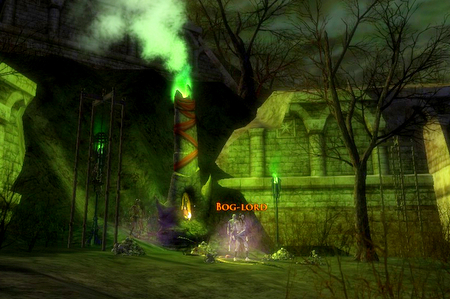
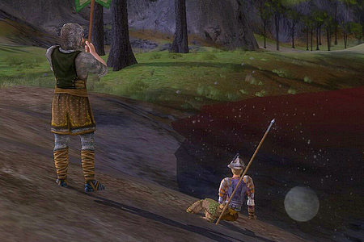

Back to: [West Karana](/posts/westkarana.md) > [2007](/posts/2007/westkarana.md) > [May](./westkarana.md)
# LotRO: Book II Finished (yay!?)

*Posted by Tipa on 2007-05-11 07:21:40*

The Hobbits, we find at the end of Retake Weathertop, have made it safely to Rivendell.  With them out of harm's way, for a time, it's up to the numberless heroes of the world to do their part. In Book II, we find the source of the Red Marsh's evil, the immortal Red Maid, and redeem some long-dead shades who broke an oath and must now be summoned for one final mission to save them all.

Making Aragorn look like a bit of a copycat when *he* does it in "Return of the King".

I was exploring the border of Angmar and working on some quests for another group of peaceful Earth-Kin when I knew by some mystic means that a friend, Growll, needed help in the Lone Lands to drive some goblins and a pretty nasty troll from Weathertop; they'd been lured there by the evil scent of the Ring Wraiths when they'd gathered to attack Frodo and company.

I "mapped" out of the North Downs and enjoyed the slide show that is Bree for a few minutes. Finally made it out of there to the South Bree stables and rode a horse to the Forsaken Inn. I dutifully headed right to the top of Weathertop, before Growll let me know that they were all gathered at its foot; a ranger would guide us into an instance.

An instance? Oh, goody! I love instances, have been missing them.

It's hard, but not *too* hard, with one near wipe; I lived to rez the minstrel (I forget what the "correct" word for rezzing is in this game... inspired? Comforted? Flirted with? I dunno. Morale is health and defeat is death, as far as I'm concerned.)

We did the deed and Weathertop was retaken, and I was left in the Lone Lands. Now would be a good time to clear out Book II, since I'd already started on Book III...

Chapter 4 was just talking with a human stuck in some ruins far to the south. Chapter 5 was talking to a nearby shade and defeating the two shades he summoned, they were about level 30. and it was a close fight for me. Chapter 6 was killing the lord of the bog wights.

Not him. After I died to his adds (or whatever the term is; felt really really sad? I dunno.)  I found a couple of more people and we killed him (and died to his adds) and hooray! It wasn't the right guy. The correct guy was past some ruins up on a hill, and by that time we had a nearly full group and did it with ease.

Chapter 7 was talking to Radagast once more. Chapter 8.... the final chapter in Book II... ah, another instance, crawling through Augamar saving small furry animals (Radagast HAS to stop and help every little critter he sees) and leading an army of undead to keep the crowd of wights busy until we could get to them.

We fought and fought and fought and made it through to the end, where Iver, the evil creature who had summoned the Red Maid back from her deathless sleep to spread evil through the land, faced us, and we faced him... Six heroes and a Guardian of the Secret Flame against an ancient evil. We were battle-scarred but battle-hardened, and we were ready to die in order that the lands were cleansed...

And then Iver walked off, and Radagast sent us home. Huh? Wha...? Don't we get to fight teh 3v1l?

Nope.

So a little worse for wear, but not as worse as we'd have liked, Book II slammed shut and nothing would keep me from my beloved North Downs where, not coincidentally, Book III takes place.

## Comments!

**[Ruadh The Red](http://onedruid.blogspot.com)** writes: Congrats! Clauso and I just finished Book I last night. We ran it with a pick up group, one of whom knew exactly where to go and what to do. I think I would have enjoyed it more if we stumbled around a bit more and didn't run exactly to the next encounter. I also didn't get a chance to read alot of the quest dialgoue. But it was still very fun. 

I don't have a lot of full group experience as a healer in this game, so I died a few times in the final instance, but fortunately, the devs made it so you can just talk to Tom Bombadil to get right back in.

Also, the feel of the woods around Tom Bombadil's house was great. It creeped me out and that's exactly what it should do. I can't get enough of those elite trees uprooting themselves to come after you.

Book II here we come! Um, after we get five more levels.

---

**[Amber](http://ambernight.org)** writes: Congrats! I just started Book 2 myself.

One of the reasons I turned /ooc off is that every third time someone says "I died..." some other smartass has to pipe up and wax poetic on how it's not death, morale, yadda yadda...

---

**[Lishian](http://lishian.wordpress.com)** writes: No spiders?! I'm disappointed!

---

