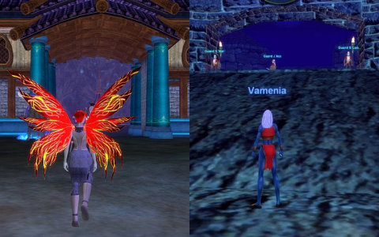
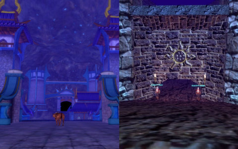
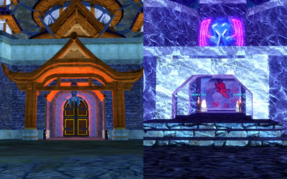

Back to: [West Karana](/posts/westkarana.md) > [2007](/posts/2007/westkarana.md) > [May](./westkarana.md)
# EQ2: Neriak, Old and New

*Posted by Tipa on 2007-05-25 07:26:51*

Centuries ago, during the Age of Turmoil, the necromancers of the Tier'dal city of Neriak threw their undesirables into the outskirts of the city and shut themselves off from the world. Those undesirables -- trolls, ogres, and dark elves deemed insufficiently pure by the Queen -- found themselves under assault by brave, courageous, legendary, fabulous, and in all other ways the perfect paragons of pulchritude (thanks, Sanya), Halflings. Having battled the inkies in Nektulos, they invaded Neriak itself, killing and destroying what they could. The embattled Foreign Quarter of Neriak became Fallen Gate, haunted by the spirits of those who died there, betrayed by the Thexians. Now, seizing upon Lucan D'Lere's apparent disinterest, they have returned from their centuries-long exile, and brought with them a new race, the living personifications of the darkest magics, the Arasai.

They love their Fae cousins. They make great centerpieces at any banquet.

The inkies *have* been busy in the centuries. Largely gone are the masonry and neon of old Neriak. They've redone the place in rare woods and the ubiquitous bluish stone that's everywhere -- and mind your step. Mining and delving have left many chasms waiting to trap the unwary. Don't think having wings will save you.

If you look carefully (but not *too* carefully... the Neriak guards zelously investigate rumors of too-curious people, be they Thexians or barely-tolerated visitors) -- if you look carefully, you can see the echoes of the Neriak of old in the Neriak of new. And if you look down into the chasms, sometimes I think I can catch a glimpse of the Neriak of old, too... where it was pushed...

The priests of Neriak moved from their neon-soaked home into the Spires -- four towers for administration, receiving visitors, or informal meetings, surrounding the central tower of the Temple of Innoruuk. This large temple, dominated by an enormous statue of Innoruuk poised to awe solicitors as they enter, is the center both of worship and intrigue in Neriak. Here you can find blessings... and enemies.

Most of the places of Old Neriak have counterparts in the new. The Down Under has maybe become a little more literal; it is actually dug beneath the pathway from Neriak Commons to Third Gate instead of just being a basement shopping center.

Even the docks still exist. And just as bare of ships as they've ever been. The people near the docks assured me, though, that they expect ships to dock there in the *very* near future. If you ask me, those ships won't dock there by choice, and I would be very surprised if their crews survived the trip.

The warm, homey environs of the Necromancer Guild have been rebuilt entirely. Gone are the skeletons and ghouls that brought such (un)life to the place. But even now, visitors had best be assured they know which doors to open, and which to leave closed, should they visit. Some things (in Neriak, *most* things) are best left unexamined.

After obtaining Neriak citizenship (in typical fashion, by killing several people whose loyalty to the Queen was in question), one may rent apartments of any size. They are cold, sterile places that stink of age and death. Just perfect for a young Necromancer such as Dorah. She moved right in, using the new moving service which instantly carries your belongings from your old rooms to your new.
Neriak is a grand new zone, laggy as Bree for me, though. Sometimes, it is too dark to move around, though relogging usually fixes that. I wish that the designers had stayed as close to the original design of the city as the designer of Unrest stayed when updating that zone. Everything is *mostly* in the same place; the docks moved from Third Gate to the Commons; the entrance from Darklight Woods looks more like the entrance to the Foreign Quarter than the Commons... things like that that throw you off if you were familiar with the city from EverQuest.
## Comments!

**Stingite** writes: Ahhh dangit . . . I loved the neon of old EQ Neriak. I guess blue stone will have to do.

So this is the world you've been inhabiting. I tracked you down to say hello and pass on a hello from elemenope (old school Semper Questio) as well. From what I understand, we've been on the same server twice now and never said hello. I was on Emarr and am now on Windfola on LOTRO. 

So, hello!

I love your blog. You do a great job. Did you also use to do the website for CE? The ones with the comics? I use to visit the front page just to read them. hehe. Cracked me up. I think my favorite was the Vishimitar one.

Thanks!

---

**[Dardore](http://texasrugby.wordpress.com/)** writes: Good Lord I loved every minute of this post. I love to take EQ1 and EQ2 and see the difference in the two. It's amazing how finely detailed the programmers could get. It's truly awesome!

---

**[Tipa](https://chasingdings.com)** writes: Hi, Stingite! I remember Elemenope :) SQ was a really fun guild! I do play on Windfolia occasionally; right now, LotRO is on the back burner. EQ2 is just too much fun to stay from for long.

Yes, I did the website for CE up until, hmm, I guess just after we entered the Demiplane of Blood. I still play EQ1 now and then because all my best friends are there, but the game itself is just missing something.

I loved doing the [Vishimitar comic](https://chasingdings.com/eqdkp/viewnews.php?s=&start=20)... It was kind of a hard thing to follow, though, and the pressure of coming up with them got to me, which combined with my waning interest in the game, was deadly.

I'd like to do comics for the games I play now, but I have to find a way to do them that doesn't lead to burnout...

---

**[Tipa](https://chasingdings.com)** writes: Thanks, Dardore :) I made the pictures a little clearer after I came home from work. Neriak is really incredibly well done; I LOVED the old Neriak. Going to Fallen Gate for the first time and suddenly realizing that I was standing in the ruins of that great city was amazing, one of the things that made me love EQ2 immediately.

---

**Stingite** writes: hehe . . . the vish comic still cracks me up. "winghugz" is possibly the funniest thing I've ever read on an MMO comic.

yeah SQ rocked. I was "Reverencia" back then and used to heal along side Window in the Halls of Testing!!! (tm). Didn't you and Window use to hang out? 

Anyway . . . I will definitely put this blog on my list to visit. I have a couple up myself. This puts mine to shame. Keep up the good work!

---

