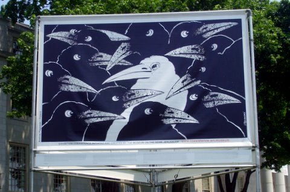

Back to: [West Karana](/posts/westkarana.md) > [2007](/posts/2007/westkarana.md) > [May](./westkarana.md)
# Coexistence

*Posted by Tipa on 2007-05-26 09:13:56*

The Hartford is sponsoring a traveling exhibit of billboard-sized artworks on the theme of Coexistence created by the [Museum on the Seam](http://www.coexistence.art.museum/) in Jerusalem. [From the Hartford's website](http://www.thehartford.com/coexistence/ "The Hartford presents Coexistence"):

> Coexistence is a giant public art exhibition, featuring approximately 45 billboard-sized images created by artists from around the world. It encourages people to think about human relationships and the meaning, use and misuse of words such as tolerance and respect. These images create the potential for initiating valuable dialogue on issues of diversity such as race, ethnicity, religion and gender.

I spent my lunch hour yesterday walking around through the exhibition, snapping pictures. The best ones I put into [my web gallery](http://picasaweb.google.com/brendahol/Coexistence). Take a look -- many of the billboards are beautiful, some are disturbing, all are thought-provoking. Or if you're in the Hartford, Connecticut area, take an hour or so and go see it for yourself.
## Comments!

**[Cameron Sorden](http://randombattle-cameron.blogspot.com/)** writes: This came to my University a few years back and we checked it out. It was pretty cool.

---

**[Alex](http://texasrugby.wordpress.com/)** writes: Ya, indeed. Very Cool Stuff! I wish we had that down here. I'd love to see that exhibit.

---

