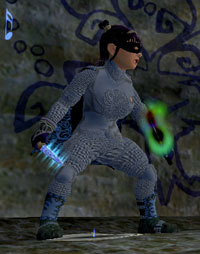

Back to: [West Karana](/posts/westkarana.md) > [2007](/posts/2007/westkarana.md) > [November](./westkarana.md)
# EQ2: Rambling on...

*Posted by Tipa on 2007-11-05 00:53:19*

  
*Those who write on Freeport walls, roll their...*

I'm in a little bit of a funk regarding EQ2 at the moment. Not the game -- no, the game is great. It's me. And it's other people. These sorts of games are social games, and if the social isn't working, the game isn't working.

 The guild I'm in is having problems. It has been having problems for awhile. There is room for only so many raiding guilds on any particular server, and we were number one, once; now we're number ten, maybe lower.

It's hard to get people to join who will stay. I know how this story ends; Crimson Eternity on EQ1 ended the same way. Recruit all you like, but once a guild has lost its momentum, it's impossible to get it back. Sure, we have people coming back for Kunark -- they are joining other guilds.

It's kind of a bummer.

My son and I are discussing what to do, after Kunark comes out and we level to 80. The personal ties that kept me in Crimson Eternity long after it was clear our time had passed aren't so strong in Eternal Chaos. I don't want to let anyone down, but logging in for Labs is just depressing.

Oh yeah, I got a new knife in Clockwork Menace tonight (inset picture). We raided Cheldrak and CWM jointly with another guild with whom we might merge or absorb. It was nice to be raiding again. The proof would be FTH, EH and MMIS. Clear those, and I will be nothing but happy staying right where I am.

Appearance armor is that junk armor from HoF, Stygian Chain.

## Comments!

**[ogrebears](http://ogrebear.com)** writes: Guild can and do gain there momentum back. My guild has once, and we are in the middle of doing it again. Recurring is one thing, but changing the rules, and change up the leadership of the guild is also a major step. Right now we just got in place are third generation of officers. I am the only one of the second generation of officer that stayed, and a few from the first are still officer, but now 1/2 the guild officer are new people.

They have new idea that none of the old officer ever thought of but it change the guild, make it fresh, and we are hoping that we can pull the guild around again. It seem to be working, recurtment is up, and guild raid attendence has gone up as well.

---

**[Tipa](https://chasingdings.com)** writes: Well, best of luck to you, and I hope you pull it off. Our raids with Risen Beyond last night were pretty good, and maybe we'll pull it off as well. I fear, though, that our times as one of the top guilds on the server are over. The real test will be Kunark. Is our guild strong enough to do epics? When original Kunark came out, this was THE dividing point. If a guild could not do epics, you left for one that could. And sadly, once you got your epic, people often left for a guild that was past epics and into other raids, leaving a three tier guild syatem. Casual, working on epics, and raid guild.

---

**[stargrace](http://mmoquests.com)** writes: Hmms. I've seen some pretty good guilds fall, and I'm agreeing with you on this one, once you loose the momentum, it's very hard to pick it back up again. Even with all the new people coming back for RoK, until level 80 comes around and people are hitting it and progressing, it's very difficult to know where things will sit.

---

