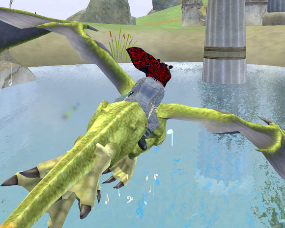
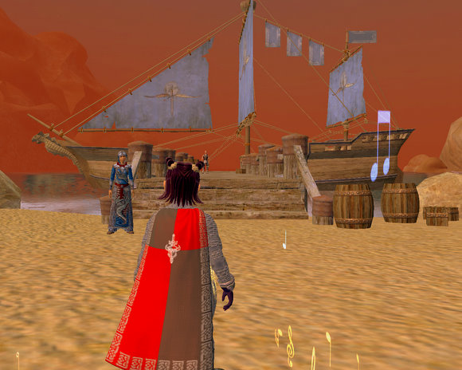
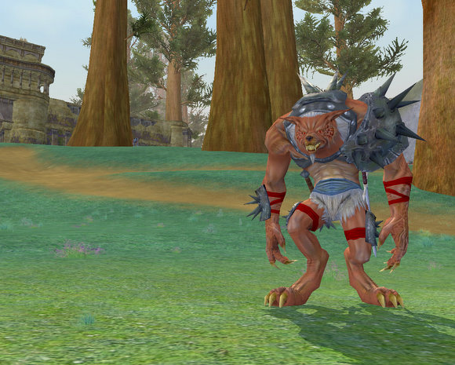
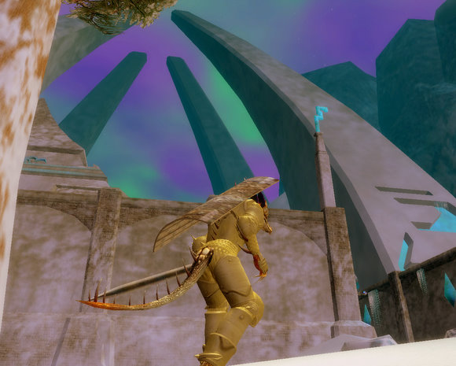
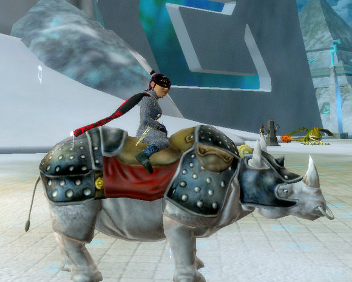
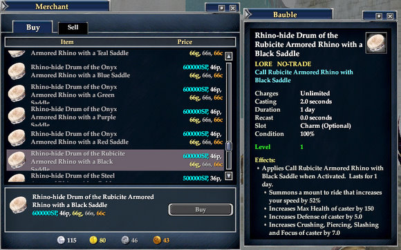
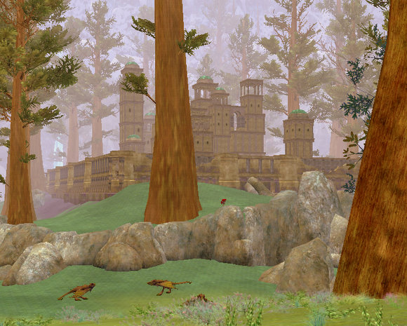
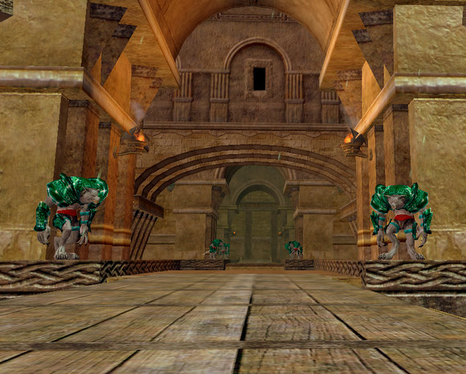

Back to: [West Karana](/posts/westkarana.md) > [2007](/posts/2007/westkarana.md) > [November](./westkarana.md)
# EQ2 - Kunark: a BRIEF first look

*Posted by Tipa on 2007-11-10 01:02:12*

The original continent of Kunark in EverQuest was really big. The centuries since then haven't made it any smaller. In my days of exploration, I doubt I've seen more than a tenth of the expansion, and only been in one dungeon. Two, if you count Chardok.

But at least I got my Sokokar :) And you can, too! This is going to be a pretty heavy load, so you can read more about Kunark... after the jump.

First question everyone asks: **How do I get to Kunark?** By boat, of course. All those problems with raiders from Kunark were dealt with by the tireless patrolling of the murky shores by stout adventurers. The boat to Kunark leaves from the docks in Antonica and the Commonlands.

Make sure you're holding on to something. The boat ride can be a little bumpy.

Welcome to Kunark! Now, make your way up to the docks, look around, fight through the inevitable lag, and **talk to this halfling!**

He's the one you get the Sokokar quest from. Why do you need this? Because there are no griffins in much of Kunark (there are some in the newbie grounds, but I haven't seen any in the higher level regions). To fly from place to place, you will need to acquire a Sokokar.

Fortunately, it's a very simple quest. Talk to the haffer. He wants you to obtain 24 drolvarg fangs. Head out past the drachnids and kill twelve of them. They are good dogs. They drop two teeth each. The drolvargs are level 68-70 and are true lightweights. (I did not beta-buff, and stayed level 70 throughout beta, and had no trouble. And if a troub can solo these, anyone can! But a group would be even better!)

Hey, that Drolvarg just made an unflattering remark about your hat! KILL HIM!

Though I must admit, that's a pretty ugly hat. And hey, what's that building to the left? That's Karnor Castle. We'll get to that in a bit. Having collected two dozen Drolvarg fangs, head back to the haffer. He has a new mission for you. He needs to gather information from Karnor's Castle. But you, you're way too wimpy to go inside such a deadly place, so all he wants you to do is to release a hawk outside it.

Easy enough. Go to KC (invisibility works if you stay out of the water), find the hawk in your inventory, use it, and you're done. Return to the haffer and... well, he's pretty much through with his stuff, but maybe you could help someone nearby with their problem. He sends you to a lady out in front of the outpost, sitting at a Sokokar post, and she explains that their prize Sokokar, Lynchpin, is missing! Maybe? Possible? Could you?

Of course you could! Lynchpin is trapped in a hollow tree near KC, guarded by five Drolvarg whom you must kill. Kill them, give Lynchpin a comforting pat and FWOOOSH! You're flying! All the way back to the docks. The lady there suggests you ride Lynchpin to its trainer up at Teren's Grasp, and so you do. The trainer there is so happy, he gives you a Sokokar of your own. And now you can fly from post to post, once you have encountered them.

By the way, welcome to Teren's Grasp.

Teren's Grasp was an ancient city of the Combine Empire, and these were the spires that allowed them to travel to the now-blowed-up moon of Luclin. Its ruins were a source of power and mystery in the time of EverQuest 1, but now the city has been cleared of undead and the followers of Teren now live there. They won't sell to you until they trust you, but the dock area folk all look to Teren, so by the time you finish with all their cares and worries, you should be fine to buy stuff from the people there.

Maybe you could buy a rhino!

I'm sure you can afford one!

Maybe not. Those spires are hecka cool, though, aren't they? You can climb them! And aren't Sarnaks just the sexiest things ever? They start off looking really ugly, but after awhile, you get used to them. Not the smell so much.

Okay, let's fly back down to the docks and head up to Karnor's Castle.

Times like these you just want to look up and say to yourself, "Self, this place doesn't look anything like it did in EQ1". Yeah, it's had an overhaul. Also, trees are closer, everything looks nicer... those drolvarg are pretty cool folks. Like trees. Pick wildflowers.

Oh yeah, they just have to die. Let's go inside.

Everything *inside* KC is the same as before. Weird it looks so different from the outside.... looking off toward RM -- Right Moat, one of my favorite camps. And looking inward...

Remember, TRAIN RIGHT.

This whole time, we haven't explored more than the smallest corner of the very first zone you'll see in Kunark. Lots more places to see!

Taking a look around the rest of the zone... well there's so much... I srr Ogrebear has covered the Fens... maybe I'll do the Jarsath Wastes next :)
## Comments!

**[Keen](http://www.keenandgraev.com)** writes: Thank you for the preview Tipa! I'm really excited to start my Sarnak Shadowknight and have a little bit of fun in Kunark's starting areas. Some day, and I hope it's not too far off, I will be high enough to adventure in these places as you have. Looking forward to seeing more so that I can live vicariously through you.

---

**[Tipa](https://chasingdings.com)** writes: Because I knew you were making one, and would read this, I made a Sarnak SK. That's her in the golden armor. Betabuffing kills masters and adept 3s, so I didn't betabuff my main troub -- I made the Sarnak SK to betabuff and check out the higher level things :)

---

**[&#8220;Rodents of Unusual Size? I don&#8217;t think they exist.&#8221; &laquo; Gestalt Mind](http://raoworld.wordpress.com/2007/11/12/rodents-of-unusual-size-i-dont-think-they-exist/)** writes: [...] Ever since the NDA for beta was released, information and screenshots have been pouring across the web.  I got nearly giddy looking at the screenshots posted by Ogerbear and Tipa. [...]

---

