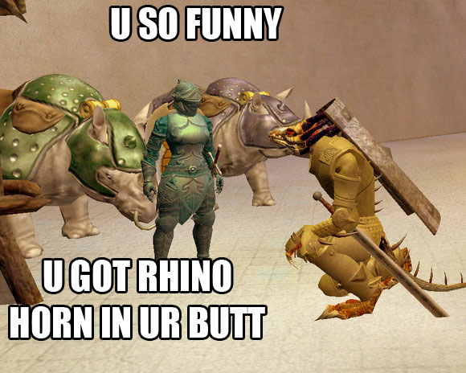
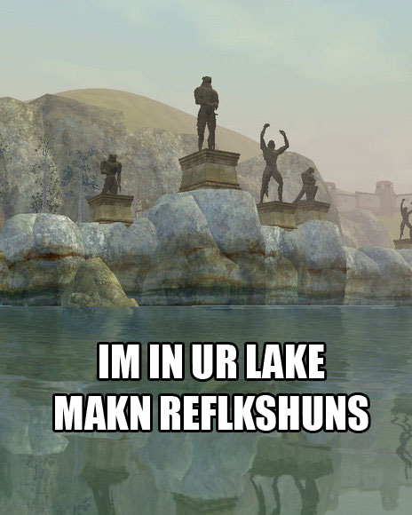

Back to: [West Karana](/posts/westkarana.md) > [2007](/posts/2007/westkarana.md) > [November](./westkarana.md)
# EQ2: LOLVARGS

*Posted by Tipa on 2007-11-10 01:15:56*

Ya know, I'm not even going to try to explain. It's late, I'm tired, just leave me alone.

More after the jump.

## Comments!

**[Genda](http://thegrouchygamer.com)** writes: Heheh.. Not bad Tipa.

---

**[cyanbane](http://www.eq2-daily.com)** writes: Last one rocks.

---

**[Keen](http://www.keenandgraev.com)** writes: LOL @ last one!

---

**[Scott Hartsman](http://www.hartsman.com)** writes: Okay, that's funny. :)

---

**[Scott Hartsman - Off the Record &raquo; All the EQ2 that&#8217;s fit to print](http://www.hartsman.com/2007/11/11/all-the-eq2-thats-fit-to-print/)** writes: [...] Besides, it has LOLvargs. [...]

---

**[Lishian](http://lishian.wordpress.com)** writes: I'm not going to ride those rhinos

---

**[Tipa](https://chasingdings.com)** writes: Beats wiping.

---

