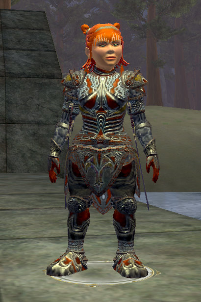

Back to: [West Karana](/posts/westkarana.md) > [2007](/posts/2007/westkarana.md) > [November](./westkarana.md)
# EQ2: Tier 8 Armor

*Posted by Tipa on 2007-11-11 11:28:58*

RoK introduces many new armor styles. Following are some pictures of Tier 8 mastercrafted (the plate) and handcrafted (everything else) armor for all five types (plate, chain, brawler, leather and cloth).

Mastercrafted Plate:

Even yet more after the jump :)

Handcrafted chain:

Handcrafted brawler armor:

Handcrafted leather armor:

## Comments!

**[Lishian](http://lishian.wordpress.com)** writes: Awesomeness!

---

**[Gunthore](http://www.eq2holymight.net)** writes: I really like the plate armor!

---

