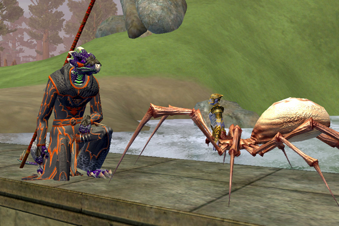

Back to: [West Karana](/posts/westkarana.md) > [2007](/posts/2007/westkarana.md) > [November](./westkarana.md)
# EQ2: New Summoner Pets

*Posted by Tipa on 2007-11-11 11:36:23*

The summoner pets introduces in Rise of Kunark, like from previous expansions, draws from the expansion itself. The robe our conjurer and necromancer wear is the tier 8 handcrafted robe.

Conjurer Mage Pet:

More after the jump.

Conjurer Tank Pet:

Conjurer Scout Pet:

Necromancer Tank Pet:

Necromancer Mage Pet:

Necromancer Scout Pet:

## Comments!

**[Gunthore](http://www.eq2holymight.net)** writes: The conjuror pets aren't bad (maybe excluding the mage), but the necro pets are just awesome.

---

**[Tipa](https://chasingdings.com)** writes: Heh... yeah, they are cool. I logged into beta last night to try and make some Adept 3 pets, as my sage had been copied over, but the rares on the broker were stupid expensive -- well over 100p each. Why people were gouging each other on rares when (a) they had got them for free on the tradeskill beta buffer before they removed them, and (b) everyone got wiped today; I don't know. Upshot is, I didn't make any spells last night.

My sage is a brigand; instantly leveling from 30 to 80 was cool :)

---

