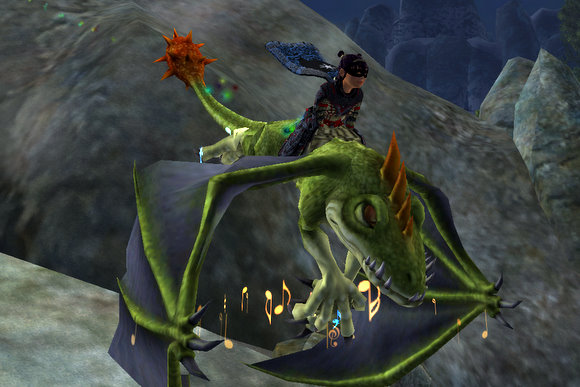

Back to: [West Karana](/posts/westkarana.md) > [2007](/posts/2007/westkarana.md) > [November](./westkarana.md)
# EQ2: Rise of Kunark, Day One

*Posted by Tipa on 2007-11-14 08:28:16*

Things I accomplished: Leveled to 71, got my Sokokar, got to "amiable" with the Followers of Teren, 103 AAs, explored all of Karnor's Castle and killed its commander (for no reward), made a server discovery on a tradeskill book, got the new EQ2Maps and ProfitUI running.

Things I did not accomplish: Level jewelcrafting, reinstall Windows on my other machine, get enough faction with Teren that I could buy and sell in Teren's Grasp.

There were only so many hours to the night! And a couple of them were taken up by patching.

I'd called my son from work and asked him to get the patching going. He'd already started on his machine; the patch time had started off at 18 hours, gone to 16 and then 12, and sometimes the patch time would go up. I didn't like the sound of that. He started it going on this machine and it was up in the realm of 'forever'.

By the time I got home, he was sitting at 40 minutes (and seem stalled there), and my machine was looking at about four additional hours. I got to wondering if I could just copy the PAKs from Beta, and so I did, and it started copying the MP3 files in which all the game music is stored. I copied those from Beta as well, and was done about ten minutes after that. My son, who was also in Beta, tried this same trick, but he had not actually been playing Beta, so his files were out of date and he still had a fair amount of new stuff to download.

I got in game, called back to Freeport from where I'd camped outside Freethinkers, repaired, and went down to the docks to travel to Kunark. I was one of the first people in the guild to the new lands, and got a spot in the guild group they had going.

My maps were broken; I'd ripped the ProfitUI out of my machine and after that pretty much nothing worked, so I had no idea where the group was (turns out they were up at Teren's Grasp). So while waiting for them to get back to where I could see them, I started on the Sokokar quest. I'd grinded through about half the drolvargs I needed when the rest of the group arrived and we entered Karnor's Castle.

I'm the little Billy doll -- that illusion is one of the Four Year Veteran rewards, along with three experience potions (I used one) and some house stuff. I don't think I got my Burynai pet, though. I got a droag plushie, some massive bench, and a treasure chest that cuts my rent by 25%, but.... no Burynai to find shinies in my house!

That screenshot was taken in a raid instance we found, deep within KC -- the Execution Throne Room -- so I'm getting way ahead of myself.

We zoned into KC and found a crowd of people, drolvargs beating hapless AFKers senseless, people training drolvargs to the zone, people looking for a pickup group... it was JUST like coming home again. I sent a tell to a friend on EQ1 -- "I'm in a KC RIGHT MOAT GROUP!". And he told me they were enjoying *new* zones over there. Yeah. Like Loping Plains? BEEN THERE.

We moved in, went through the Drolvarg Captain, Left Courtyard and Skeletal Captain camps -- not that those nameds pop in EQ2, but the zone is so similar to its previous incarnation that it's easier just to call the new places by their old names. We found a couple of nameds, one of which claimed to be the Commander surrounded by advisers, who gave neither loot nor AA when we killed him and so must be a quest mob, evaced back to zone in, explored the moat, found the path to the basement in the same place it was in EQ1, and followed that to the raid zone.

The zone was fun and filled with memories, but the experience? Not so great, even with drinking an experience potion. Doing quests was far more rewarding, so we left KC to get our Sokokars and work on some of the Teren faction quests.

I love my Sokokar :)

The dock quests lead you to the Teren's Grasp quests, which bring you in turn to a small quest camp north of KC, and somewhere in there I dinged. After that, I worked on quests until I became amiable to Teren, and could use the mender at the docks but still got the silent treatment in Teren's Grasp (so I guess I need to get to "warmly", at least), and then I just goofed around -- got the Sokokar routes up toward Chardok, got my UI working... I wanted to keep going, but had to sleep.

Good points about RoK so far: Nostalgia, beautiful zones, lots of soloable quests with decent rewards and great xp that leas you naturally through the zone.

Bad points: Group experience in KC was pretty crappy anywhere near the zone. The level 74+ mobs deep inside gave acceptable experience. The loot was a disappointment. If I had just been grinding xp in a good group in KC, I'd still be level 70. Also, started the night with only 10% vitality. I've been level 70/100AAs for awhile. Would 100% vitality have been too much to expect?

All in all, though, a great experience so far, a fantastic expansion, and I'm looking forward to seeing Wuoshi dead in a couple of levels...

## Comments!

**[Lucifrank](http://tenfoldhate.wordpress.com)** writes: I'm loving the screenshots, Tip. I'm surprised not more is said around the MMORPG community about how beautifully done EQ2 is. It really puts other games, even some that are graphics card-eating memory hogs, to shame.

---

**[Tipa](https://chasingdings.com)** writes: Those are actually low quality screenshots. The crowds everywhere tormented my system so much -- to the state where the vid drivers would crash out of memory -- that I had to ratchet down the graphics quality just so I could move around normally. But yeah, this is a nice looking game. Really helps get into the feel of the world.

---

**[rao](http://raoworld.wordpress.com/)** writes: I didn't get my burynai either. According to an e-mail that I got from Sony yesterday, it seems that they have changed what the house pet gift will be from a burynai to a cockatrice. If that did indeed to this, the nature of the pet will most likely change as well. I simply can't see a chicken scrounging around our houses digging up shinies like the miner would have.

I guess we won't know for certain until we can actually claim the silly things though.

---

**[Tipa](https://chasingdings.com)** writes: Hmm. I didn't get an email! And truly, I don't really need another house pet roaming around -- I must have well over a dozen by now -- place smells like a zoo -- but I really do need a Burynai to help with the "shiny" problem.

I want a Burynai :(

---

**[Lishian](http://lishian.wordpress.com)** writes: I received the house items from all of the expansions. :) I wasn't expecting that.

---

**[Tipa](https://chasingdings.com)** writes: Huh! Well I never got the special edition dragon or the EoF clockwork... I'll have to check! Lucky you!

---

**[almagill](http://gudeman.co.uk)** writes: Don't throw rocks... I've got my burynai (and I will call him Badger and hugs him and loves him and... yeah yeah..) AND the cockatrice.

One was for the DD and the other was in the 'retail box' reward option that was listed when I hit claim. Hope I don't find Badger gone when I log in tonight... I've got hims some bones and everything.

Okies, the graphics in EQII? They constantly impress me. I've just chucked 2gig of RAM in this machine (it ran 'alright' on 1gig but hey) and, hitting the setting above 'Raid' in the ProfitUI video panel it sltill looks really nice. Cranking it up to Screenshot and you really need to bring a mop, I drool that badly, but only at about 5fps, ;) And I'm only using a piddly 1.8ghz processor too.

---

**[Lishian](http://lishian.wordpress.com)** writes: I didn't get the dragon. If I did, it would be on the broker already.

---

**[Tipa](https://chasingdings.com)** writes: @almagill -- pictures or it didn't happen :) I want so much to have a Burynai waiting for me tonight. I'll call him Dalnir.

---

**[Killzum](http://www.revenants.wordpress.com)** writes: I love my Sokokar too :)

Got a Dark Warg Summoning Drum in my free LoN booster pack when I claimed it...I can't tell you how pleased I am!!

---

**[Tipa](https://chasingdings.com)** writes: Oh yeah, I forgot to open my free pack. To be honest, I'm not really a fan of mounts. I don't need them for speed, all my high level characters already have fast mounts, I find them cumbersome and they don't allow me to back up at full speed when I kite. So I'd probably sell mine if I could, if that's what I got. Glad you got something you needed, though :)

You know what I'd like? A "Ding!" card. You use it, and you ding. Just like that. Level up.

---

