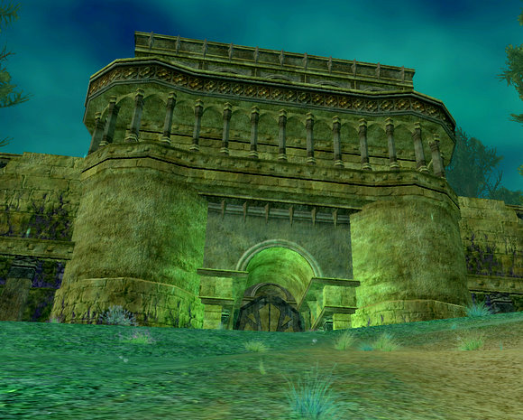
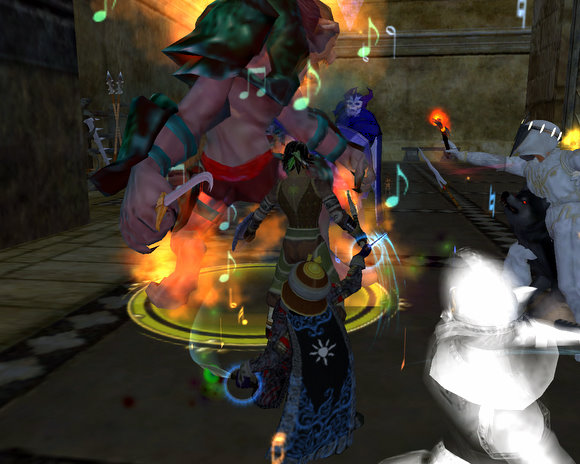
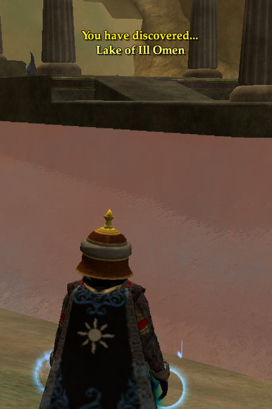

Back to: [West Karana](/posts/westkarana.md) > [2007](/posts/2007/westkarana.md) > [November](./westkarana.md)
# EQ2: Karnor's Castle -- Beauty IS only skin deep.

*Posted by Tipa on 2007-11-15 08:06:57*

I have great and fond memories of Karnor's Castle from EQ1. The experience was decent for its level. Loot was plentiful. And the place was absolutely, friggin' HUGE. There was really no better place to be for levels 49-54, and if you weren't hunting there at those levels, you were waiting for a spot in a group there.

For those who didn't play EQ1 back when Kunark was king, let me explain what play was like in KC. The zone was split into "camps" -- a dozen or so -- and each camp had enough mobs so that by the time you finished killing every mob in your camp, they'd begin to respawn. Killing the initial set of mobs in a camp was called "breaking" a camp. A group would move into a camp, break it, then from then on, continual pulling and experience. Loot was and is fairly common in EQ, and so EQ1 groups had various well-known methods of distributing loot. You'd go into KC for a group, and depending on your camp, would walk out with a lot more experience (unless you were in the hell of level 54), plenty of gems and other cash loot and perhaps a rare item. SOE kept adjusting the loot upward to make the zone an attractive place to be even many expansions down the line.

It's this sort of place for good xp, good loot and moderate risk that really drives all the EQ1 nostalgia for this zone and Old Sebilis.

Unfortunately, this is not the Karnor's Castle of EQ2.

I've been all through the new Karnor's Castle twice now, last night and the night before. EQ2 groups do not sit in one place and pull; they keep moving through dungeons, because a good EQ2 group is a roving death machine. We were a good group. A tank, two healers, an assassin, a conjurer and me for all the cool troub buffs (and mezzes!) -- there wasn't any part of it we couldn't do. We roamed around a bit, then, because we were all on the same catalog quest given outside KC, evaced back to the zone and went through again to finish that up.

The quest continues, but we didn't. Why? Because our trips through the zone netted us only 4% experience (0.1% experience per kill), and one Adept.

We split up to do quests outside; I returned to the quests I was soloing in the Friends of Nascar Fens of Nathsar.

And there I soloed about 20% experience, got several adepts, and a Legends of Norrath Booster Pack (broker price, about 3p). If I'd been in a group, we could have finished all the quests given on the Span and I'm sure I would have dinged.

Just doing quests and killing in a risk-free, outdoor zone, beats hunting in a semi-risky dungeon. How is that even possible. Dungeons are supposed to give you superior benefits for the trouble of grouping -- better experience, better loot.

Somehow that got lost.

Consider a similar open dungeon in EQ2 -- the Sanctum of the Scaleborn (SoS) in Tenebrous Tangle (the Ruins of Varsoon, Stormhold, Kaladim, Klak'anon, Mistmoore Catacombs, Crushbone, Castle Mistmoore and Fallen Gate are also terrific examples of fantastic open dungeons for their levels).

If you're in SoS at the correct level - 58 to 64 or so - the experience is amazing, and the loot just keeps dropping. Every room has a named, some have ring events with awesome loot at the end, and there's at least ten quests you can be doing, and likely far more, so that you're working through quest lines, and getting experience for them and the loot from them as well. The zone is built to support roving groups; repops are fast and the nameds are fairly common.

And SoS is amazingly huge.

Karnor's Castle is not. It can support three groups without getting in each other's way at all, but more than that, and you're going to be running out of stuff to kill. And the xp is dismal, so why stay? Both groups I was in ended because the xp stank.

When word of this gets around, KC will become a ghost town. People will do the Kylong Plains/Teren's Grasp quest lines, then move to the Fens and just skip Karnor's.

SOE, it's not too early to consider tuning this zone. Grouping in KC should be more rewarding than questing outside.

The *outdoor* design of these two zones, Kylong Plains and the Fens of Nathsar, is amazing; plenty of room for me to kite. It's as if kiting runs were specifically laid out for those of us who can't stand up well, toe-to-toe, against monsters one or two levels above us. Pull, snare, nuke nuke nuke (it's not for nothing I'm wearing caster appearance armor these days), if things go bad, mez, sneak, backstab+snare+nukenukenuke DEAD! Yay!
## Comments!

**[almagill](http://gudeman.co.uk)** writes: OK, looking for a positive spin to put on that... at least KC is in. Now, as you point out, it 'only' needs some love and attention and upward conversion to make it THE place to be seen.

The KC of EQ does sound pretty amazing though.

---

**[Tipa](https://chasingdings.com)** writes: SOE's old strategy was to be TOO generous at start, then tune things downward -- Runnyeye, for example, gave out fantastic loot at launch, but they removed some overpowered items and tuned it down a little until they got it right. That's how you get people to come to your new playgrounds; you toss loot at people so that dungeon becomes part of their leveling plan. If it's too much, you tune it down until your risk/reward ratio is where it needs to be for the game's health.

KC isn't that risky, if you're careful. It's far easier than EQ1's KC, where it was all too easy to pull a dozen mobs on you by mistake and then you were training to the zone. Clerics were so rare that usually you'd have shaman and druids as your only healers, and they couldn't rez (back then) (in fact it's been so long, I'm not sure they can even rez now), and there was no respawning at zone in, so even one death could mean the end of a group -- that made for some harrowing and exciting gameplay... back then.

The disappointment of finding a named up, killing it, and getting nothing except, perhaps, an adept or a tradeskill tome, and very little experience, is just going to kill this zone. I hope SOE moves quickly on this. Guildies say other dungeons are somewhat better -- Chardok, also in Kylong Plains, is supposed to have better experience and loot -- but I haven't grouped there yet so can't say.

Chardok in EQ1 was a very dangerous zone. Because of the risk, the rewards for experience and loot, were amazing. Charasis, another dungeon shared by both games, had even more risk, even better loot and experience, and had an intriguing zone design. In EQ1's Kunark, risk vs reward was a well-understood ratio; if you were grouping in a dungeon doing level-appropriate stuff, you would be rewarded well.

Kaesora... another Kunark zone... you'd ding just walking in that place, I swear. With commensurate risk, of course.

---

**[The Common Sense Gamer » Weak in the knee](http://commonsensegamer.com/?p=520)** writes: [...] been reading for the expansion for long time EQ2 players seems to be loot drops, experience in areas like Karnor’s Castle and group experience rewards…not the fact that they pulled the epic [...]

---

**[Kendricke](http://www.clockworkgamer.com)** writes: We want to group in Karnor's. We do. But the rewards and the size heavily discourage it. The new instances spawn around 50 people it seems, and frequently I've been in Karnor's Castle where there are at least 30-50 people milling about, stepping all over each other, and basically just getting in each other's ways. 

There were several little areas that would have made great camps, but the respawn rates just couldn't keep up and of course the experience was horrid.

Honestly, increase the respawn rates just a tad, boost the experience in the zone just a bit, and drop a few more quest lines in there and I think you've got yourself a great little dungeon. As it is now, we're all but skipping it except to get the Drolvarg Legend and Lore book and the discovery experience.

---

