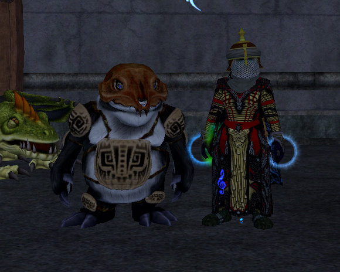
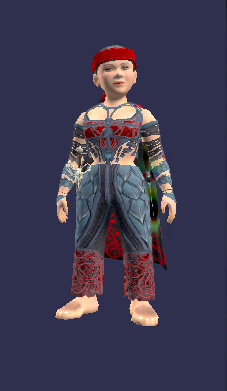
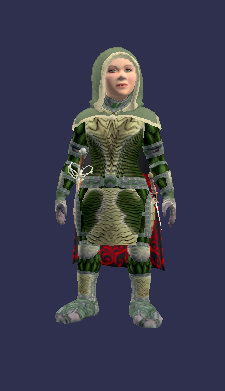
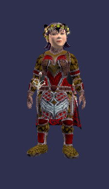
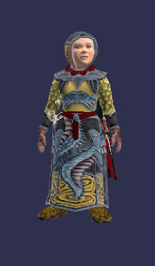

Back to: [West Karana](/posts/westkarana.md) > [2007](/posts/2007/westkarana.md) > [November](./westkarana.md)
# EQ2: Burynai, shinies and fabled armor sets.

*Posted by Tipa on 2007-11-15 08:27:22*

This is my Burynai. His name is Dalnir! When I feed him, he acts like he's coughing up a hairball, but it's really collectible items. I got a Crushed Scorpion (ewww) and a Rivervale Scroll from the foods I had on me.

I was so happy to see I could claim him -- I just hadn't looked far enough up in the list.

I took my alts out of my main guild's alt guild, "E C Bots". That name is just embarrassing; a joke someone thought was funny, but just try to be taken seriously in a group when you have that name hovering over you. I asked in guild if there was an alt guild I could join my crafters to, since I will be grinding writs and would like that effort to go to leveling a real guild. The guild leader mentioned "E C Bots", but, um, no. I know that very few alts join that guild. I see people's alts in half a dozen other guilds, and I was looking for an invite into one of those.

I got a tell from a guildie who had an alt guild *precisely* to avoid being branded a twink, and so I joined all my crafters to that. When I get to leveling my jeweler to 80, I won't feel that effort is wasted now.

The beta is still running, for some reason. I accidentally logged into it last night. Looking at the guild's events log, I saw there were several people being buffed to 80 and given the fabled set gear, perhaps to test some things out, so I used the dressing room to capture some of those sets -- pictures of them after the jump.

Monk:

Templar:

Ranger:

Fury:

Coercer (I think, maybe Illusionist):

Dirge:

There were others, but nobody had thought to do a troubador. Someday, we'll be flavor of the month again!

## Comments!

**[stargrace](http://mmoquests.com)** writes: Hah, I love the appearance armor choices you have on in the shot. You're pretty much an illusionist in chain is how I figure it. Able to mez, root, nuke, and buff your group up. My troub and Illusi both play similar in game, though right now, the illusi lasts longer in a fight, and the troub has an easier time tracking down what she needs and evac'ing. Plus, nothing beats that run speed right now in Kunark. LoL. Though a guildie did manage to get enough faction to buy their first rhino from The Fens merchant last night. I found it odd that for 18p and some faction you get 50% run speed rhino -- however, it doesn't have as nice stats as the guild level 80 49p 600,000 status one.

---

**[stargrace](http://mmoquests.com)** writes: Ps. I adore the monks new fabled gear. Brawlers look so amazing in them. Especially non-halfling ones *snickers*

---

**[Tipa](https://chasingdings.com)** writes: Halflings look amazing in everything!

I would have trashed most of the quest armor rewards except that they make such great outfits! I have a couple more sets waiting, well, at least one more, just from the KP quests. I love being able to change my look. One girl told me every time she looked at me in the group I was something else -- a Billy doll, a spider, a halfling...

The secret to lasting long in solo fights is to snare and kite. I often end a fight with a monster 1-2 levels above at 100% health and nearly that in power, ready to pull again. Sometimes I finish stuff off with melee. And bard speed means when things really get nasty, I can outrun my problems.

I have lots of alts, but it's only as a bard that I feel I'm really in control. I don't dare solo with another class; even with my necro, I mostly group. I don't have an illusionist, though -- maybe I'd be good at it.

---

**[Lishian](http://lishian.wordpress.com)** writes: The red they have in the gear kind of freaks me out. I love those clothy helmets though. I want to get one for my swashy.

---

**[Lishian](http://lishian.wordpress.com)** writes: btw: Are there quests for level 65 toonages in the new zones? Wonder how quickly I could get to 70...

---

**[Tipa](https://chasingdings.com)** writes: Swashy fabled hat is that same wide brim, low crown hat you've already seen. The high level RoK zones start at level 68 -- the roaming outdoor mobs start at level 68 and in the first zone, Kylong Plains, range from 68-72. The dock quests start at 68 as well. If you're at 65, you aren't very far from being able to check it out :)

---

**[Lishian](http://lishian.wordpress.com)** writes: I'm talking about the persian style hat with the spike in the middle. I like those ones.

---

**[Lishian](http://lishian.wordpress.com)** writes: i have multiple type of xp potions too.. I have some longevity potions and soome LoN potions.. I might try to level the swashy/carpy when nobody is logged on (or few) in the guild early on the weekend.

---

**[Lishian](http://lishian.wordpress.com)** writes: In response to Tipa's appearance infatuation. Since we have so many appearance switching options, I no longer feel I need to make an alt every other day. I, finally, may be able to stick to one (or two -- I need a male and female toons) toons.

---

**[Tipa](https://chasingdings.com)** writes: Oh, that hat was a quest reward. It wasn't a reward for my class but I could wear it and nothing else seemed cooler. Those kinds of hats drop everywhere -- I saw one from Nizara anyone could wear, I saw one somewhere else, too... the robe was also from a quest.

Better make your two characters plate classes, they can wear anything :)

---

**[Lishian](http://lishian.wordpress.com)** writes: bahhh.. plate classes. Zerkers are fun though.

---

**[Lishian](http://lishian.wordpress.com)** writes: Can you were a robe with plate pauldrons? hmm

---

**[stargrace](http://mmoquests.com)** writes: When you wear a robe your shoulders / sleeves graphic gets covered no matter what, so probably not the effect you're going for...

There's a fashion don't quest (as I term it) on the Kylong docks... take a look at the cloth hat reward that has a very red (interesting.. unique..) graphic.. you'll know the one I'm talking about right away ;)

---

**[Lishian](http://lishian.wordpress.com)** writes: I couldn't find a burynai in my claim items :( All I could find was some dumb cockatrice :( WANT BURYNAI!

---

**[Tipa](https://chasingdings.com)** writes: The Burynai looks like a stuffed cat in the claims list. I bet you just didn't recognize it -- I sure didn't!

---

**[Lishian](http://lishian.wordpress.com)** writes: @stargrace Looking at all the screenshots, there is too much red in some stuff. Kind of sticks out like a bloody finger.

I really like the old boiled leather camo outifts. I have one of my toons wearing it as shown in my blog. I wish there was more earthy outfits.

---

**[Lishian](http://lishian.wordpress.com)** writes: Burynai is a pre-order item, right? Did you get the cockatrice too?

---

**[Tipa](https://chasingdings.com)** writes: I did get the cockatrice, and the clockwork. Meh, more pets. Dalnir, my Burynai friend, is special :)

---

