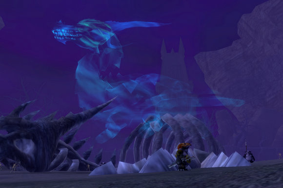

Back to: [West Karana](/posts/westkarana.md) > [2007](/posts/2007/westkarana.md) > [November](./westkarana.md)
# EQ2: How did beta testers test Rise of Kunark?

*Posted by Tipa on 2007-11-16 08:41:48*

Rise of Kunark is a beautiful expansion, but the tuning has problems. Three days in, and I'm stumped as to how the tuning I've seen so far in the Kylong Plains and the Fens of Nathsar was done.

In the beta, I saw a lot of soloers, and a lot of people beta-buffing and grouping up for the dungeons. What I didn't see much of, was people playing the game as they would do when the game went live.

I've already talked about the problems with Karnor's Castle.

Last night, my plan was to log in and faction for awhile to get Teren's Grasp faction, but I got a group doing Fens quests nearly immediately.

The Fens, like the Kylong Plains, is covered with solo mobs. There are no mobs grouped with one another. There's no heroic mobs. I'm not sure if even the nameds were heroic.

When EQ2 launched, overland zones were a mix of solo, heroic and group mobs -- they were mixed-use zones. If you wanted to solo, there were mobs you could grind on. If you were in a group, there was plenty for you as well. Everyone got great experience according to their playstyle, and while you were soloing in a zone, you could be looking for a group in that zone as well. I loved the Thundering Steppes for this.

Over time, the player base moved on, and the zones were readjusted to be only solo mobs. This made sense. When nobody groups in a place, group-only content is wasted.

That's *not* where we are in RoK, yet. Last night I spent perhaps five hours doing quests in a full group in the Fens. There were lots of groups. I saw no soloers -- I'm sure there were some I didn't see -- but whenever we passed other people, they were grouped.

Since we were killing solo mobs, though, our experience bars barely moved, unless we were turning in quests. Grouping in EQ2 should, in my opinion, always be more rewarding than soloing. I've got nothing against soloing; I love soloing sometimes.

But couldn't RoK have launched with open zones filled with solo AND group mobs, so soloers would have stuff they could kill, and groups, stuff they could do? Five hours of grouping, killing continually, and I think my vitality might actually have *grown*, I was getting so little adventure experience.

Mixing solo and group content was something SOE knew well in 2004. And it was totally appropriate to move those group mobs to solo mobs as the usage of the zone changed.

RoK moved a little too quickly to solo-only zones. In a year, when the bulk of the playerbase has left Kylong Plains and the Fens of Nathsar, that would be the time to refocus these zones to the solo player. It was way too early to do it when people are eager to *group* in these zones.

That said. The Fens of Nathsar is an amazing zone. By the time we finished, we'd gathered around thirty quests from the various camps around the zone. The zone is in sway of various factions; the Rilisian Iksar, the Bathezid Sarnak, the Bellywhomper Burynai, the Drogan Exiles, the townsfolk of Omen's Landng -- and there's no reason why you can't be friends with all of them. They distrust you at first, but then are eager to pile quests upon you, which let you get even more.

When you're done with the quests, their camps make excellent hunting grounds as well, with many heroic nameds. But you wouldn't betray your new friends, right?

I'm still loving RoK. It could be better. There could be more group content at this time when people *are* grouping.

Still looking for a nice zone, dungeon or instance where a group can get some good experience, some good loot, and a bit of adventure. I've seen some loot and some adventure... but the experience (points) have been lacking (except when turning in quests or discovering new places).

## Comments!

**[Solo? Group. Wait-- Solo? Group. No, solo. | Random Battle](http://random-battle.com/2007/11/16/solo-group-wait-solo-group-no-solo/)** writes: [...] Tipa is irked by the zone design in many of the new zones in Rise of Kunark, and understandably so. What’s her beef? The Fens, like the Kylong Plains, is covered with solo mobs. There are no mobs grouped with one another. There’s no heroic mobs. I’m not sure if even the nameds were heroic. [...]

---

**[Genda](http://thegrouchygamer.com)** writes: I was wondering about this, and after your article about KC, almost asked this question myself on my blog. I'm kind of surprised that they haven't stuck to a winning formula and given a premiere zone or 3 for the kind of group hunting you talked about. Maybe they think that the mix has changed to mostly solo-ers? At any rate, glad to hear you are enjoying the expansion, too bad it's not a little more polished.

---

**[Keen](http://www.keenandgraev.com)** writes: I really disagree with your statement: "Grouping in EQ2 should, in my opinion, always be more rewarding than soloing."

That would appeal to the groupers but literally be saying "Hey, we don't care at all for the other playstyle. It's inferior". SOE has made it clear that they obviously care very very much about soloers. There's evidence in statements and actions. There should however be enough content to satisfy both. If group content is lacking then that's a problem - same could be said if it was the other way around.

My guild has found a few decent places for group exp in Kunark. I'll see if I can get them to tell me where they are and I can relay the info.

---

**[Tipa](https://chasingdings.com)** writes: I solo bunches and appreciate solo content. But I stand by what I said; grouping should be a faster, better way of approaching content in EQ. There's no reason why that should prevent soloers from doing that same content alone. When EQ2 first launched, if a quest wanted you to kill orcs, you could find plenty of solo wanderers to kill, or get in a group and kill the heroic ones. It was a well-understood formula. You would get better experience, better loot... but still, you weren't forced to group until you entered a dungeon (and Upper Tunnels of Splitpaw was a solo dungeon, and there were many other solo instances as well, so soloing didn't even prevent you from doing challenging dungeon crawls).

I know SOE made a decision to make overland content solo, and group content in dungeons; and I also know I have not been to every zone, so really, my comments to date are solely about Kylong Plains, Karnor's Castle and the Fens of Narsath. Since these *are* the first zones people will come to, I think it's appropriate to question their design decisions. Already people talk about going back to EoF zones to level in Castle Mistmoore or solo in Loping Plains, which is FAR more rewarding than soloing in Kylong Plains -- bunches of quests and excellent solo experience (or was excellent experience back before I hit 70, anyway).

I imagine most people want to get to 80 swiftly so that the entire expansion is open to them, and then in their spare time, go back and do the quests when they've got nothing else to do. Explore the storylines, build faction and so on. It's the same thing that happens every time an expansion raises the level cap -- EQ1, EQ2, WoW, whatever -- the way people play is to group up to explore the new content, find the best places to level, grind out the levels, and then they can relax and enjoy the full expansion at their leisure. 

Until Rise of Kunark, that's been how it worked in EQ2, as well. Now, SOE seems to be saying, look, we don't want you to hit 80 too soon. We're not going to give you very much adventure experience. You're going to have to do the quests to progress, even if you'd rather do them later. You're going to have to solo, even if you want to group.

Doesn't seem right to me. Maybe the solution is over the rise of the next hill and suddenly, the game changes, experience is plentiful, all is flowers and sunshine, and if that's the case, I'll be as vocal about it as I am now about the lesser rewards for groups in the first couple of zones.

---

**Zygwen** writes: In Beta I soloed to 72 getting part way into Fens then they boosted the difficulty of solo mobs. I went from being able to handle 2 or 3 even con mobs to having a hard time with even one using EoF fabled gear. On live, I duoed or trioed most of the quest in KP and started on the Fens quest and I am up to 74 already. Given some of the rewards you get through questing I can understand why they upped the difficulty.

At Fan Faire they told us that they planned to make the overland zones 90-99% solo content because their statistics showed that even if you put heroic content into an overland zone people don't use it. When it comes to heroic content players prefer tackling it in dungeons. 

It would be my guess that if you plan on grinding out levels with a full group tackling heroic mobs the best place to go for the early 70s would be Mistmoore Catacombs or Kaladim. But the most efficient way to level up to 72 is to complete all the KP quest and most of the Fens quest before starting the grind. This will give you some very nice equipment that makes the grind go faster. Furthermore, a lot of the KP quest are under 70 so you might not get AA credit if you leveled to 80 first.

---

**[Tipa](https://chasingdings.com)** writes: Those are some excellent suggestions.

About the solo stuff in the overland zones, well, in a year they wouldn't do that with groups, but they do now, and it would have been nice if they had supported that type of play now, and changed it to solo only, later, if they needed to do that. They can change stuff based on usage; there was no reason to jump the gun this time.

I raid, so I'm in fabled gear and can easily solo critters a level or two above me, or two if I'm quick on the mezzes -- I can solo SoS pretty deep (though I've never managed to get down far enough to solo Riddle of the Vault without dying, though I have gotten past the (thankfully single-pullable) oozes). And I've also dinged 72 from quests -- and many in my guild were 73 with one at 75 last night, so getting experience really isn't the issue. I'll get to 80 in a few weeks and that will be fast enough, though I am trying to level as fast as I can right now because when my guild begins to raid again, I won't have as much time to level.

My wonder is, why isn't group play being rewarded? KC, which requires groups, is amazingly unrewarding for one. Overland zones have bunches of quests but since you're fighting solo mobs with a group, again, adventure xp is nearly nonexistent, though quests get done safely and quickly. Previously, dungeons and overland zones have been excellent places for groups both for experience and loot, only being retuned when groups no longer needed them, even up to the previous expansion.

Why the drastic anti-group changes now? That's all I'm asking.

---

**[Gunthore](http://www.eq2holymight.net)** writes: There's a reason why grouping should be more beneficial. It's called Risk vs Reward. The greater risk you are taking, the greater your rewards should be (xp, loot, coin). A full group exploring the depths of a dungeon should see a benefit over splitting up and seperately killing deer in an open field with guards nearby in case bambi lands a lucky shot.

---

**[Gunthore](http://www.eq2holymight.net)** writes: Just read about the first person to ding 80, a whopping 39 hours after the expansion came out someone hit 80. Grats to him, great accomplishment. But how is it even remotely possible that someone could not see something wrong with that.

---

**Trog** writes: Gunthore wrote "There’s a reason why grouping should be more beneficial. It’s called Risk vs Reward. The greater risk you are taking, the greater your rewards should be (xp, loot, coin). A full group exploring the depths of a dungeon should see a benefit over splitting up and seperately killing deer in an open field with guards nearby in case bambi lands a lucky shot."

 You are comparing apples and oranges...deep in a dungeon with a group and deer in and open field near the guards....What about deep in a dungeon with a group vs. deep in the same dungeon solo?...the risk for teh soloers would be much much greater...so the reward should be also...but aside from not splitting the xp, the reward isn't much greater (the mob will drop the same items, etc).

 There is no easy way to reward soloers and groupers evenly. If you reward soloers like they should be rewarded, then raid geared people will take advantage of it. I have been on both sides, top end raider and a soloer during my time playing EQ1 and EQ2 and it isn't equal, and it probably can't be made equal without some crazy formula that calculates your AC, HP and other stats vs. the Mobs (for soloers and groups). Sony is trying to level the playing field with quests (just look at the rewards for solo/partial group quests) and I think this is a good thing. Anywhere you see a lot of quests, you probably aren't going to get great kill xp, and vice versa, to do otherwise would allow groupers to double dip.

 So far I like RoK, if you find areas aren't giving good xp, just look for another area. You move as your situation changes, start soloing in the solers area, when you get a group, move on to the dungeons. Not only is this an attempt at levelling the field it also separates the two groups so that soloers can find mobs to kill, since a group probably won't be there clearing everything around and soloers won't run by and deplete a groups hunting area, or take a named while the group is clearing the last mobs to get to it.

---

**[Tipa](https://chasingdings.com)** writes: Soloing until I find a group and head into a dungeon is in fact exactly what I, and probably a lot of players, enjoy doing.

The problem is, if someone did that and then headed into Karnor's Castle, that would be an amazingly bad waste of their time. I did finally end up grouping in Unrest to make the last 20% of my level to finally ding 75.

I hear things are better in the 75+ instances, but I won't know until I get to them. While I previously saw groups doing solo quests, I haven't seen any quest groups in a couple of days now, though people do seem to come together briefly for the heroic nameds, as they do in WoW.

Thanks for your comment!

---

