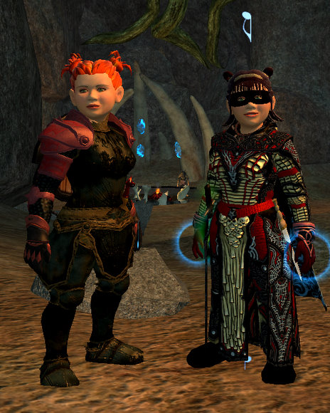
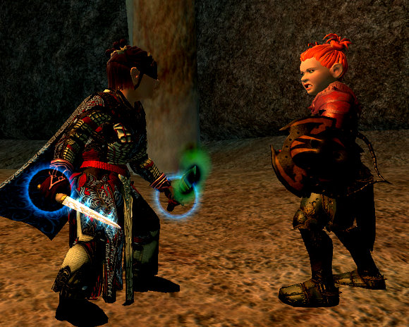
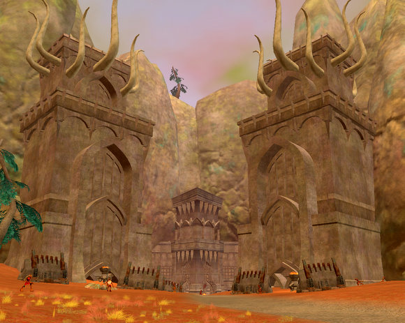
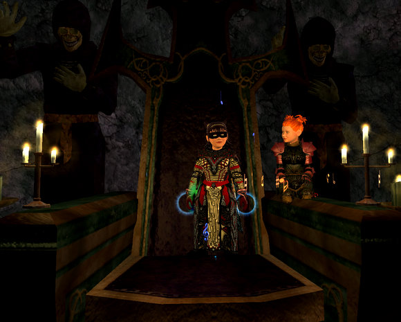

Back to: [West Karana](/posts/westkarana.md) > [2007](/posts/2007/westkarana.md) > [November](./westkarana.md)
# EQ2: Dera and Dina's Travels Through Kunark

*Posted by Tipa on 2007-11-20 10:16:10*

DERA: I am Dera Tanglewood, a 72nd level Inquisitor in service to the Overlord, Lucan D'Lere. My armor was made in the bowels of Fallen Gate my Dwarf metalsmiths whose hands were crushed after to prevent them making another like it. My shoulder and arm armor were stained with the blood of High Elves. I raid occasionally, but usually am content to keep my groups... somewhat alive... in high-end KoS and EoF dungeons, and my gear reflects that.

DINA: Hiiiii! I'm Dina Tanglewood, and Dera won't tell you this, but we're cousins. My mom, Etha, is sisters with her mom, Dora, and Grampa Budo and Grammy Nina used to play in Rivervale together when they were little. I am a 74th level troubador, and when Rivervale was lost, my grandparents took refuge in the Sprawl, where as a young girl, I taught crippled dwarfs how to whistle. I wear my mom's bathrobe. It's so warm and cozy! I do raid, and most of my gear is fabled gear from KoS and EoF raids. And I like doggies!

DERA: And I HATE dogs. WHY did you insist we come to Splitpaw to introduce this piece?

DINA: Well, I thought, if we're going to talk about the new expansion, why not start with the first one? Splitpaw was an odd little piece SOE called an Adventure Pack. You got the first level for free, and after that, you had to pay to see the rest. They've since dropped this program to focus on larger expansions, like Kunark, but it was one of the few benefits of being a Station Pass member.

DERA: Splitpaw scaled itself to you and your group's levels, and had solo missions as well as group ones, and a raid where you had to split the raid in two and travel two different ways, solving puzzles to open the way for the OTHER half of the raid. It was such a good place to level that the place was packed when it came out; so packed that SOE had to tune down the experience so that people would go somewhere else!

DINA: Anyway, back to Kunark. While in Beta, we saw that Kunark was going to be a place for soloers and small groups. More than, say, three people in your group, and unless you had all the same quests, your progress was going to be slowed by having to go back and help complete quests you had already done. We had two accounts, but Dera shared mine.

DERA: And I DESPISED it. Too many flowers. I moved to Dorah's account. She's a necromancer. Dreary, the wet smell of rotted flesh and the sweet simplicity of the tomb... Yes. Now this was home. Three days after Dina began to explore Kunark, I arrived on its shores.

DINA: I'd been adventuring in the Fens with a group for a couple of days, and while I had fun, was hoping for a little more experience. I tried soloing, but it could take a minute or more to kill something, especially if it was higher level than I. Grouping with Dera meant that I would always have someone with me who was doing all the quests I was.

DERA: Dina and I returned to Kylong Plains and did dozens more of the quests there. Although Dina, in her raid gear, didn't find many upgrades, almost all of my NON-raid gear was bettered. Significantly, the gear I did get in raids, high-end EoF instances, and the Shard of Fear, was not upgraded. Those people who were clamoring that top end EoF fabled gear was being replaced with treasured Kunark quest gear from Kylong Plains were sadly mistaken. Old Tier 7 raid gear is still far superior. What the KP quests did was lift the pieces that were not raid-got to a higher level, and to tune my gear, especially my jewelry, to support my spec.

DINA: Then we returned to the Fens. I'd already done a lot of quests here in a group, so we didn't have a chance to redo all those quests -- just a couple in order to get Dera's faction on the right track.

DERA: My first reaction, of course, was to kill them all. This turns out to be a bad plan. Kill the Sarnak, and while the Iksar may like you more, you become unable to accept quests from the Sarnak. Kill the Iksar, and travel becomes deadly and slow; as well, the largest portion of quests in the zone come from the Iksar. Naturally, both the Sarnak and the Iksar give quests to kill the other faction.

DINA: Don't you just hate it when you're invited to a party, and you find out someone brought the same gift? Quests in Kunark vary from the common kill-this bring-this-there quests, to fun ones like this Rhino Wrangling quest. I wish there were more quests like these and fewer of the former; Kunark quests are very much in the mold of those from World of Warcraft and Lord of the Rings Online; get quest, run a long distance to find whatever it is you're supposed to get, run back, find out you need to return to that place to get even more things, run there, run back, find out you have to return again...

DERA: We slaughtered everything in the Mines of Nurga several times over.

DINA: And in fact, the goblins of Nurga now consider me their queen.

DERA: That is very unlikely. One of the largest problems we have faced in Kunark is that of apathy. The zones are grand and huge, but the quests themselves are not very fun, though the rewards can be nice -- the reward for the Nurga quests was a legendary item of great power. Still, now that Kunark is more or less a solo game, it competes with other attractions of our player, such as watching television, reading books, or playing other games.

DINA: We still have about 35 quests to complete in this zone before we can move on to the Kunzar Jungle. I am very much looking forward to adventuring there, but I wonder if I will finish there or just be bored. There could be group content just around the corner I haven't seen.

DERA: That would be nice. To once again skirt death at every turn. That is the true purpose of an adventurer; not killing cats and bringing their pelts back to a hunter too lazy to do the job for himself.

## Comments!

**[Lishian](http://lishian.wordpress.com)** writes: pffft... freeps are weird.

---

**[Lucifrank](http://tenfoldhate.wordpress.com)** writes: Heh heh, they're like a pint-sized Siskel and Ebert--or maybe female versions of those two old guys who'd sit in the balcony of "The Muppet Show." Well-written and very entertaining, Tipa.

---

**[almagill](http://gudeman.co.uk)** writes: "I wear my mom's bathrobe.. and like doggies"

Totally cracked me up. :)

---

**[Lishian](http://lishian.wordpress.com)** writes: Geez. I hope none of those rhinos are sex offenders.

---

