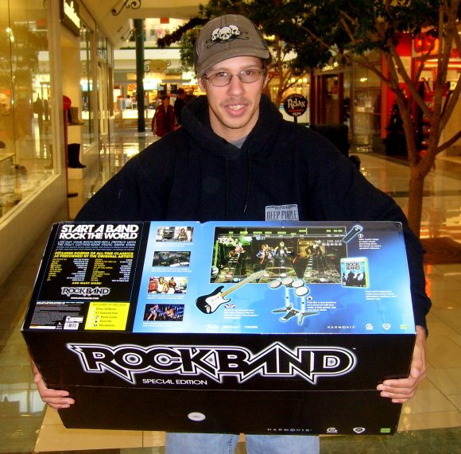

Back to: [West Karana](/posts/westkarana.md) > [2007](/posts/2007/westkarana.md) > [November](./westkarana.md)
# We're getting the band back together!

*Posted by Tipa on 2007-11-20 12:02:50*

Today, the dentist finished off my root canal, the first snow of the season fell here in Connecticut, and, oh yeah, Rock Band came out.

My son there is the drummer!

## Comments!

**[cyanbane](http://www.eq2-daily.com)** writes: I picked mine up an hour ago, if you guys play online look me and my wife up tonight.. she is a hell of a bassist :)

---

**[Tipa](https://chasingdings.com)** writes: If I can get the Xbox hooked to the internet. Maybe I'll temporarily run cable from my router to the Xbox in the next room. I still haven't sat down and figured out how to use an old Netgear wireless router to bridge to our main D-Link. I don't know why Microsoft couldn't just have included WiFi in their console like Sony and Nintendo did. Even on their PORTABLE consoles.

Voice doesn't go over the internet. And I am hearing full band mode isn't supported over the internet? HUH? I'll have to check this out when I get home. And kick my son off the drums. He says they are VERY HARD in medium.

---

**[cyanbane](http://www.eq2-daily.com)** writes: The drums are VERY HARD on Easy!

It seems like the "Rock band Central" was extremely busy or just laggy or something, I ended up getting on it to check out the leaderboards but didn't experiment with online play.

The game as a whole is absolutely awesome though.

---

**[Tipa](https://chasingdings.com)** writes: Around 8:30PM the neighbors downstairs decided we'd played drums enough, so my son switched to lead guitar and I tried vocals. Let's just rest on that word, "tried". First, the microphone wouldn't work. The Harmonix site told me that the microphone AND the normal Xbox wireless controller were sympatico, and that I needed both to be present. And then, I played the vocals on medium. Some I did okay with. Some were absolutely so bad, my son had to "save" me (for which he earned the kudo "Band Savior"). After a break, we reformed with me on lead guitar and he on bass. Since he originally was the Band Leader on drums, and we weren't using drums anymore, we had to make a NEW band fronted by a lead guitarist.

A VERY fun game. We're waiting for the people downstairs to go to work or something so we can play again.

---

**[Lishian](http://lishian.wordpress.com)** writes: Why don't you just gank your neighbors?

---

