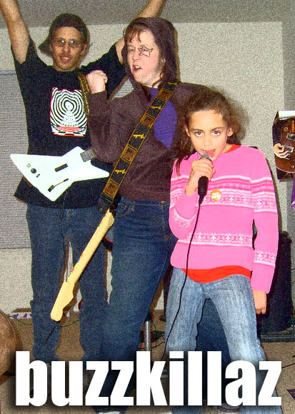

Back to: [West Karana](/posts/westkarana.md) > [2007](/posts/2007/westkarana.md) > [November](./westkarana.md)
# Rock Band: We'll get medium on yo azz.

*Posted by Tipa on 2007-11-24 23:33:06*

Yeah, we're turning it up to ten and a half.

That's Drew on bass, Genj on lead guitar, Jazz on lead vocals and me, I'm the drummer. I look like Genj, but taller.

See, we had it easy. And by that I mean, we were cruising along where everyone was on "easy" (I was on vocals; I think I may have dared to stretch to "medium".)

And after awhile, we were getting no more fans. Too set in our ways. From city to city, always the same songs, hoping the van wouldn't break down...

So we took it up. To medium. Drew couldn't drum at medium, so we switched; but he couldn't sing, so he went back to bass and Genj sang, but it didn't work out so in the end, nine year old Jazz ended up the singer, me on drums with the aching ankle, Genj on lead and Drew on bass.

Worldwide fame followed!

But now... well, in Stockholm, they want a little more than we can give... so we're stuck... in medium...

## Comments!

**[Bildo](http://bildos.blogspot.com)** writes: Damn you and making that stupid thing look like so much fun... :P

---

**[Tipa](https://chasingdings.com)** writes: It IS fun. The singing and drums are mostly real, and the guitars sure sounds real :) It's just like being in a real (fake) band. The only real problam with it is that you can't enjoy it so much while trying to focus on your part. The drum part keeps getting more challenging -- Deep Purple's "Highway Star" is amazingly fun on drums...

It got really competitive. Some of the songs were really hard, and sometimes there was slacking and I got a little annoyed and had to remind myself -- it's just a game and this isn't a real band :P

---

**[Genjer Leigh](http://www.michaelstuartsalsero.com)** writes: It is fun - but hard to get adjusted from playing guitar hero on playstation to using the xbox. You had to push down very hard when strumming the notes and the color bars on the screen are these thin bars. But - I did adjust and do OK with it. We played this for hours and my mind would wander during songs after a while. I think I only have a 5 song attention span. lol Vocals on hard is mission impossible - we kept failing at this one song 'cause we didn't realize the vocals was on hard. Drums is hard on medium. I think I'm gonna stick to guitar. Bass is too boring - would send me into a coma.

"The musical growth of this band cannot even be charted. They are treading water in a sea of retarded sexuality and bad poetry." --- Spinal Tap

---

**[Tipa](https://chasingdings.com)** writes: Did you hear Drew mention that the lady from downstairs came up and said, "I don't know what you're doing up here all day and night, but I wish you would stop it"?

I dunno when I'm going to be able to practice the drums. Medium is getting easier and hard can only be around the corner with some dedicated practice. I went on to some drum websites to learn how to hold the sticks properly, handle wear and tear on the kick bass ankle and get some tips -- this is the first Guitar Hero-esque game where learning to play the real instrument can really help.

If only it wouldn't annoy the neighbors downstairs so much. Maybe there's some padding I can put on the floor...

---

**[JoBildo](http://bildos.blogspot.com)** writes: Tell the lady that if it's too loud, she's too old. :)

---

**[Tipa](https://chasingdings.com)** writes: I don't think it's that it's too loud -- never hear any complaints about normal GH playing, even loud playing. It's gotta be the continual tap-tap-tapping from the drums, even though I try and play softly -- but in the places where you're doing runs and fills and are just all over the kit, it's impossible.

---

**[Genjer Leigh](http://www.michaelstuartsalsero.com)** writes: When did she come up and complain? Is it the music that is bothering her or is it that she can hear when you step on the peddle from the drum unit? We can always turn it down a little if the music is too loud.

---

**[Genjer Leigh](http://www.michaelstuartsalsero.com)** writes: maybe it's that you don't play GH for hours on end the way we did rock band. So she let the GH noise go but found the extended play of rock band hard to take? who knows.

---

**[Genjer Leigh](http://www.michaelstuartsalsero.com)** writes: Speaking of rock music - found out the lead singer of Quiet Riot died this weekend. :( 

http://www.tmz.com/2007/11/26/quiet-riot-singer-found-dead-in-his-vegas-home/

---

**[Lishian](http://lishian.wordpress.com)** writes: you should book a gig at a night club and show up with your rock band game controllers.

---

**[Tipa](https://chasingdings.com)** writes: According to another of my sisters, there is a place up in the Boston area where they have at least Guitar Hero set up (maybe Rock Band by now). Given Harmonix is based in Boston, I wouldn't be surprised if, somewhere, there's a place where you can play Rock Band on stage...

---

**[Lishian](http://lishian.wordpress.com)** writes: @Genjer He must have banged his head one too many times.

---

**[Tipa](https://chasingdings.com)** writes: Well, you know that metal health will drive you mad, don't you?

---

**[Genjer Leigh](http://www.michaelstuartsalsero.com)** writes: It was those striped leggings that did him in.

---

**[Lishian](http://lishian.wordpress.com)** writes: He choked himself while trying to put on his spandex jumper

---

