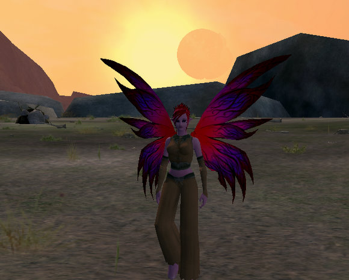

Back to: [West Karana](/posts/westkarana.md) > [2007](/posts/2007/westkarana.md) > [November](./westkarana.md)
# EQ2: Failure Cascade

*Posted by Tipa on 2007-11-30 08:37:16*

I didn't want to talk about Winterwing before she finished the Butcherblock quest line, but while I was messing up an alliance between the Timorous Deep and Butcherblock aviaks, I looked up and caught the end of a partial eclipse of the sun as the un-blowed-up moon Drinal passed before it. Whichever artist did the sky -- well done. I was blown away.

Also, note that Winterwing has a gi now :) That's the Lonetusk Gi from a named in the Ruins. The stats are awful but... it looks like a gi, and now she doesn't have to do the woefully out-of-date armor quests in order to look like a monk again. Well, bruiser.

I should rather have chosen a toilet for a picture for this post. Last night, several more people left the guild, including its former raid leader and main tank, some healers, a couple other random people... and those who are left are getting a little worried. Maybe more than a little. Especially a friend I grouped with last night to do some Fens quests. He's got a physical handicap which he feels will hurt him should he apply to a new guild. It's nothing he can help, and Lord knows we all need some compassion for people with his condition.

You see, he's a paladin.

Yes, he is. And we love him anyway. But can he find a home elsewhere?

I may have to get in touch with Sally Struthers here. For just one raid a week, you can support a needy paladin and help him have a normal life.

The Escapist recently had an article called "[Riding the Failure Cascade](http://www.escapistmagazine.com/articles/view/issues/issue_124/2645-Riding-the-Failure-Cascade)", and though they were talking about EvE orgs, they noted that this sort of catastrophe piled upon cataclysm happens everywhere. First one thing goes wrong. Then another. Then an important person leaves. Then some follow. Then its rats + sinking ship = taking my chances with the sharks.

That's where we are now. We've lost too many people to raid anything past Kingdom of Sky, the website is gone, our DKP history is gone. and the new guild leader is recruiting people in their 60s in the hopes they will grow and more importantly, STAY, one they've reached the cap.

I don't like leaving places. and it would be silly to think about going anywhere before I hit 80 with both Dina and Dera, to increase my options. Heck, maybe the guild leader can pull it off... but it looks for sure like we're caught in a Failure Cascade, and that only ends one place. The toilet.

## Comments!

**[Keen](http://www.keenandgraev.com)** writes: I know the feeling of watching a guild cascade to failure. I've watched it happen a few times and each time I get sick to my stomach and end up logging for a week. 

It just makes me realize how lucky I am to have found Vindicators on Antonia Bayle. It's a very large guild set on the overtone of taking things at a comfortable pace. It's all about RL first and taking care of the needs of the players. Any class can raid (yes, even Paladins) and they've been able to see the content with surprising success. It amazes me the fun and the quality a guild can achieve when they shift the focus where it should be.

Best of luck to you with your guild fiasco. :(

---

**[almagill](http://gudeman.co.uk)** writes: That's a bummer. BUT you got to see an eclipse!!

Love that EQII sky.

---

**[MrrX](http://mrrx.wordpress.com)** writes: There's just soooooo much drama with any guild isn't there ? I'm still not in one I feel at home with, and I doubt I'll ever get there.

Maybe the key is to join a raiding guild after all and make it clear that I can't be counted on for constant raids. If that's agreeable to them, I can be their Master of Quests or something :) .

---

**[Tipa](https://chasingdings.com)** writes: And this cake is so delicious and moist!

Things always work out. And in this case, perhaps I can sit back and enjoy the ride to 80 without being forced to level. When the paladin was asking for help doing Fens quests last night, I *knew* I'd done most of them already and wouldn't progress much, but how could I possibly fuss about getting no help on my quests if I wouldn't help someone else!? It made no sense! So of course we grouped up and ya know, we did some of my quests too -- those four lieutenants I had no luck soloing in the past. With a paladin, they were easy. (And he needed them too!)

I definitely need more time in my leveling plan to group with people and make more friends.

---

**[Tipa](https://chasingdings.com)** writes: @MrrX -- oh, I love to raid, though. I think I'm like you; I'd rather it were on my schedule. And I'd rather Labs, Lyceum and Halls of Seeing would never appear on the raid list EVER.

There are plenty of raid guilds on Befallen. If EC fails -- and it seems likely -- I promise myself I will not join the hardest core of them. A nice raid guild that does something challenging three or four times a week with the other days left for questing and grouping sounds about right.

---

**[rao](http://raoworld.wordpress.com/)** writes: I feel incredibly fortunate to have found the guild I'm in now. I went through far too many guild failures in EQ1 that I was somewhat paranoid of guilds in general. My SWG guild was stable, but there isn't any raiding in that game. No raiding = no loot = no loot disputes = no drama.

In EQ1, I spent 5 years in the same guild. About 2 months after I joined, we had a massive collapse and nearly folded the guild. A few of us decided to stick it out and rebuild and, over time, we built it into a server force. Then, another collapse over a raid loot item and we just didn't have the will to rebuild a second time. After that, it seemed like guild after guild just collapsed on itself for one stupid reason or another.

The guild I'm in now is unique. The maturity level is very high. 90% of the guild members are former guild leaders from EQ1, DAoC or EQ2. Everyone has a very low tolerance for drama. The officers are all real life friends who have been gaming together for years. 3 of the officers were senior GM's in EQ1 together for a long time.

Granted, I have only been in the guild for a few months, but in that time, I have only seen drama arise once and the officers kicked that guy from the guild within minutes of him starting to stir the pot.

I've felt some pressure to level, but it has mostly been pressure I put on myself. The one or two times that I felt some pressure was coming down from the guild, all it took was a quick tell to one of the officers and it was over and done with. They are extremely dedicated to keeping the guild free of drama and I honestly couldn't be happier anywhere else.

Sorry for your troubles, Tipa. That kind of crap is never fun.

---

