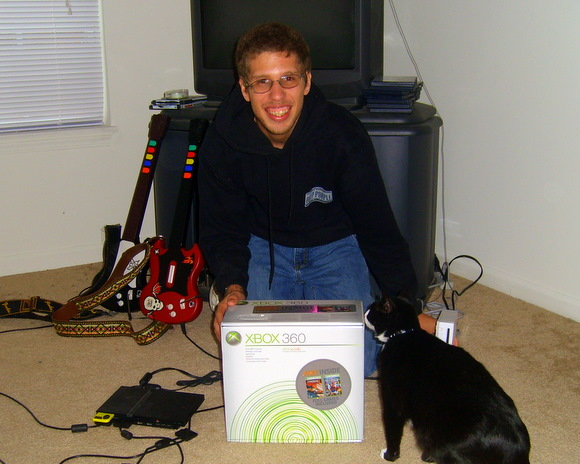

Back to: [West Karana](/posts/westkarana.md) > [2007](/posts/2007/westkarana.md) > [November](./westkarana.md)
# Rock Band: Naming my fake band.

*Posted by Tipa on 2007-11-04 06:06:17*

We got a little closer to being the most famous fake cover band in our living room yesterday when we finally bought an Xbox 360 so we could run Rock Band when it comes out in a couple of weeks (and, we also pre-ordered the game itself).

Right up to the end, we weren't sure if we were going to go with the Xbox or the PS3. I was kinda leaning toward the PS3 when I saw a nice demo of Ratchet and Clank at the store, but their ending of support for PS2 compatibility on their cheaper models sealed the deal. So we became a PS2/Xbox 360 family (and the Wii went into a box until I can get one of those switchers running. Ever since we got Hot Shots Tennis for the PS2, we haven't touched the Wii).

The Xbox 360 was also somewhat cheaper. But not really. We have to return to the store and buy a wireless network adapter to get the thing online. And another controller -- and Xbox wireless controllers are REALLY EXPENSIVE. And a guitar controller, since Rock Band only comes with one, and we need two.

But, who will use it?

Okay, a little bit of whining here...

I was the first one in the family to get into Guitar Hero. It was me who got my son, my sister and my niece all plinking away at a fake guitar controller. I'm the one who plays on Hard/Expert, while they all play on Easy or Medium.

So how is it happening that I'm being shut out of my own game? My son wants to play drums. No matter what, he says, he's on drums.

Okay. Fine. My niece, Jazz (what a name for a musician!), is a natural at fake bass. Cool! Then I'll take lead guitar and my sister can do vocals.

Wrong-o! Genjer won't do vocals because it's dull. Jazz's dad bought her Guitar Hero 2, so Genjer and Jazz have become minor rock gods in their Bronx neighborhood and Genj will be damned if she's going to take all those long, lonely hours learning to shred just to come up here and hum into a microphone while everyone else has fun...

So here's how it's going down, apparently. Drew on drums, Jazz on bass, Genj on lead guitar and me... well, I get to do the cowbell on Don't Fear (the Reaper). I'm practicing my singing chops (of which I have none) by practicing the Portal song, "Still Alive", while accompanying myself with [Jam Sessions](http://www.nintendo.com/newsarticle?articleid=mdaLVrWzIKInvEIy9j2pgQiSEpuOnADz) (a program that turns your DS into an acoustic guitar simulator). I got the [lyrics and chord progression](http://www.jonathancoulton.com/2007/10/15/portal-the-skinny/) off [Jonathan Coulton's web site](http://www.jonathancoulton.com/).

Anyway, they can have my fake band instruments, but they can't have my fake BAND. D347hK1L 0V3RdR1V3 will still be known world-wide as a Tipa solo project. I'm gonna name the new fake band, "Slouching Toward Bethlehem", after that old [William Butler Yeats poem](http://www.online-literature.com/yeats/780/).

Slouching Toward Bethlehem
Tipa - vocals and [stun guitar](http://members.aol.com/bocfaqman/boc_faq.html)
Genj - lead guitar
Jazz - bass guitar
Drew - drums

Of course, I still can't sing worth a darn.

## Comments!

**[Genjer Leigh](http://www.michaelstuartsalsero.com)** writes: What can I say - I am a party pooper. We can distract Jazzmin with candy or a shiny object & I will play the bass, OK? Too bad they don't have a rhythm guitar - then everybody would have an instrument.

---

