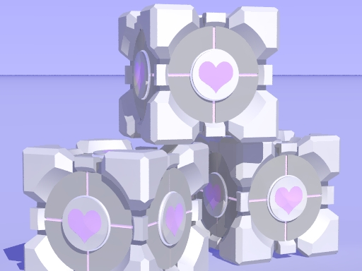
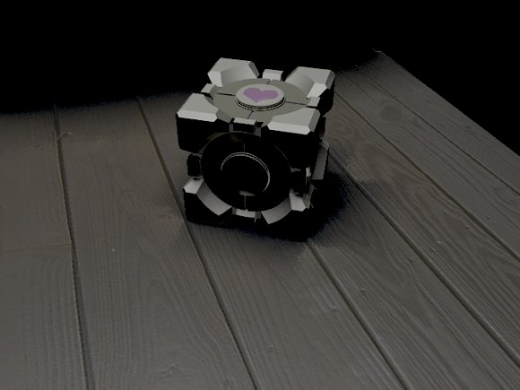

Back to: [West Karana](/posts/westkarana.md) > [2007](/posts/2007/westkarana.md) > [November](./westkarana.md)
# Final Weighted Companion Cube model

*Posted by Tipa on 2007-11-04 08:31:24*

Woke up early this morning due to the time change, so I thought I'd correct my Weighted Companion Cube model... here it is, rendered with radiosity (realistic lighting) in Povray.

Experimenting with lighting, texture maps and bump maps (the wood floor is from a picture I snapped with my digital camera. I used GIMP to normalize it.)
## Comments!

**[Tipa](https://chasingdings.com)** writes: And via [Rock, Paper, Shotgun](http://www.rockpapershotgun.com/?p=535), news of a guy who makes [WCC's from Rubik's Cubes](http://granades.com/2007/11/02/rubiks-companion-cube/) :) So cool!

---

**[Damiano](http://damianov.wordpress.com)** writes: I just had to post: very nice work. I really like the way the final picture came out.
I have no idea how you did it, but it really looks like a photograph as opposed to a render.

Definite kudos... (wish I could pull off something like that)

---

**[Tipa](https://chasingdings.com)** writes: Thanks for the kudos :)

I did it all with a free 3D renderer called Persistence of Vision (www.povray.org). I've been using it for years, but it's easy enough to use. I made the cube literally by looking at a screenshot of the WCC and cutting away anything that didn't match.

I used the free 3D modeler KPovModeler (runs under Linux) to do the initial model, then I exported it to code and did the detail work directly.

Though I haven't used it personally, Google SketchUp (http://sketchup.google.com/) looks like a cool tutorial in CSG modeling, the kind Povray does, and from what I understand, you can put your finished works in Google Earth and Second Life.

---

