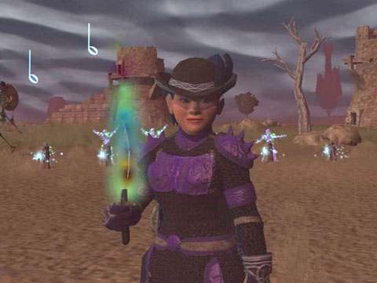
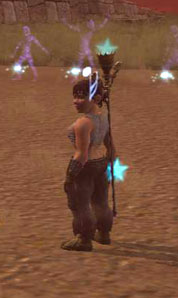

Back to: [West Karana](/posts/westkarana.md) > [2007](/posts/2007/westkarana.md) > [October](./westkarana.md)
# EQ2: Knights of the Round....

*Posted by Tipa on 2007-10-01 06:09:26*

*
The sky over the Commonlands was the color of galvanized aluminum...
Appearance armor: Pristine Melodic Xegonite with Nightchord hat.
*

Much of this weekend and the last one was spent catching up to the guild on the Swords of Destiny quest. I made a mistake with the Claymore quest; I didn't focus on it at the time, and I ended up doing all the quests for other people and not for me because I hadn't yet started it. Now that I'd like to do it, groups are hard to find... and so I'm still on the Sanctum of Scaleborn bits and likely will never hold my glowy saber. Especially with Kunark coming out and making older weapons obsolete.

The weapon isn't even that great and it's likely I wouldn't use it over better weapons such as the Grinning Dirk of Horror -- 4 second delay -- crit and proc heaven -- wish I had it.

I last wrote about the SoD quest after I finished the first quest and began the second, The Knights of the Round. This involves finding 50 statuettes hidden all over Norrath. Between this, Speaks as a Dragon, and a few other quests... what's up with the ancients? They're doomed, they're going to die, but first... they have to scatter things through a dozen zones.

Most everything I could solo -- gray zones. Others I had to have help with (Acadechism, Kaladim, Unrest), and one I couldn't find help for and really NEEDED help with.

That would be New Tunaria. Two of the three statuettes in New Tunaria could be gotten fairly easily by someone who was even a little bit sneaky, but the last was next to a dozen hostile mobs.

Even as a 70 troubador with largely fabled gear, I can't take 1K hits... and hitting a couple of times, mezzing, healing up, breaking the mez with a backstab, rinse and repeat, is boring, slow, dangerous and did I mention slow?

Enter Dorah, my 64 (at the time) necromancer. She's on the other account, and I can play her on my Linux server if I reboot into Windows. And stop watching movies, listening to music, browsing the web and programming, my usual distractions... Once I got Dorah to the spotI just ran her into the VERY VERY hostile room that appeared empty, past the eight sentinels, and feigned death, while Dina ran behind and on to a handy roof, got the last statuette and then ran into the water. Five minutes later, when Dorah's feign death refreshed, she did the same, and it was off to the Commonlands again where fifty ghosts bowed before me.

Today Commonlands. Tomorrow... the world.... Bwahahaha.

Back to Butcherblock, where the evil (in a good way) Lucanic Knight had another little job for me. I'd found Soulfire's hilt... but could I find the blade?

Dorah and I traveled to the Loping Plains to find out. The first couple of steps weren't bad, as we pursued the rumors of a man who bore the vampire's curse, had killed his family and had escaped his grave to live in unlife near Mistmoore, harried constantly by the werewolves who would not let him rest in fear of him.

To reassure him, I would need to talk to said werewolves about letting him be. And the chief of these werewolves would not come to speak to me until I lured him out by killing his underlings... who came in pairs and once again hit too hard for me to tank with just a necromancer healing me.

ut this time, I had help. My son brought his warden, and a guildie brought his wizard (and later his guardian), and between us, we traveled through the Loping Plains, the Catacombs, Kaladim, the Catacombs and soon found ourselves meeting the vampire on the steps of the castle itself, as he told us all he knew of Soulfire before he ran from an angry mob of villagers.

Sucks to be a vampire. Adventurers pestering you, angry mobs hunting you down...

Back we went into Mistmoore Catacombs. Four characters, three players, me having to do all the dps work with two characters, as well as help heal with Dorah (sometimes those little heals made a huge difference). Very thrilling... groups are where the fun is.

It took us four hours to get to that point, four hours of near-constant battle, but more fun than I've had in the game in awhile. I reached 100 AAs on Dina and got a couple on Dorah, and now I just need a few hours in Castle Mistmoore and a solo instance to get to the point where only Mayong Mistmoore stands between me and a new glowy rapier.

We saw Mayong last night. It's been awhile since my guild was powerful enough to finish EOF instances, but rebuilding actually seems to be working. We finished Freethinker's the other night, and last night was likely our fastest and least-calamitous Mistmoore Inner Sanctum run yet. Though we started late, we reached Mayong hours faster than expected. We hadn't expected to get to him and thus hadn't brought Wolfsbane and Blessed Stakes for the kill.

Next time, and I hope to be at the point next time where he can give me my glowy.

