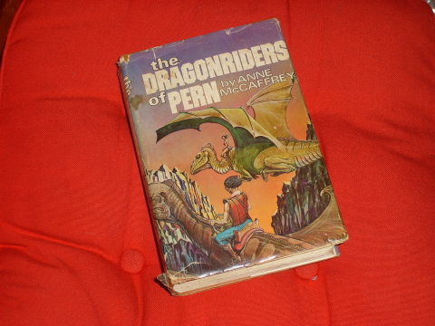

Back to: [West Karana](/posts/westkarana.md) > [2007](/posts/2007/westkarana.md) > [October](./westkarana.md)
# PernMUSH

*Posted by Tipa on 2007-10-01 07:17:17*

In thinking about how Wiki technology could be extended to make MUDs (text-only **M**ulti-**U**ser **D**ungeon -- these were the MMORPGs of the 80s and 90s), I got wondering if the MUD in which I spent the most time, PernMUSH, was still around...

And what do you know, it's still up.

Anne McCaffrey writes romance novels. They may seem to be fantasy or science fiction (or, in the case of the Pern books, *both*), but what they really are, are romance novels.

*I've read this a dozen times over the past thirty years, Maybe more.*
Pern (to labor the backstory) is a planet, colonized and forgotten in the way things normally are in the future, and everyone was peachy and happy until Thread started falling from the sky -- burning, voracious fungus life from the planet in a severely eccentric orbit that swings by every couple hundred years Turns. (Why not just say *years*?) (Actually, I know the answer to that one. It's so geek girls with stuffed firelizards on their shoulders at SF cons can earnestly roleplay with other fans).

So the colonists bred teleporting, psychic dragons to burn the Thread from the sky. Of course.

Okay, it sounds silly, and maybe it is a little silly, but they are really good stories, and I recommend them to everyone.

PernMUSH brings you to Pern just after the end of the Threadfall that backdrops the first three books. You can go to every place, tame firelizards, ride dragons, learn a craft, build your own room... It's a "worldy" game, there's no points, levels, killing or anything... to be part of a story is the reason to play.

*To get to PernMUSH, telnet (or use a MUD client such as Gnome-MUD) to pern.mccr.org port 4201.*
## Comments!

**Aktad** writes: Tipa,

Thanks for the info on the Mud - I had read the Pern books (as of 20 to 30 years ago) and had forgotten how fun they were to read.

In the mid to late 90's I played extensively on the Discworld mud http://discworld.atuin.net/lpc/ also still up and operational. Mostly based on the Discworld books by Terry Pratchett it was big fun to play and I spent (or wasted if you ask my wife) hours and hours and hours playing. Right up until I read some article in Wired Magazine about this new "visual mud-like game" called Everquest . I had been interested in social networks (real world and computer based) for years and thought I should take a look at the EQ thing.

I remember going into the computer store to buy it and the clerk making some snide comments about "EverCrack"....

The MUD's were fun in a way very, very different than EQ or LoTR or WOW, like the difference between listening to a play on radio vs watching TV, both fun, both good in their own way, just different.

Anyway - thanks for the Pern link - off to find a good cloak and a dragon!!

Aktad

---

**[Tipa](https://chasingdings.com)** writes: Discworld! I really loved the first couple of books in the series. The later ones are still funny, just -- too topical.

I was doing a couple of searches on PernMUSH to see what other players were up to, and found this interesting tidbit on a Blogger blog with a Chinese name:

> You can go to now and again plop, tame firelizards, ride dragons, glance a craft, figure your own room… It’sa “worldy” game, there’s no points, levels, killing or anything… to be chip of a narration is the lucidity to play.

Going there just shows my blog was ripped and used as filler text for a porn page -- which, I guess, is something... but my new motto is "to be chip of a narration is the lucidity to play".

Poetry!

---

**[Amber](http://ambernight.org)** writes: LOL at the blatant ripoff!

I read the Pern books, or at least the first--I think--3 of them in high school. I loved the books, and I love McCaffrey's writing style. It's one of the series that really hooked me on fantasy.

---

**[JoBildo](http://bildos.blogspot.com)** writes: Speaking of interesting takes on the dragon motif, everyone must go out and buy His Majesty's Dragon and the rest of the lot by Naomi Novik.

Dragons meet Napoleonic Wars makes for some delicious reading.

---

